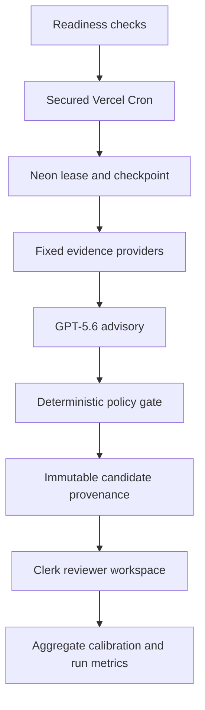
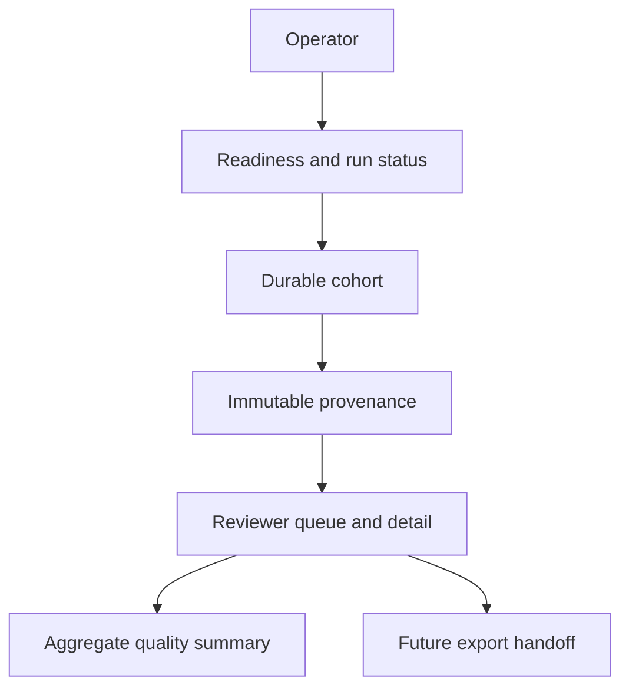

# feat: production CBO audit agent and reviewer workspace

## Overview

Turn the merged, bounded CBO audit loop into an operable production service and a reviewer-first web workspace. The service will collect fixed public evidence, obtain a GPT-5.6 advisory, enforce deterministic policy, and queue only human-reviewable candidates. It will not autonomously browse new sources, declare a resource closed, or publish a directory change.

---

## Problem Frame

The current project can schedule a durable monthly cohort and stage review candidates, but operators cannot yet see whether production is ready, follow a run end to end, inspect the full advisory provenance in the website, or measure whether model advice agrees with human decisions. Those gaps make the pipeline hard to operate and the reviewer workspace incomplete.

---

## Requirements Trace

### Controlled audit agent

- R1. Every scheduled checkpoint must retain a traceable chain from seeded snapshot through fixed provider observations, validated GPT-5.6 advisory, deterministic outcome, and human decision.
- R2. The agent loop must remain bounded: only configured server-side providers collect evidence; model text cannot call tools, change provider scope, close a record, merge identities, approve, publish, or create an ungoverned category.
- R3. Production execution must fail safely before provider calls when the dedicated workspace, reconciled baseline, required configuration, or role boundary is not ready.

### Operations and review website

- R4. Operators must see production readiness, active/cohort run progress, checkpoint outcomes, failures, and safe recovery actions without seeing secrets or raw credentials.
- R5. Reviewers must see the proposed field changes alongside redacted provider evidence, the model's eligibility/status/quality/citation/rationale advisory, its prompt version, and immutable decision history.
- R6. Review actions remain role-restricted, reasoned, revision-safe, and human-controlled. Approval remains a future-export handoff only, never a production-directory write.

### Quality and rollout

- R7. The system must measure model-to-reviewer agreement by prompt version and preserve a small, reviewer-labeled calibration sample without exposing raw credentials or unredacted captures.
- R8. Activation must use a defined canary cohort and measurable stop conditions before relying on the monthly all-resource schedule.

---

## Scope Boundaries

- No general-purpose autonomous-agent framework, browser agent, model-directed tool use, or unrestricted web search.
- No automated closure, deactivation, identity merge, category creation, or production-directory publish.
- No changes to the source-directory system of record. The dedicated review workspace remains the only writable runtime target.
- No patient-level data, protected health information, credentials, cookies, or authorization headers in review pages, logs, commits, or exported calibration artifacts.

### Deferred to Follow-Up Work

- Separate governed export/publisher implementation after reviewer workflow, source target contract, and rollback procedure are approved.
- Any future model-prompt experimentation platform beyond a versioned prompt and calibration summaries.

---

## Context & Research

### Relevant Code and Patterns

- `src/lib/runs/index.ts` already provides the durable monthly cohort, lease, checkpoint, and report lifecycle.
- `src/lib/runs/execute-checkpoint.ts` is the shared one-checkpoint worker used by manual and Cron flows.
- `src/lib/verification/index.ts` keeps deterministic evidence policy authoritative and `AiAdvisory` non-authoritative.
- `src/lib/repositories/review.ts` persists immutable candidate provenance while retaining mutable compare-and-swap review state.
- `src/app/review/page.tsx`, `src/app/review/[candidateId]/page.tsx`, and `src/app/review/review-actions.tsx` establish Clerk plus review-workspace role gating and field-level review actions.
- `docs/policy/source-policy.md` and `docs/ops/operator-runbook.md` define the no-auto-closure and dedicated-workspace operating boundaries.

### External References

- Vercel Cron uses a production Route Handler, bearer `CRON_SECRET`, and the function runtime limit. The current five-minute schedule requires Pro or Enterprise. [Vercel Cron Jobs](https://vercel.com/docs/cron-jobs/quickstart)
- Vercel supports route-level `maxDuration` for App Router handlers. [Vercel function duration](https://vercel.com/docs/functions/configuring-functions/duration)

---

## Key Technical Decisions

- **Keep the Neon run registry as the agent orchestrator:** It already supplies durable state, idempotency, lease fencing, retries through lease release, and checkpoint-level auditability. A general-purpose agent runtime adds no needed capability while widening the tool boundary.
- **Keep tools fixed and server-owned:** Evidence collection remains Firecrawl for the known official URL, Google Places, Tavily discovery, and explicitly configured directories. The model receives bounded evidence only.
- **Expose advisory provenance, not model authority:** The reviewer UI presents GPT output as context and links it to the exact captured providers; deterministic policy and reviewers remain the decision makers.
- **Use application health as a read-only readiness contract:** It may report named checks and safe remediation states, but never environment values, connection strings, or provider keys.
- **Use reviewer-labeled calibration summaries:** Agreement is tracked at aggregate level by prompt version and decision type, not used to automatically alter production policy.

---

## Dependencies / Prerequisites

- A Vercel Pro or Enterprise project is required before the existing five-minute Cron schedule can deploy successfully.
- The dedicated Neon review workspace must have all reviewed migrations applied, a reconciled baseline receipt, and least-privilege application access.
- Clerk subjects who will operate the system must receive explicit `operator` and/or `reviewer` grants in the review workspace.
- Production must already contain the reviewed provider, Azure model, database, Clerk, and Cron secret configuration. The plan adds only presence checks and never writes, copies, or displays those values.

---

## High-Level Technical Design

> *This illustrates the intended approach and is directional guidance for review, not implementation specification. The implementing agent should treat it as context, not code to reproduce.*

---

## Implementation Units

### U1. Production readiness and canary control

**Goal:** Make it clear whether a production run may safely start and provide an intentional, bounded first-run posture.

**Requirements:** R3, R4, R8

**Dependencies:** None

**Files:**
- Modify: `src/lib/db.ts`, `src/lib/repositories/review.ts`, `src/lib/runs/index.ts`, `src/app/api/runs/route.ts`, `src/app/review/page.tsx`
- Modify: `docs/ops/operator-runbook.md`, `docs/policy/source-policy.md`
- Test: `tests/run-lifecycle.test.ts`, `tests/review-ui-workflow.test.ts`, `tests/execute-batch.test.ts`

**Approach:** Define one read-only readiness result that checks the dedicated-workspace sentinel, reconciled baseline receipt, required non-secret configuration presence, and scheduled-run state. Present named pass/fail checks to operators. Keep the existing manual bounded run as the canary mechanism; document the explicit cohort size, review sample, stop conditions, and rollback action before enabling reliance on Cron.

**Patterns to follow:** `reviewRepository.assertBaselineReady`, `WorkspaceTargetError`, `RunControls`, and the current authenticated Cron route.

**Test scenarios:**
- Happy path: a dedicated workspace with a reconciled baseline reports ready and permits a bounded operator canary.
- Error path: missing sentinel, nonreconciled receipt, or absent required configuration reports a safe blocked state before provider collection.
- Integration: Cron and manual launch use the same baseline and workspace gates.
- Security: readiness response names failed checks without returning secret values or connection strings.

**Verification:** An operator can determine whether to run a canary from the website and a blocked environment makes no provider call or review mutation.

### U2. Run history and operational status surface

**Goal:** Give operators a compact, protected view of active and recent runs, checkpoint progress, outcomes, and recoverable failures.

**Requirements:** R1, R4, R8

**Dependencies:** U1

**Files:**
- Modify: `src/lib/runs/index.ts`, `src/lib/repositories/review.ts`, `src/app/api/runs/route.ts`, `src/app/review/page.tsx`, `src/app/review/run-controls.tsx`, `src/app/styles.css`
- Create: `src/app/review/run-status.tsx`
- Test: `tests/run-lifecycle.test.ts`, `tests/review-ui-workflow.test.ts`

**Approach:** Reuse durable run current state, reports, and checkpoint records to query a bounded run-history projection. Show status, current/total checkpoint count, report counts, trigger kind, and safe actions only for authorized operators. Do not introduce a separate job queue or dashboard datastore.

**Patterns to follow:** `NeonRunRegistry.get`, existing report shape, role checks in `ReviewQueuePage`, and revision-safe run controls.

**Test scenarios:**
- Happy path: an operator sees an active scheduled cohort and its report counts.
- Edge case: a completed, cancelled, or no-work run renders an accurate terminal state without a resume action.
- Error path: a run with a released lease displays recoverable status without exposing provider exception details.
- Authorization: a reviewer without operator access cannot view run controls or run metadata.

**Verification:** Operators can diagnose cohort progress and choose a documented recovery action without direct database access.

### U3. Candidate provenance projection for reviewers

**Goal:** Make the review record explainable by returning redacted observation detail and the validated advisory attached to the candidate revision.

**Requirements:** R1, R2, R5, R6

**Dependencies:** U1

**Files:**
- Modify: `src/lib/repositories/review.ts`, `src/lib/verification/index.ts`, `src/app/review/[candidateId]/page.tsx`, `src/app/styles.css`
- Create: `src/app/review/advisory-card.tsx`, `src/app/review/evidence-card.tsx`
- Test: `tests/review-ui-workflow.test.ts`, `tests/run-checkpoint.test.ts`, `tests/schema-contract.test.ts`

**Approach:** Extend the existing candidate read projection to return a typed, redacted provenance view from immutable revision JSON. Render provider, retrieval state, source link, safe excerpt or observed values, and the GPT advisory with prompt version, exact validated citations, and rationale. Keep storage immutable and do not re-run collection or GPT during review.

**Patterns to follow:** `NeonReviewRepository.stageVerification`, existing evidence redaction, `AiAdvisory`, and the candidate detail page's field-diff rendering.

**Test scenarios:**
- Happy path: a candidate with corroborated evidence renders proposed fields, cited providers, advisory assessment, and prompt version.
- Edge case: a conflict with no proposed field still renders its evidence and advisory without offering a closure action.
- Error path: malformed or absent historical advisory provenance renders an explicit unavailable state rather than failing the page.
- Security: credential-shaped text remains redacted; a citation absent from collected providers cannot appear.

**Verification:** A reviewer can explain why a candidate was staged from one page without trusting a model claim that lacks collected evidence.

### U4. Reviewer queue triage and decision-history UX

**Goal:** Make the growing candidate queue reviewable by exposing priority, status, evidence quality, and previous human decisions while preserving existing approval rules.

**Requirements:** R5, R6

**Dependencies:** U3

**Files:**
- Modify: `src/lib/repositories/review.ts`, `src/app/api/review/route.ts`, `src/app/review/page.tsx`, `src/app/review/review-actions.tsx`, `src/app/styles.css`
- Create: `src/app/review/review-history.tsx`
- Test: `tests/review-ui-workflow.test.ts`
- Create test: `tests/review-repository.test.ts`

**Approach:** Add bounded server-side queue filtering and sorting over current candidate status, kind, evidence quality, and recency. Show immutable decision history and revision transitions on the detail page. Preserve required reasons, field-subset approval, and optimistic revision checks; do not add bulk approval.

**Patterns to follow:** `CandidateStatus`, `ReviewDecisionRecord`, `requiredReason`, and `ReviewActions`.

**Test scenarios:**
- Happy path: reviewers can open staged, conflict, and deferred candidates in a deterministic order and see prior decisions.
- Edge case: a superseded candidate shows history but cannot accept a stale decision.
- Error path: invalid filters and stale expected revisions fail without changing candidate state.
- Authorization: only reviewers can view history or submit a decision; operators retain their existing narrower scope.

**Verification:** Reviewers can triage a queue and make one evidence-backed, revision-safe decision per candidate.

### U5. Calibration summaries and prompt-version accountability

**Goal:** Measure whether GPT advisory classifications are useful to human reviewers without making agreement an automated decision rule.

**Requirements:** R1, R2, R7

**Dependencies:** U3, U4

**Files:**
- Modify: `src/lib/repositories/review.ts`, `src/app/api/review/route.ts`, `src/app/review/page.tsx`
- Create: `src/lib/verification/calibration.ts`, `src/app/review/calibration-summary.tsx`
- Create test: `tests/calibration.test.ts`, `tests/review-repository.test.ts`

**Approach:** Derive aggregate counts from immutable candidate advisory provenance and final human decisions, grouped by prompt version and decision type. Display coverage, agreement, disagreement, and insufficient-evidence counts with clear denominators. Preserve the original advisory and human decision separately; do not feed the summary back into live scoring.

**Patterns to follow:** append-only candidate revisions and decisions, existing redaction boundaries, and `CBO_AUDIT_PROMPT_VERSION`.

**Test scenarios:**
- Happy path: known advisory and human-decision fixtures produce expected per-version aggregate counts.
- Edge case: records without an advisory or with deferred decisions are excluded or labeled according to documented denominators.
- Security: aggregates contain no source excerpts, resource identifiers, reviewer subjects, or secret-bearing metadata.
- Integration: prompt-version changes split reporting without changing deterministic verification policy.

**Verification:** Operators can judge advisory performance by prompt version without treating calibration as automation authority.

### U6. Production rollout, alerts, and runbook completion

**Goal:** Establish a safe operating contract for the canary and monthly cohort, including alert thresholds and recovery ownership.

**Requirements:** R3, R4, R7, R8

**Dependencies:** U1, U2, U5

**Files:**
- Modify: `docs/ops/operator-runbook.md`, `docs/ops/operations.md`, `docs/policy/source-policy.md`, `README.md`
- Modify: `vercel.json`
- Test: `tests/execute-batch.test.ts`, `tests/run-lifecycle.test.ts`

**Approach:** Document the exact preflight, canary, stop, recovery, and escalation sequence. Define observable thresholds for provider failure, blocked/timeout rate, lease recovery, candidate volume, and reviewer disagreement. Keep Vercel Cron at one secured endpoint and use its existing production-only schedule; make schedule changes only after the canary acceptance criteria are met.

**Patterns to follow:** current Cron authorization, `maxDuration`, durable release-lease behavior, and the source policy's conservative closure rules.

**Test scenarios:**
- Happy path: documented production configuration uses a secured Cron route and one checkpoint per invocation.
- Error path: invalid Cron authorization, baseline failure, provider timeout, and scorer failure each leave no directory mutation and a recoverable run state.
- Integration: a canary run can be cancelled or resumed without duplicate checkpoint completion.

**Verification:** A new operator can follow the runbook to run, stop, recover, and audit a canary without direct database modification.

---

## System-Wide Impact

- **Authorization:** Clerk authenticates users; the dedicated review workspace remains authoritative for `operator` and `reviewer` grants.
- **Data lifecycle:** Raw provider capture remains redacted and immutable in the review workspace. UI projections must not expand access beyond reviewer/operator roles.
- **Error propagation:** Collection and scoring failure releases or records checkpoint state for retry, while readiness failures block before provider calls.
- **Unchanged invariants:** Production directory writes, automatic closure, and model-directed collection remain absent.

---

## Risk Analysis & Mitigation

| Risk | Likelihood | Impact | Mitigation |
|---|---|---|---|
| Incorrect production target or incomplete baseline | Medium | High | Sentinel and reconciled-baseline readiness gates before provider work. |
| Hallucinated or overtrusted model evidence | Medium | High | Fixed evidence envelope, citation-provider validation, advisory-only policy, and reviewer visibility. |
| Provider outage or cost spike | Medium | Medium | Per-checkpoint bounds, outcome counters, canary stop conditions, and documented recovery. |
| Reviewer overload or inconsistent decisions | Medium | Medium | Queue triage, decision history, and calibration summaries; no bulk approval. |
| Credential or sensitive-text exposure | Low | High | Existing redaction reused in immutable provenance and UI projections; no secret-bearing readiness output. |

---

## Phased Delivery

### Phase 1: Safe production operation

- U1 production readiness and canary controls
- U2 run history and operational status
- U6 rollout/runbook completion

### Phase 2: Explainable human review

- U3 candidate provenance projection
- U4 reviewer queue triage and decision history

### Phase 3: Model quality governance

- U5 calibration summaries by prompt version

---

## Success Metrics

- A canary can be launched only after all readiness checks pass, and any blocked check produces zero provider calls.
- Every staged candidate displays its redacted evidence, validated cited providers, advisory prompt version, and human decision history.
- Operators can account for every scheduled checkpoint as completed, recoverable, cancelled, or intentionally blocked.
- Calibration summaries report clear denominators and prompt-version agreement without changing approval or publication behavior.

---

## Sources & References

- [Automated audit plan](2026-08-13-feat-automated-cbo-audit-plan.md)
- [Source policy](../policy/source-policy.md)
- [Operator runbook](../ops/operator-runbook.md)
- [Vercel Cron Jobs](https://vercel.com/docs/cron-jobs/quickstart)
- [Vercel function duration](https://vercel.com/docs/functions/configuring-functions/duration)
