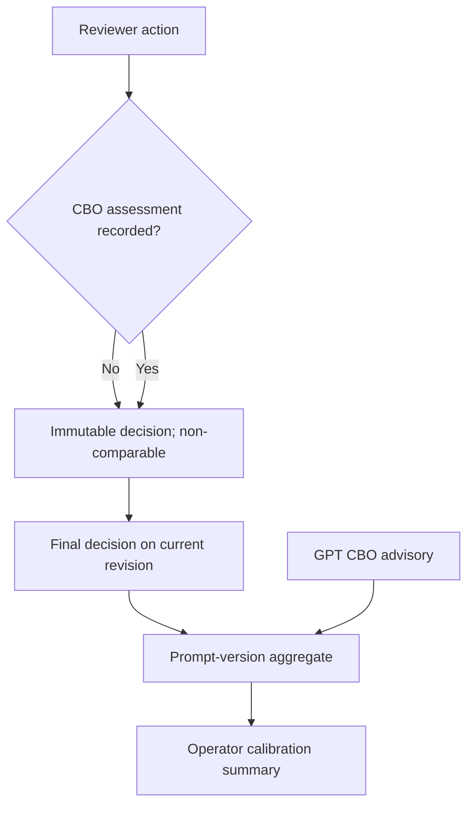

# feat: capture reviewer CBO eligibility for calibration

## Summary

Add a separate, optional reviewer CBO-eligibility assessment to the immutable review decision record. Use that assessment—not approval or rejection of a proposed directory field—to calculate GPT advisory agreement by prompt version.

## Problem Frame

PR #13 correctly stopped treating a generic field-level review action as a CBO-eligibility judgment. Consequently, calibration reports no comparable records because the application does not yet collect the human label required for a valid comparison. This work closes that data-contract gap without changing the human-review or no-auto-publish boundary.

---

## Requirements

### Reviewer decision capture

- R1. When approving or rejecting a candidate, a reviewer can record `eligible`, `not eligible`, or `not assessed` independently of the proposed directory fields.
- R2. The CBO-eligibility assessment is optional; reviewers may approve or reject a field-level proposal without making an organization-level eligibility judgment.
- R3. A recorded assessment, reviewer subject, rationale, action, and timestamp remain immutable and are visible in candidate review history.

### Calibration correctness

- R4. Calibration compares GPT CBO eligibility only with an explicit reviewer CBO-eligibility assessment from the final decision on the current candidate revision.
- R5. Records without an explicit assessment, GPT `insufficient_evidence`, or non-final review state do not contribute an agreement or disagreement count.
- R6. Calibration remains aggregate-only, prompt-version grouped, advisory-only, and incapable of changing verification policy or directory data.

### Delivery safety

- R7. The review workspace migration is additive, runs through an upgrade-safe one-migration command after the currently approved migration set, preserves append-only decision records, and retains the existing review application role access.
- R8. Existing review API clients that omit an eligibility assessment retain their current behavior.

---

## Scope Boundaries

- No automatic CBO classification, closure, publication, category creation, or model-directed tool use.
- No reinterpretation of historical approve/reject actions as CBO eligibility.
- No backfill of legacy decisions; they remain non-comparable because their explicit human eligibility judgment is unknown.
- No changes to the production directory or its credentials.

### Deferred to Follow-Up Work

- Formal inter-reviewer reliability studies or policy changes based on calibration results.
- Bulk review actions and any reviewer workflow beyond one candidate at a time.

---

## Key Technical Decisions

- **Store the label only on terminal `review_decisions`:** it is an append-only human action record, so an eligibility assessment is attributable to the same reviewer, rationale, and timestamp as an approve/reject decision. Deferred and edit actions do not assert eligibility.
- **Use nullable boolean storage:** `true` means eligible, `false` means not eligible, and `NULL` means not assessed. This preserves the distinction required for R2 without inventing a fourth decision action.
- **Read the latest terminal decision for the current revision:** a deferred decision, even when labeled, is non-final. Calibration uses only the latest approved or rejected decision row rather than mutable candidate status alone.
- **Keep comparison eligibility-specific:** confirmed/likely GPT CBO assessments compare to `true`; `not_a_cbo` compares to `false`; GPT `insufficient_evidence` is reported separately but never scored as agreement.
- **Do not backfill:** inferring past labels from generic review actions would recreate the defect reported on PR #13.

---

## High-Level Technical Design

*This illustrates the intended approach and is directional guidance for review, not implementation specification. The implementing agent should treat it as context, not code to reproduce.*

---

## Implementation Units

### U1. Add the immutable eligibility-label schema contract

- **Goal:** Make an explicit reviewer CBO assessment durable without changing legacy decisions.
- **Requirements:** R2, R3, R7, R8.
- **Dependencies:** None.
- **Files:** `migrations/008_reviewer_cbo_eligibility.sql`, `migrations/README.md`, `package.json`, `docs/ops/operator-runbook.md`, `tests/schema-contract.test.ts`.
- **Approach:** Add a nullable `reviewer_cbo_eligibility` boolean to `review_workspace.review_decisions` using an idempotent additive statement. Add a dedicated command that applies only migration 008; do not append it to the non-idempotent 001–006 replay command. Document the rollout order: apply 008 to the dedicated review workspace, deploy the backward-compatible app, then enable label capture. The previous app remains safe after the nullable schema addition.
- **Patterns to follow:** `migrations/003_neon_review_persistence.sql` for the review application role and `migrations/001_review_workspace.sql` for append-only decision records.
- **Test scenarios:** The migration declares the nullable decision field and can be rerun safely; the dedicated migration command applies only 008; legacy rows without a value remain valid; no migration adds production-directory access or alters append-only triggers.
- **Verification:** The dedicated review workspace accepts decisions with or without an explicit eligibility assessment, and existing audit records are unchanged.

### U2. Carry the label through reviewer decision and history contracts

- **Goal:** Let authorized reviewers record a separate assessment and see it in immutable history.
- **Requirements:** R1, R2, R3, R8.
- **Dependencies:** U1.
- **Files:** `src/app/review/review-actions.tsx`, `src/app/api/review/route.ts`, `src/lib/repositories/review.ts`, `src/app/review/review-history.tsx`, `tests/review-ui-workflow.test.ts`.
- **Approach:** Add a three-state reviewer control with `not assessed` as the default, enabled only for approve and reject actions. Accept only the optional boolean at the protected API boundary; persist it only with terminal actions in `NeonReviewRepository.decide`; include it in the in-memory contract and chronological history projection. Deferred and edited proposals remain non-eligibility events.
- **Execution note:** Start with the request/repository contract test so the UI cannot silently turn an omitted value into a CBO judgment.
- **Patterns to follow:** `ReviewActions` required rationale behavior, `requireWorkspaceRole`, `RevisionConflictError`, and the existing `ReviewDecisionRecord` history projection.
- **Test scenarios:** An approved field change with `not assessed` persists no eligibility label; a rejected field change can explicitly record eligible; an explicit not-eligible assessment is visible in history; deferred/edit actions cannot submit a label; invalid non-boolean payloads fail without mutation; stale revision and unauthorized calls retain existing behavior.
- **Verification:** A reviewer can make one field decision and, when appropriate, independently record their CBO assessment without changing approval semantics.

### U3. Aggregate only final, explicitly labeled eligibility comparisons

- **Goal:** Turn explicit reviewer assessments into accurate prompt-version calibration counts.
- **Requirements:** R4, R5, R6.
- **Dependencies:** U1, U2.
- **Files:** `src/lib/repositories/review.ts`, `src/lib/verification/calibration.ts`, `src/app/review/calibration-summary.tsx`, `tests/calibration.test.ts`, `tests/review-ui-workflow.test.ts`.
- **Approach:** Query the latest terminal approved or rejected decision for the current candidate revision and pass its nullable assessment into the aggregate function. Exclude all deferred decisions, including labeled ones. Keep generic review totals separate from comparable records. Render denominator language that makes zero comparable records and excluded records clear to operators.
- **Patterns to follow:** `summarizeCalibration`, the existing prompt-version summary, and aggregate-only operator rendering.
- **Test scenarios:** Confirmed/likely GPT eligibility aligned with an explicit eligible label increments agreement; `not_a_cbo` aligned with explicit not eligible increments agreement; inverse labels increment disagreement; omitted labels, GPT insufficient evidence, and a latest labeled deferred decision are excluded; a later final decision replaces an earlier deferred label for the current revision.
- **Verification:** Dashboard agreement counts can be traced only to final explicit human eligibility labels and never to directory-field approval/rejection.

### U4. Document activation and historical-data limits

- **Goal:** Give operators a safe interpretation and rollout procedure for the new metric.
- **Requirements:** R5, R6, R7.
- **Dependencies:** U3.
- **Files:** `docs/ops/operator-runbook.md`, `docs/ops/operations.md`, `README.md`.
- **Approach:** State that calibration begins prospectively after the migration, requires explicit labels, excludes legacy/unassessed records, and remains a quality signal rather than an automation gate. Define a small labeled canary sample before any new numerical threshold is considered.
- **Patterns to follow:** Existing canary stop/recovery guidance and the source policy's advisory-only model boundary.
- **Test expectation:** none -- documentation only; U1–U3 provide behavioral coverage.
- **Verification:** An operator can explain why a dashboard denominator is smaller than total reviewed candidates and does not treat calibration as permission to publish.

---

## System-Wide Impact

- **Authorization:** Only existing `reviewer`-role users may submit the optional label; operator-only users retain no review-decision access.
- **Data lifecycle:** The new value lives solely in the dedicated review workspace's append-only decision records. Historical values stay null and are excluded.
- **Auditability:** Candidate history displays the eligibility assessment with its existing reviewer, rationale, and timestamp.
- **Operations:** Dashboard counts may initially remain zero until reviewers deliberately label enough final decisions; that is correct, not an outage.

---

## Risks and Dependencies

- Apply migration 008 before deploying code that reads or writes the new column. The nullable addition is compatible with the prior application; the new application must fail safely if its required migration has not been applied.
- Reviewers could overuse the label for simple contact updates. The UI and runbook should make `not assessed` the expected default unless CBO eligibility is actually reviewed.
- A small labeled sample is descriptive only. It must not set automatic close/publish rules or substitute for human review.
