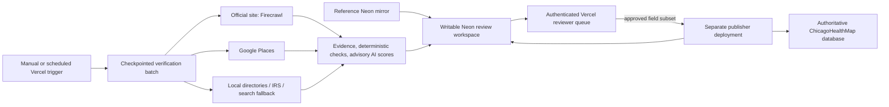

# feat: Verify Chicago CBO resources

## Goal Capsule

Build a review-first system that periodically verifies ChicagoHealthMap community-based organization (CBO) resources, stages evidence-backed changes and possible new resources, and publishes only reviewer-approved deltas to the authoritative production directory.

**Authority:** the user-selected human approval gate overrides every automated score or source signal. The existing Neon database is a read-only reference mirror; it is never a write target. The production database is not yet identified and may not be changed until its owner, schema, credentials, rollback path, and safe test target are confirmed.

**Execution profile:** Vercel hosts the authenticated review application and batch trigger; a separate writable Neon review database holds operational state. Start with manual runs; enable scheduled runs only after the non-production end-to-end gate passes.

**Stop conditions:** no credential in source control; no unreviewed candidate reaches production; no unavailable, blocked, or conflicting source is interpreted as closure.

---

## Product Contract

### Summary

The system evaluates existing resources and candidates against the question: “Is this an active Chicagoland community-based organization that provides a health-relevant resource?” It presents evidence, field-level differences, and separate fit, identity, and operational-evidence scores in a simple Vercel reviewer queue. A reviewer approves, rejects, or defers each candidate before the publisher can alter the live directory.

### Problem Frame

The reference table has 1,969 resource locations and already holds names, addresses, URLs, status, categories, contact fields, source metadata, and verification timestamps. It has no database constraints in the reference copy, and many records have an unknown or missing status. Public websites and directory listings drift; a plausible scrape alone is not safe evidence for a public resource directory.

### Requirements

- **R1.** Import the current `community_resource_locations` reference records into a writable Neon review database without mutating the reference mirror.
- **R2.** For every run, preserve append-only evidence for source retrieval, normalization, proposed values, score rationale, reviewer decision, publication intent, and publication outcome. Corrections create a superseding revision; they never overwrite audit history.
- **R3.** Use the official organization website as primary operational evidence, Google Places as corroboration for address, phone, and business status, trusted local directories as additional evidence, IRS nonprofit data as nonprofit corroboration, and exactly one configurable search fallback (Exa or Tavily) only for missing or broken official-source discovery.
- **R4.** Firecrawl v2 is the normal official-site retrieval path. Browser interaction is an exception for approved public domains after ordinary retrieval fails; it must be bounded, recorded, and never bypass logins, CAPTCHAs, robots restrictions, or terms barriers.
- **R5.** Produce separate scores for CBO/service fit, organization identity, and operational evidence. Scores may propose a category, update, closure review, or potential new resource, but cannot publish or approve a record. A closure candidate requires the defined evidence threshold; a lone Google closure, missing website, timeout, or search result can only create conflict or unable-to-verify.
- **R6.** Classify categories through a human-owned, versioned many-to-many taxonomy. A resource may be unclassified or need review; automation must not invent a category or collapse uncertainty into “other.”
- **R7.** Treat `unable_to_verify`, source blocked, source conflict, missing data, and retrieval failure as review states—not evidence that an organization is closed.
- **R8.** Give approved reviewers an authenticated Vercel queue that shows before/after field diffs, evidence excerpts and links, scores, source conflicts, and approve/reject/defer actions with a reason. A reviewer can decide individual fields; their approved subset becomes an immutable candidate revision.
- **R9.** Allow production publication only from an explicit approved immutable revision, using a separately deployed publisher with a narrowly scoped production credential, a durable outbox, field-level optimistic concurrency, and before/after audit receipts.
- **R10.** Support manual runs first. Design the trigger so a monthly or every-two-month Vercel cron can be enabled later without changing the verification workflow.

### Actors

- **A1. Operator:** starts a bounded manual verification run and observes its outcome.
- **A2. Reviewer:** evaluates evidence and approves, rejects, edits, or defers proposed directory changes.
- **A3. Publisher:** a narrowly scoped server-side action that applies only approved deltas to the authoritative production database.
- **A4. Verification service:** retrieves evidence, calculates deterministic and AI-assisted scores, and stages candidates without production-write permission.

### Key Flows

- **F1. Existing-resource verification:** select reference record → collect evidence → normalize and compare → stage candidate or no-change result → reviewer field decisions → immutable approval revision → optional production publication.
- **F2. Potential-resource discovery:** trusted directory or bounded search result → identity resolution against existing records → stage a potential new resource with evidence → reviewer decision → optional publication.
- **F3. Uncertain evidence:** blocked, stale, conflicting, or insufficient source → preserve the reason → show reviewer a `needs_review`/`unable_to_verify` candidate → make no public status change.
- **F4. Publication recovery:** immutable approval → single claimed publish intent → production transaction → receipt; a post-commit crash reconciles the production ledger and review outbox without duplicating a change.

### Acceptance Examples

- **AE1.** A food pantry’s official site and Google Places agree on a new address; the reviewer sees both sources and the exact address diff before approving it.
- **AE2.** Google Places reports a permanent closure but the official site remains current; the system stages a conflict for review and does not change the public status.
- **AE3.** A trusted local directory identifies a possible behavioral-health organization absent from the directory; the system stages it as a potential new resource rather than inserting it automatically.
- **AE4.** A rate limit or robots restriction prevents retrieval; the candidate is recorded as unable to verify and production receives no update.
- **AE5.** A reviewer approves an address but defers a questionable phone number; only the approved address is eligible to publish.

### Success Criteria

- Every published field change can be reconstructed from its evidence, reviewer decision, and publication receipt.
- A reviewer can dispose of a normal candidate from one screen without visiting a raw database tool.
- Dry runs create candidates and reports but perform no production DML.
- A failed, duplicated, or concurrent trigger cannot create duplicate publication effects.

### Scope Boundaries

#### In scope

- Existing-resource verification, potential new-resource staging, category proposal, evidence review, approval, and controlled production publishing.
- Vercel review application and trigger; writable Neon review/audit database.

#### Deferred to Follow-Up Work

- 211 Illinois licensed data/API integration, pending the partnership response and a data-use agreement.
- Scheduled cadence activation, after an approved manual non-production run.
- Public ChicagoHealthMap map/filter redesign, contact outreach, and automatic publishing.

#### Outside this product's identity

- CAPTCHA, login, paywall, OAuth, or terms-consent bypass.
- A general autonomous browser agent or a conversational agent surface.

### Open Questions

- **Blocking before U5:** What is the authoritative ChicagoHealthMap production database, table/key contract, network route, and rollback mechanism?
- **Blocking before U5:** Can a non-production copy and a least-privilege publisher role be provisioned?
- **Deferred implementation choice:** Which AI API/provider and monthly token budget will score candidates? The model remains advisory regardless of provider.
- **Deferred implementation choice:** Which one search fallback is licensed for the first release: Exa or Tavily?

---

## Planning Contract

### Key Technical Decisions

- **KTD1. Vercel + writable Neon, not an Azure copy.** Vercel hosts the review UI and batch entry point; a separate Neon database is the durable review workspace. The actual production database remains the only production source of truth. This avoids copy-of-copy drift and is sufficient for a small, checkpointed workload. Governs R1, R2, R8, R10.
- **KTD2. Human approval is a persisted workflow state.** A reviewer decision is stored against a proposed field-level delta; it is not a runtime prompt or a score threshold. Governs R2, R8, R9.
- **KTD3. Evidence hierarchy, not one “truth” score.** Official websites carry primary operational evidence; Google Places and trusted local directories corroborate; IRS data establishes nonprofit context only; search discovers candidates only. Governs R3, R5, R7.
- **KTD4. Deterministic gates precede AI.** Identity resolution, field diffing, source recency, and publication authorization are deterministic. AI receives only bounded extracted evidence and returns a schema-constrained advisory result; it cannot merge, approve, close, request tools, expand source scope, or write records. Governs R5, R6, R7, R9.
- **KTD5. Bounded retrieval.** Call Firecrawl v2 scrape first. Permit Interact only on an allowlisted public URL after defined failure conditions, with page/action/time budgets and session cleanup. Web content is untrusted data, never instructions. Governs R3, R4, R7.
- **KTD6. Vercel triggers only durable batches.** Monthly/bimonthly selection enqueues due records; guarded short invocations drain checkpoints under provider budgets until the queue is complete. Manual continuation is the initial v1 path. This accommodates Vercel function duration limits and absent cron retries. Governs R2, R10.
- **KTD7. Clerk protects the reviewer application.** The small ChicagoHealthMap team signs in through Clerk's free tier; each reviewer decision records the authenticated Clerk user ID. Governs R8.
- **KTD8. Publisher isolation follows the production network.** The review app creates a publish intent only. A separately deployed publisher alone has production credentials and service authorization. If production requires a private Azure network, this small publisher moves to Azure; it does not create another database copy. Governs R9.

### High-Level Technical Design



### Output Structure

```text
src/
  app/                 Vercel review pages and protected API routes
  lib/                 domain workflow, adapters, scoring, repositories
migrations/            review-workspace schema migrations
tests/                 unit, contract, and end-to-end workflow tests
docs/                 ops, policy, data, and delivery plans (see docs/README.md)
vercel.json            manual/scheduled trigger definition
```

### Risks & Dependencies

- Production database ambiguity is a hard release gate; do not substitute the read-only mirror or create a replication path.
- Provider terms, robots restrictions, source staleness, and conflicts can reduce coverage; show them as evidence states, never silent exclusions.
- Firecrawl and search costs need per-run quotas; browser interaction is costlier and must be exceptional.
- Vercel cron may duplicate events and does not retry failures, so the run lock, idempotency key, batch checkpoints, and retry state live in Neon.
- The exposed reference-database credential must be rotated and replaced by secrets outside the repository before implementation.

### Sources & Research

- The reference mirror contains 1,969 locations with `organization_name`, `location_type`, `full_address`, `categories`, `status`, contact data, source metadata, and verification timestamps; it is read-only as `intern_reader`.
- [Firecrawl pricing](https://www.firecrawl.dev/pricing) supports a low-volume official-site pass; its v2 Interact API replaces the deprecated browser API.
- [Google Places pricing](https://developers.google.com/maps/billing-and-pricing/pricing) provides a free-volume path for low-frequency Place search/details corroboration.
- [211 Illinois directory management](https://211illinois.org/directory-management) is a licensed future integration, not an assumed public data feed.
- [Vercel cron guidance](https://vercel.com/docs/cron-jobs/manage-cron-jobs) requires explicit idempotency and locking; it does not retry failed invocations.

---

## Implementation Units

### U1. Establish the application and review-workspace contract

**Goal:** Create the minimal Vercel/Neon application skeleton and durable schema for reference snapshots, runs, evidence, candidates, review decisions, publication receipts, categories, and reviewer access.

**Requirements:** R1, R2, R6, R8, R9, R10.

**Dependencies:** None.

**Files:** `package.json`, `tsconfig.json`, `src/lib/db.ts`, `src/lib/domain/`, `migrations/001_review_workspace.sql`, `migrations/002_categories.sql`, `tests/schema-contract.test.ts`, `docs/data/data-dictionary.md`.

**Approach:**

1. Use the Neon serverless driver and SQL migrations; do not introduce an ORM for this initial worker/application.
2. Model append-only source observations, candidate revisions, reviewer decisions, publish intents, and publication receipts; enforce no audit UPDATE/DELETE with database privileges or triggers.
3. Seed a governed category taxonomy with identifiers, labels, definitions, synonyms, effective dates, and deprecation state; allow many categories per resource.
4. Import reference records by source ID and preserve their source snapshot/version so later comparison is repeatable; the snapshot is never canonical after import.

**Test scenarios:**

- Importing a reference location creates a review-workspace resource snapshot without writing to the source mirror.
- A candidate stores distinct before, proposed, and provenance values for an address change.
- A resource can have multiple approved categories and a separate proposed category pending review.
- Duplicate source observation identifiers are rejected or safely deduplicated.
- Attempted update or deletion of an audit event fails; a correction creates a linked superseding event.

**Verification:** Review schema migration succeeds on an empty Neon review database and a seed import produces a traceable snapshot for every source record.

### U2. Retrieve, normalize, score, and stage verification candidates

**Goal:** Convert a small batch of reference records or discovery leads into evidence-backed no-change, candidate-update, conflict, unable-to-verify, or potential-new-resource states.

**Requirements:** R2, R3, R4, R5, R6, R7. Covers F1, F2, F3, AE1, AE2, AE3, AE4.

**Dependencies:** U1.

**Files:** `src/lib/retrieval/firecrawl.ts`, `src/lib/retrieval/google-places.ts`, `src/lib/retrieval/local-directory.ts`, `src/lib/retrieval/irs.ts`, `src/lib/retrieval/search-fallback.ts`, `src/lib/verification/`, `src/lib/scoring/`, `tests/retrieval-contract.test.ts`, `tests/verification-workflow.test.ts`, `docs/policy/source-policy.md`.

**Approach:**

1. Apply deterministic URL, name, address, phone, source-recency, and discovery-deduplication checks before any AI advisory score; ambiguous matches remain reviewable rather than merged.
2. Retrieve public official-site evidence through Firecrawl scrape; record failures and only enter bounded Interact after the fallback policy permits it.
3. Query Google Places for a matched place and record the returned business status as corroboration, not closure authority.
4. Read configured trusted local directory and IRS adapters; use one configured Exa-or-Tavily adapter only to discover missing official sources or potential new resources.
5. Generate separate fit, identity, and operational-evidence scores with explanations and stage field-level diffs or conflicts.

**Execution note:** Start with characterization fixtures from known reference records before enabling a provider credential against a live batch.

**Test scenarios:**

- Covers AE1. Concordant official-site and Google evidence stages an address-change candidate with both citations.
- Covers AE2. Conflicting closure evidence stages a conflict and cannot create a closed status.
- Covers AE3. A trusted-directory lead that does not match a known identity becomes a potential new resource.
- Covers AE4. A robots restriction, timeout, 429, or missing source becomes `unable_to_verify` with no status delta.
- A browser fallback is rejected for a non-allowlisted domain or after its action/time budget is exhausted.
- AI output proposing an unsupported category or identity merge remains a review candidate and cannot mutate canonical fields.
- Prompt-injection text embedded in web evidence cannot alter the retrieval policy, tool scope, score schema, or staged canonical values.

**Verification:** A fixture batch produces only reproducible staged states and evidence records; provider failures never produce production writes.

### U3. Build the protected reviewer queue

**Goal:** Give authenticated ChicagoHealthMap reviewers a focused Vercel interface to inspect and decide candidate changes.

**Requirements:** R2, R5, R6, R8, R9. Covers F1, F2, F3.

**Dependencies:** U1, U2.

**Files:** `src/app/login/`, `src/app/review/page.tsx`, `src/app/review/[candidateId]/page.tsx`, `src/app/api/review/route.ts`, `src/lib/auth.ts`, `src/lib/repositories/review.ts`, `tests/review-authorization.test.ts`, `tests/review-ui-workflow.test.ts`, `docs/policy/reviewer-guide.md`.

**Approach:**

1. Authenticate with Clerk and protect reviewer and manual-run routes; record the Clerk user ID with each decision.
2. Show the candidate’s source record, proposed diff, evidence excerpts/links, scores, conflicts, retrieval issues, and explicit active/closed/unable-to-verify outcome semantics together.
3. Require a decision reason for rejection, defer, reviewer edit, and approval; bind the decision to the exact candidate revision and retain reviewer identity and time.
4. Define `staged → deferred/rejected/approved → publish_pending → published|publish_failed`, with reviewer edits or new evidence creating a superseding revision and invalidating approval.
5. Never expose an action that directly edits production data from the UI.

**Test scenarios:**

- An unauthorised user cannot view candidates or call a decision route.
- An approved reviewer can approve an address change and the recorded decision includes the evidence snapshot and reason.
- A reviewer defers a source-conflict candidate without changing its proposed values.
- A reviewer-proposed category edit is stored separately from the model’s proposal.
- Concurrent reviewer decisions compare-and-swap the candidate revision; one succeeds and the other sees the superseding state.
- An approval is invalidated after a reviewer edit, refreshed evidence, or category-policy version change.

**Verification:** A reviewer can resolve fixture candidates end-to-end in the Vercel preview while no route has production database credentials.

### U4. Add durable manual runs and future scheduling

**Goal:** Start and resume small verification batches safely from Vercel, with one later-compatible cron entry.

**Requirements:** R2, R4, R7, R10. Covers F1, F2, F3.

**Dependencies:** U1, U2.

**Files:** `src/app/api/runs/route.ts`, `src/app/api/cron/route.ts`, `src/lib/runs/`, `vercel.json`, `tests/run-lifecycle.test.ts`, `docs/ops/operator-runbook.md`.

**Approach:**

1. An authorised manual route creates a run with source selection, fixed provider budget, rate limit, and idempotency key.
2. Claim one durable active-run lock and process a checkpointed batch; a subsequent invocation resumes the next checkpoint.
3. Keep the cron definition disabled or non-production until manual acceptance succeeds; validate the trigger secret and reject direct unauthorised access.
4. Return an operator report with records checked, candidates staged, conflicts, unable-to-verify results, provider failures, and budget usage.

**Test scenarios:**

- Two manual launches for the same active run cannot process the same checkpoint concurrently.
- Retrying an identical run invocation does not duplicate observations or candidates.
- An invalid cron secret cannot start a batch.
- A batch resumes after a simulated provider timeout and preserves completed work.
- A cancelled run completes no new checkpoints and a later authorised continuation resumes safely.

**Verification:** A manual dry run processes a bounded fixture batch, emits a durable report, and leaves every production connector unused.

### U5. Publish approved deltas to the authoritative production directory

**Goal:** Add the only production-write path after the real production contract and safe test environment are available.

**Requirements:** R2, R8, R9. Covers F1, F2, AE1.

**Dependencies:** U1, U3, U4 and both production blockers resolved.

**Files:** `publisher/src/`, `publisher/package.json`, `src/lib/repositories/publication.ts`, `tests/publisher-contract.test.ts`, `tests/publish-integration.test.ts`, `docs/publisher-runbook.md`.

**Approach:**

1. Define the production adapter only against the confirmed table, primary key, version/updated-at-or-row-hash, and explicit field allowlist; never assume reference IDs are production IDs or route through a mirror/replication job.
2. Create a durable Neon publish intent keyed to the approved revision; one publisher claims it. Reviewers may revoke only before claim.
3. Re-read and compare the live target’s approved fields/version inside the production transaction; reject stale, changed, rejected, deferred, or already-published candidates.
4. Apply the approved field subset under a separate limited publisher role and write a production idempotency ledger if the target schema permits. Reconcile the ledger with Neon after any crash between production commit and Neon receipt.
5. Roll back only through a newly approved compensating publication that refuses when later conflicting changes exist.
6. Publish a small, approved, reversible canary before enabling any normal batch.

**Execution note:** Treat the non-production database contract test as the first proof; do not create a production connector until it passes.

**Test scenarios:**

- An unapproved, deferred, or stale candidate is refused before any production DML.
- An approved candidate updates only its allowed fields and creates one publication receipt.
- Repeating a successful publication returns the prior receipt without a second change.
- A target-version conflict rolls back the transaction and leaves the candidate reviewable.
- A controlled canary can be reverted from its receipt.
- A production commit with a simulated Neon-receipt failure reconciles to one receipt without a duplicate production update.
- A rollback refuses when a later publication changed the same field.

**Verification:** A production-copy integration test and an approved reversible canary both prove the mapping, transaction, audit, and rollback contracts.

### U6. Establish delivery, observability, and operational controls

**Goal:** Ship a secure, reproducible Vercel/Neon service with cost controls, source policy, and operator guidance.

**Requirements:** R2, R3, R4, R7, R10.

**Dependencies:** U1, U2, U3, U4; U5 only for production publishing controls.

**Files:** `.github/workflows/ci.yml`, `.env.example`, `README.md`, `docs/ops/operations.md`, `docs/ops/security-and-secrets.md`, `tests/dry-run-smoke.test.ts`.

**Approach:**

1. Keep Clerk, Firecrawl, Google, search, AI, Neon, and production credentials outside the repository; production credentials exist only in the publisher deployment’s production environment. Document required scopes and budget caps without values.
2. Run lint, typecheck, and tests on pull requests; never run collection or production publishing from CI.
3. Track run-level counts, provider cost/limit events, duration, candidate decisions, publication results, and blocked-source rates in Neon-backed operational records.
4. Document source hierarchy, retention/redaction policy for raw evidence, review authority, incident response, production rollback, emergency publisher disablement, and the backup/restore owner.

**Test scenarios:**

- A repository scan detects no configured credential value in tracked files.
- CI configuration has no route that invokes a live scrape or publisher.
- A dry-run smoke flow creates a report and no production publication receipt.

**Verification:** A clean deployment can authenticate a reviewer, run a fixture dry run, and display its result without exposing secrets or production-write capability.

---

## Verification Contract

- Run the TypeScript lint, typecheck, and test suite in CI and locally before deployment.
- Use deterministic fixtures for provider success, no-result, source conflict, blocked source, timeout, 429, and malformed evidence states.
- Run a Vercel preview smoke test covering sign-in, reviewer decision persistence, and manual dry-run report.
- Run a Neon review-database integration test against a dedicated non-production database.
- Before U5 reaches production, prove the target mapping on a production copy and complete one approved reversible canary.

## Definition of Done

- U1–U4 and U6 are complete when an approved reviewer can evaluate an evidence-backed dry-run candidate in Vercel and no code path holds production-write access.
- U5 is complete only after the actual production contract is documented, non-production integration passes, and the canary receipt proves rollback.
- Every publication is traceable to immutable evidence and an explicit reviewer decision.
- Failed or uncertain verification is visible, not guessed as a status change.
- Abandoned experiments, credentials, and test-only bypasses are removed before release.
