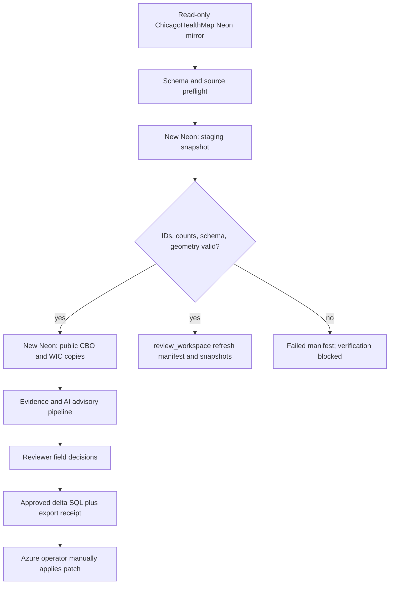

# feat: Add production-compatible CBO mirror workspace

## Goal Capsule

Provision a completely new Neon project for the CBO verifier, copy the two read-only ChicagoHealthMap mirror tables into production-compatible `public` tables, and keep evidence, review, and export audit data in `review_workspace`.

The source mirror remains read-only and is never used as a write target.
The new Neon project is not Azure production and must export only reviewer-approved, field-level patches; it must never overwrite Azure tables or hold Azure production credentials.

---

## Product Contract

### Summary

The verifier needs a durable working copy of the current CBO directory that retains the source table shape, including PostGIS geometry, while the new project's `review_workspace` schema retains provenance and approvals.
The prior review workspace is not a runtime target for this delivery.
Each refresh creates a reconciled source manifest before verification can run.
Every approved export remains a limited delta for the Azure owner to inspect and apply manually.

### Problem Frame

The existing source mirror has 1,969 `community_resource_locations` rows and 30 `wic_locations` rows with stable unique identifiers and `geometry(Point,4326)` columns.
The current import path reduces both relations into a generic normalized snapshot, which cannot produce a source-compatible CBO/WIC delta and requires DDL on the read-only mirror.

### Requirements

- R1. Create a distinct Neon project/database for this app, with a dedicated least-privilege application role and a workspace sentinel that rejects every other target.
- R2. Enable and verify PostGIS in the new database before creating `public.community_resource_locations` and `public.wic_locations`.
- R3. Recreate only the confirmed source table contracts in the new database: columns, types, defaults, keys, constraints, indexes, and `geometry(Point,4326)` semantics needed by the CBO verifier.
- R4. Import and refresh both relations from the existing mirror through read-only queries only; no view, role, grant, DDL, DML, logical-replication configuration, or trigger change is permitted on the mirror.
- R5. Record an immutable refresh attempt before source extraction and a terminal `complete` or `failed` manifest with per-table schema fingerprint, source row count, stable-ID validation, content fingerprint, geometry validation outcome, and redacted failure reason when available; only `complete` manifests may enable verification.
- R6. Do not delete or mark a copied CBO/WIC row closed merely because it disappears from a later source refresh; surface that condition as a reviewable reconciliation event with provenance.
- R7. Link each copied table row through an enforceable `(source_relation, source_key)` mapping to exactly one `review_workspace.resources` identity and immutable refresh-specific baseline snapshot without treating the generic resource ID as an Azure target key.
- R8. Continue to enforce human review: evidence, AI scores, failed lookups, Google status, and source absence cannot directly change a copied directory record or become exportable.
- R9. Keep approvals in the immutable `approved_for_future_export` state and document the required Azure table/key/version/backup/test-target contract for a later manual delta exporter.
- R10. Keep Azure credentials, automatic Azure execution, full-table replacement, and a bi-monthly schedule absent from this delivery until the source refresh and manual verification pilot are accepted.

### Actors

- A1. Mirror owner provides read-only source access and confirms the captured source schema.
- A2. CBO operator launches an import or bounded verification run in the new workspace.
- A3. Reviewer approves, rejects, defers, or edits field-level candidate changes.
- A4. Azure operator downloads, validates, and manually applies an approved delta patch in the authoritative environment.

### Key Flows

- F1. Mirror refresh: source schema preflight → extract both source tables → validate IDs/counts/geometry → transactional copy → append refresh manifest → enable the copied baseline for review.
- F2. Verification: copied source row → evidence and advisory scores → candidate revision linked to the exact mirror refresh → reviewer-approved field subset.
- F3. Future export handoff: approved subset → documented target-contract prerequisite → later manual Azure delta implementation.
- F4. Source discrepancy: a source row absent from a new refresh → reconciliation event → reviewer queue; no automatic deletion or closure.

### Acceptance Examples

- AE1. A CBO copied from `community_resource_locations` retains its integer ID and `geom` SRID 4326 in the new workspace.
- AE2. A source refresh with a duplicate ID, mismatched schema fingerprint, invalid geometry, or count mismatch writes no active baseline and cannot start verification.
- AE3. A reviewer approves an address but defers a phone update; only the address becomes eligible for a future export.
- AE4. A resource missing from a later source import becomes a reconciliation item; it is neither deleted nor marked closed.

### Scope Boundaries

#### In scope

- A new Neon project/database, PostGIS, table-contract capture, controlled copies of the two named CBO/WIC relations, review-resource linkage, manifests, and future manual delta-export contract documentation.

#### Deferred to Follow-Up Work

- Automated source discovery beyond the two copied relations, a manual Azure delta exporter, direct Azure publishing, and scheduled verification activation.

#### Outside this product's identity

- Modifying the existing mirror, full-table Azure replacement, automatic closure/deletion, or storing Azure production credentials in the application.

---

## Planning Contract

### Key Technical Decisions

- KTD1. **Use a completely new Neon project as the CBO verifier workspace** (session-settled: user-directed — chosen over extending the existing review workspace: the user wants a clean app-specific project). It contains both production-compatible `public` tables and the `review_workspace` audit schema; the existing mirror remains a read-only external source. Governs R1, R4.
- KTD2. **Use periodic extract-validate-merge refreshes, not logical replication**. The required cadence is bi-monthly, logical replication would require publisher-side configuration and can prevent Neon scale-to-zero, and the import needs a reviewable manifest before it becomes the active baseline. Governs R4, R5, R6.
- KTD3. **Treat the mirror table DDL as a captured contract, not a guessed clone**. PostGIS must be installed and its version recorded first; the migration is generated/reviewed from a read-only source schema capture and fails closed on unexpected source or destination drift. Governs R2, R3, R5.
- KTD4. **Preserve two identities**. A copied row is identified by source relation plus source primary key; the generic review resource links to that identity for audit, while an Azure patch maps independently to a confirmed target table/key/version contract. Governs R7, R9.
- KTD5. **Keep Azure handoff as a gated manual follow-up** (session-settled: user-directed — chosen over direct Azure writes: the Azure team retains production authority). The Azure owner must first supply target dialect, table/key/version contract, backup owner, and schema-matched rehearsal target. Until then, approved subsets remain `approved_for_future_export` and the app has no Azure credentials or schedule. Governs R8, R9, R10.

### High-Level Technical Design

### Assumptions

- The mirror owner can supply a read-only connection that permits metadata and `SELECT` for the two named relations but no source mutation.
- The new Neon project's supported extension list includes PostGIS at provisioning time.
- The refresh/profile environment is distinct from Vercel: it alone holds the source-read-only credential, which is restricted to the two named source relations and required metadata; the Vercel review/export runtime receives only its workspace role.
- Azure's authoritative table/key/version contract is not yet available; the exporter must remain disabled until it is supplied and rehearsed against a schema-matched non-production target.

### Sources & Research

- Neon documents PostGIS extension enablement and `GEOMETRY(Point,4326)` use in its [extension guidance](https://neon.com/docs/extensions/btree_gist).
- Neon warns that logical replication can keep a publisher compute active and has slot/subscription recovery constraints in its [logical replication guide](https://neon.com/docs/guides/logical-replication-neon).
- PostgreSQL `UPDATE ... RETURNING` reports only rows actually updated, which makes a guarded version predicate observable in the generated patch ([PostgreSQL documentation](https://www.postgresql.org/docs/current/sql-update.html)).

---

## Implementation Units

### U1. Provision and prove the new Neon workspace core

- **Goal:** Establish the new project/database and a reproducible migration path before importing directory data.
- **Requirements:** R1, R2, R3, R5; KTD1, KTD3.
- **Dependencies:** None.
- **Files:** `migrations/007_cbo_mirror_workspace_core.sql`, `scripts/migrate-review-workspace.ts`, `src/lib/db.ts`, `tests/migration-workspace.test.ts`, `docs/operator-runbook.md`, `.env.example`.
- **Approach:**
  1. Add an ordered, checksummed migration runner that validates the target sentinel and fails before applying an unknown, missing, or checksum-mismatched migration.
  2. Provision a clean Neon project manually through its console, bind the sentinel and migration ledger to a provisioned workspace UUID/attestation, and reject a legacy or copied sentinel target.
  3. Preflight available/installed PostGIS versions, enable PostGIS in the new database, record the installed extension version, and make migration failure a hard stop; this core migration does not create source-compatible public tables.
  4. Use a short-lived migration principal for DDL, then add dedicated app/import/export roles with only their required privileges. The review/export runtime receives neither source nor Azure credentials; the source profile/refresh CLI receives the separately scoped source credential.
- **Patterns to follow:** `src/lib/db.ts` sentinel validation; `migrations/003_neon_review_persistence.sql` append-only triggers and grants.
- **Test scenarios:**
  - A blank disposable workspace applies the ordered legacy `001`-`006` migrations and the new core migration, then exposes the new sentinel and PostGIS extension.
  - A URL pointing at the existing legacy workspace, a sentinel-collision clone, or source mirror is rejected before a migration or write.
  - A missing migration ledger entry, changed checksum, unsupported PostGIS extension, or missing app-role grant halts without partial mirror-table creation.
  - The runtime review role cannot write `public` copies or read source credentials; app/import/export roles cannot create extensions or alter schema after migration.
- **Verification:** A newly provisioned project has the expected migration ledger, PostGIS version receipt, workspace sentinel, and least-privilege role checks.

### U2. Capture and create the two source-compatible table contracts

- **Goal:** Define the exact, reviewed destination DDL for the two source relations without relying on the generic normalized-view profile.
- **Requirements:** R2, R3, R4, R5; KTD3.
- **Dependencies:** U1.
- **Files:** `src/lib/imports/cbo-source-profile.ts`, `scripts/profile-cbo-source.ts`, `sql/mirror/community_resource_locations.sql`, `sql/mirror/wic_locations.sql`, `migrations/008_cbo_mirror_tables.sql`, `tests/cbo-source-profile.test.ts`, `tests/cbo-mirror-contract.test.ts`, `docs/cbo-source-profile.md`.
- **Approach:**
  1. Extend the read-only profiler to capture columns, nullability, defaults, primary/unique/check constraints, indexes, geometry typmod/SRID, and row-level ID/geometry aggregates for each named source table.
  2. Emit a non-executable profile and require mirror-owner approval before checking in the two constrained destination DDL artifacts; do not create the former normalized source view on the mirror.
  3. Require an approved disposition for every source-owned sequence, generated column, default, function, or expression dependency: recreate a destination-owned equivalent, preserve an approved generated expression, or omit it as non-required for the verifier. Reject triggers, RLS policies, ownership/grant statements, unapproved extensions, and dependencies without a disposition; apply only a manually reviewed DDL allowlist as migration `008`.
  4. Create `public.community_resource_locations` and `public.wic_locations` with the approved contracts, source-compatible stable keys, and spatial indexes only where the captured source contract contains them.
- **Execution note:** Characterize the live source contract first; implementation must not fill unknown columns with guessed defaults.
- **Patterns to follow:** `src/lib/db.ts` target sentinel and `migrations/003_neon_review_persistence.sql` append-only trigger/grant style.
- **Test scenarios:**
  - The profiler accepts only the two approved schema-qualified base tables and redacts connection/error details.
  - Captured `id` and `wic_id` aggregates reject null or duplicate values.
  - Contract comparison fails on a changed type, missing constraint/index, unapproved expression/dependency, unsynchronized destination-owned sequence, or geometry that is not `Point,4326`.
  - Destination DDL rejects invalid SRID/geometry shape and preserves allowed null geometry where the source allows it.
- **Verification:** The approved source profile and destination DDL prove the exact source-compatible table contract before any directory row is copied.

### U3. Add controlled mirror refreshes and immutable manifests

- **Goal:** Copy the two source tables into the new workspace safely, with reproducible reconciliation and no source writes.
- **Requirements:** R4, R5, R6, R7; KTD2, KTD3, KTD4.
- **Dependencies:** U1, U2.
- **Files:** `migrations/009_cbo_mirror_refresh.sql`, `src/lib/imports/cbo-mirror-refresh.ts`, `scripts/refresh-cbo-mirror.ts`, `src/lib/domain/review-workspace.ts`, `src/lib/runs/cron.ts`, `tests/cbo-mirror-refresh.test.ts`, `tests/cbo-mirror-integration.test.ts`, `tests/cron-release-gate.test.ts`, `docs/operator-runbook.md`.
- **Approach:**
  1. After destination attestation, append a refresh-attempt record before source extraction; source access is through the separate read-only CLI/job role, never a Vercel route.
  2. Read both tables under one read-only repeatable-read source snapshot (or an explicit source snapshot token), validate the captured contract, stable IDs, geometry, counts, and deterministic content fingerprints, then append a redacted failed terminal manifest on any failure that can still reach the workspace.
  3. Claim a destination refresh lock/generation, load validated records into staging relations, and atomically publish only the newest claimed generation to the two `public` copies with complete manifest plus per-table results.
  4. Add a relation-qualified mapping keyed by `(source_relation, source_key)` with unique `resource_id`, plus immutable refresh-specific row/snapshot links; make a complete manifest the only eligible baseline for verification.
  5. Record source absence as a reconciliation event; preserve the existing copied row and block deletion/closure automation.
  6. Do not add a scheduled route or cron configuration in this delivery; document that manual verification begins only after a complete refresh and that schedule activation belongs to the later exporter/scheduling release.
- **Execution note:** Start with fixture-based source/destination contract tests, then run one explicitly authorized integration refresh against the new Neon project only.
- **Patterns to follow:** `src/lib/imports/cbo-baseline.ts` canonical payload receipt and destination sentinel; `review_workspace` append-only event pattern.
- **Test scenarios:**
  - A 1,969-row CBO plus 30-row WIC fixture produces matching counts, source keys, geometry SRIDs, and one successful manifest.
  - Repeating an identical manifest is idempotent and does not create duplicate copied rows, generic resources, snapshots, or reconciliation events.
  - A duplicate/null key, schema fingerprint mismatch, invalid geometry, source read failure, or destination transaction failure leaves no active baseline and, when the destination remains reachable, has one failed refresh manifest with a redacted reason.
  - Two concurrent refreshes cannot publish an older source snapshot after a newer complete manifest; the losing or stale generation remains non-active.
  - A missing source row creates a reviewable reconciliation event while retaining the last copied row.
  - A review run cannot claim a copied row until its complete source manifest, relation/key mapping, and baseline snapshot match.
  - No cron route or schedule configuration is present, and manual verification cannot claim a row before a complete refresh baseline exists.
- **Verification:** A controlled live refresh has a count-only receipt for both tables, no failed/skipped rows, and no writes recorded against the mirror.

### U4. Bind review candidates to copied records

- **Goal:** Make the reviewer workflow use the copied baseline while retaining immutable evidence and field-level approval safety.
- **Requirements:** R5, R7, R8; KTD4, KTD5.
- **Dependencies:** U3.
- **Files:** `src/lib/repositories/review.ts`, `src/lib/verification/index.ts`, `src/lib/verification/run-checkpoint.ts`, `src/app/review/page.tsx`, `src/app/review/[candidateId]/page.tsx`, `tests/review-mirror-linkage.test.ts`, `tests/verification-workflow.test.ts`.
- **Approach:**
  1. Resolve a candidate's baseline from relation plus source key and record the exact refresh manifest/snapshot that supplied it.
  2. Keep field approval subsets immutable and invalidate them when source baseline, evidence, or proposed values are superseded.
  3. Present source-absence and failed-refresh evidence as review information, never a proposed automatic closure/delete.
- **Patterns to follow:** `src/lib/repositories/review.ts` candidate revision CAS and `src/lib/verification/index.ts` conservative unable-to-verify states.
- **Test scenarios:**
  - An approved address candidate links to its exact CBO table row, source key, refresh manifest, and baseline snapshot.
  - A WIC candidate uses `wic_id` identity without colliding with a CBO integer ID.
  - Evidence refresh or reviewer edit supersedes an approval and makes the old subset non-exportable.
  - Source absence, Google-only closure, blocked provider, or rate limit cannot produce a close/delete update.
- **Verification:** Reviewer decisions are durable, field-scoped, and traceable to copied table identity and immutable refresh evidence.

## Verification Contract

| Gate | Applies to | Completion signal |
| --- | --- | --- |
| Static checks | U1-U4 | `npm run check` passes with source-profile, migration, refresh, and review fixtures. |
| Disposable Neon integration | U1-U3 | New dedicated workspace proves sentinel, PostGIS, DDL, roles, imported counts, geometry, and manifest reconciliation. |
| Review safety flow | U4 | Concurrent/stale approvals fail safely and no uncertain evidence becomes a closure/delete. |
| Deferred Azure handoff | R9 | Runbook records the required target-contract, backup, test-target, and operator prerequisites; no export route or Azure credential exists. |
| Operational evidence | U1-U4 | Runbook records provisioning identity, source read-only proof, manifests, and manual-run boundaries. |

---

## Definition of Done

- A new, app-specific Neon project—not the source mirror or prior review workspace—has the checked migration ledger, project-bound sentinel/attestation, PostGIS receipt, and least-privilege roles.
- Its `public` schema contains validated, source-compatible copies of exactly `community_resource_locations` and `wic_locations`; `review_workspace` retains audit/review/export records separately.
- A complete read-only mirror refresh produces reconciled manifests for 1,969 CBO and 30 WIC records (or an explicitly reviewed changed source count) before verification is allowed; failed attempts remain auditable but never active.
- No source discrepancy, provider failure, or AI score automatically changes a copied record, closes a resource, deletes a row, or creates an Azure update.
- Reviewer-approved field subsets remain `approved_for_future_export`; the next release cannot implement a manual Azure delta patch until the documented target-contract and non-production rehearsal prerequisites are satisfied.
