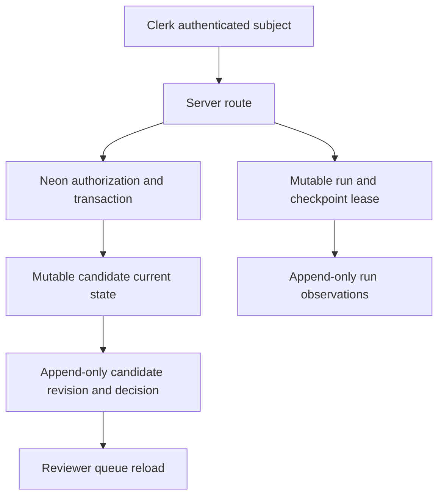

# feat: Persist CBO review workflow in Neon

## Goal Capsule

Replace process-local fixture state with durable Neon-backed review candidates, reviewer decisions, manual verification runs, and checkpoints.

The existing Neon review workspace is the only write target in this delivery.
The ChicagoHealthMap mirror and production database remain untouched, and this delivery stops at `approved_for_future_export` rather than publishing anything.

---

## Product Contract

### Problem Frame

The current Clerk-protected Vercel app stores review candidates and runs in module singletons.
Those records disappear when a Vercel instance restarts and cannot safely coordinate concurrent reviewers or triggers.

### Requirements

- R1. Persist candidate revisions, review decisions, run state, checkpoints, and reports in the dedicated Neon review workspace.
- R2. Keep observations, candidate revisions, and decisions append-only; mutable current-state and lease records are separate operational projections.
- R3. An active Neon-backed Clerk allowlist must gate every review/run read and mutation; reviewers decide candidates and operators launch, cancel, and resume runs.
- R4. A decision must validate its exact candidate revision and approved field subset atomically, returning a conflict on stale or concurrent decisions.
- R5. A run must deduplicate by idempotency key, claim one fenced checkpoint atomically, survive restart, and preserve cancellation/resume state and its report.
- R6. Candidate revisions must reference the exact imported resource snapshot being reviewed, and a bounded snapshot bootstrap must exist before any real candidate is staged.
- R7. Preserve the existing fixture contract as fast tests and add an opt-in, non-production Neon integration suite that aborts unless the target identifies the dedicated review workspace.
- R8. No production database credential, publisher implementation, production state, or cron activation is introduced.

### Scope Boundaries

- In scope: review workspace persistence, Clerk-subject authorization, manual-run persistence, schema/migration tooling, and Neon integration tests.
- Deferred: importing all 1,969 mirror rows, live Firecrawl/Google adapters, scheduled execution, and a reviewer UI redesign.
- Outside this product's identity: production directory writes, automatic approval, and storing unredacted raw scrape artifacts in Neon.

---

## Planning Contract

### Key Technical Decisions

- KTD1. **Neon is the workflow system of record** (session-settled: user-approved — chosen over process-local fixtures: the team needs data to survive Vercel restarts). Keep immutable event tables and add small mutable projection tables for candidate CAS and fenced checkpoint leases. Governs R1, R2, R4, R5.
- KTD2. **Human approval remains a guarded repository transaction** (session-settled: user-directed — chosen over AI or source-only status changes: reviewers decide what becomes eligible for future export). Clerk authenticates a subject; every repository method accepts that subject and checks its active `reviewer` or `operator` grant in the same CTE/statement as its mutation. Reviewer grants decide candidates; operator grants launch, cancel, and resume runs; dual-role subjects hold two grants. The app credential has no production grant, and only an audited role-administration command may grant or revoke roles. Governs R3, R4, R8.
- KTD3. **This release never publishes** (session-settled: user-approved — chosen over copying Neon to the ChicagoHealthMap production database: production ownership and contract are unresolved). The terminal review state is `approved_for_future_export`. Governs R8.
- KTD4. **Use the existing Neon serverless driver and SQL migrations** (session-settled: user-approved — chosen over adding an ORM: the current project already has a minimal driver helper and the schema is SQL-first). Implement conditional review decisions as one parameterized SQL CTE, because the driver's HTTP transaction API cannot branch after reading a query result. Add a checksummed migration ledger/runner that baselines the already-applied `001`/`002` schema before applying `003`. Governs R1, R4, R7.

### High-Level Technical Design

Directional model, not implementation code:

### Assumptions

- The existing dedicated Neon project remains a non-production workspace and is reachable from Vercel; a migration-created workspace sentinel and a least-privilege review role can be verified before migrations or integration writes.
- `REVIEW_DATABASE_URL` is supplied only through local/deployment secret configuration.
- Raw provider captures remain outside the relational workspace; snapshot and observation insertion accepts an allowlisted, redacted payload plus content hash and optional controlled raw-object reference.

---

## Implementation Units

### U1. Extend the review-workspace schema and migration runner

- **Goal:** Add candidate current-state, snapshot linkage, reviewer role, run lifecycle, checkpoint lease, report, and migration-ledger data without changing append-only tables.
- **Files:** `migrations/003_neon_review_persistence.sql`, `src/lib/migrations.ts`, `src/lib/domain/review-workspace.ts`, `tests/schema-contract.test.ts`, `tests/neon-review-persistence.test.ts`.
- **Approach:** Keep UUID audit IDs, add stable externally usable IDs deliberately, use current-state rows only for CAS/leases, and replace the one-subject `reviewer_access` table with active `(subject, role)` grants. Add a workspace sentinel plus a least-privilege review role. Baseline verified existing `001`/`002` installs in the checksum ledger before `003`; an empty workspace applies all migrations once.
- **Test scenarios:** Empty bootstrap and pre-existing-workspace upgrade succeed; a candidate revision links a redacted, allowlisted snapshot; audit UPDATE/DELETE fails; active reviewer/operator roles are required; a lease expiry permits recovery while a stale token cannot complete; a role revoked before a mutation is denied.

### U2. Implement Neon repositories for candidates and runs

- **Goal:** Replace exported production singletons with asynchronous Neon repositories while retaining explicit in-memory fixtures for fast unit tests and add a bounded snapshot bootstrap.
- **Files:** `src/lib/repositories/review.ts`, `src/lib/runs/index.ts`, `src/lib/db.ts`, `src/lib/snapshots.ts`, `tests/review-ui-workflow.test.ts`, `tests/run-lifecycle.test.ts`, `tests/neon-review-persistence.test.ts`.
- **Approach:** Use one parameterized CTE for role check, expected-revision compare-and-swap, immutable decision insertion, and current-state advance. Persist checkpoint ordinal/resource, lease token, expiry, attempt, and report delta; completion compares the token so a stale worker cannot advance a reclaimed checkpoint. The initial operator-driven runner claims and processes one checkpoint per invocation; an expired claim may repeat an external retrieval, but must not duplicate a staged candidate or report completion. Bootstrap bounded imported snapshots through a redacting allowlist and source version/hash receipt before staging real candidates.
- **Test scenarios:** Two decision attempts at one revision yield one success and one conflict; approved fields must exist in the proposal; supersession invalidates approval; duplicate launch returns the same run after a new repository instance; cancellation and resume retain the next checkpoint and counters; claim → crash → expiry → reclaim permits a single fenced completion; a bounded bootstrap creates an immutable, redacted snapshot usable by a candidate.

### U3. Move server routes and pages to durable async reads/writes

- **Goal:** Route all review/run operations through Neon and enforce Clerk role authorization without exposing database credentials to the browser.
- **Files:** `src/app/api/review/route.ts`, `src/app/api/runs/route.ts`, `src/app/review/[candidateId]/page.tsx`, `src/app/review/page.tsx`, `tests/review-authorization.test.ts`.
- **Approach:** Await repository operations, return 403 for an authenticated but unauthorized subject and 409 for stale decisions, and render durable candidate state. All queue/detail/report reads require an active role; no browser code sees a database credential.
- **Test scenarios:** An allowlisted reviewer persists a reasoned field-level approval; a signed-in non-member cannot read, decide, or launch; crossed-role actions return 403; a fresh route/repository read sees the prior decision; a stale request returns 409.

### U4. Add operational setup and non-production verification

- **Goal:** Make repeatable migration, seed-access, and integration verification possible without live provider or production access.
- **Files:** `package.json`, `.env.example`, `docs/operator-runbook.md`, `docs/security-and-secrets.md`, `tests/neon-review-persistence.test.ts`.
- **Approach:** Provide audited role administration, an explicit review-workspace migration command, and an opt-in integration command guarded by `REVIEW_DATABASE_URL`; both verify the sentinel before any write and run under the least-privilege review role. Keep the default test suite fixture-only.
- **Test scenarios:** Integration suite skips cleanly without a test URL, rejects a target without the workspace sentinel, runs only against the dedicated workspace, and validates persistence across independent repository instances.

---

## Verification Contract

| Scope | Evidence |
| --- | --- |
| U1 | Schema contract and non-production migration test pass. |
| U2 | Fixture tests plus Neon CAS, lease, append-only, and restart-persistence integration tests pass. |
| U3 | Typecheck/build pass and Clerk-authenticated route behavior returns expected 403/409 results. |
| U4 | Local and preview configuration contain only review-workspace credentials; no provider or production credentials are needed. |

---

## Definition of Done

- A fresh application instance reloads a Neon-backed candidate and run created by a prior instance.
- An allowlisted reviewer can make one reasoned field-level decision; a concurrent stale decision fails, and a revoked or crossed-role subject is denied.
- An authenticated non-allowlisted user cannot decide or launch a run.
- A verified workspace sentinel and least-privilege review role prevent the review app from writing a wrongly configured target; the publisher is absent.
- Default checks, production build, and opt-in non-production Neon integration tests pass.

## Appendix

External Neon documentation retrieval was attempted but unavailable from the planning browser; implementation should verify current serverless-driver transaction guidance before changing database access patterns.
