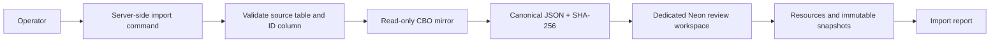

# feat: Seed the review workspace from the current CBO directory

## Goal Capsule

Create a one-time, repeatable baseline import that reads the current ChicagoHealthMap CBO directory from a read-only mirror and writes immutable resource snapshots to the dedicated Neon review workspace.

This release stops after the baseline import report. It does not scrape websites, decide that an organization is open or closed, remove a resource, or write to ChicagoHealthMap production.

## Product Contract

### Problem Frame

The reviewer workspace has durable tables but no authoritative starting population. Without a snapshot of the current CBO directory, the first verification run cannot distinguish an existing resource that changed from a genuinely new potential resource.

### Requirements

- R1. Import every readable source row from the configured current CBO directory into `review_workspace.resources` and an append-only `resource_snapshots` record without writing to the source mirror.
- R2. Use configured `CBO_SOURCE_NAME`, schema-qualified source table, stable source-ID column, and allowlisted public source fields; stop before writing if the source is unavailable, the table/column is invalid, an unapproved field is requested, or a row lacks a usable/unique ID.
- R3. Keep the import idempotent by source name, source ID, and deterministic content version. Re-running an unchanged source must not create duplicate snapshots.
- R4. Preserve only the explicitly allowlisted public directory fields as the baseline payload and record a key-sorted canonical-JSON SHA-256 receipt with redaction policy version `public-directory-v1`. Do not import credentials, raw scraping artifacts, internal notes, or production connection details into the repository or logs.
- R5. Emit a durable machine-readable import receipt with source row, inserted-resource, inserted-snapshot, unchanged, skipped, and failed counts, plus a human-readable terminal summary.
- R6. Make the importer a controlled server-side CLI command, not a Vercel request. It must verify the dedicated review-workspace sentinel before every write and use a credential limited to the review workspace.
- R7. The imported baseline is eligible for later verification only. A first verification run may propose `needs_review`, possible closure, changed data, or potential new resources; human review remains required and neither removal nor production publication is automated.

### Scope Boundaries

- In scope: read-only source mirror connection, table/ID validation, snapshot upsert/import, report generation, and fixture coverage.
- Deferred: Firecrawl/Google retrieval, automated verification execution, reviewer-queue redesign, category classification, source-to-production publication, and record removal.
- Outside this release: writing to the source mirror or ChicagoHealthMap production, auto-closing organizations, or committing any connection string.

## Planning Contract

### Key Technical Decisions

- KTD1. **The current CBO mirror is the import authority** (session-settled: user-directed — chosen over discovering a new directory first: the first run must verify the resources ChicagoHealthMap already lists). Source configuration stays in deployment secrets and is read-only. Governs R1, R2.
- KTD2. **Use an allowlisted public-directory snapshot with validated identifiers** (session-settled: user-approved — chosen over hard-coded unknown source columns or a full-row copy: the mirror schema has not yet been configured and immutable snapshots cannot safely be redacted later). The command validates schema/table/ID/field inputs, recursively key-sorts the selected JSON, and hashes its UTF-8 bytes for deterministic versioning. Governs R2, R3, R4.
- KTD3. **Seed only; do not decide or publish** (session-settled: user-approved — chosen over automatic open/closed/removal actions: the team needs human review of all web-derived deltas). Governs R7.
- KTD4. **Run the first full import as a controlled CLI** (session-settled: user-directed — chosen over a Vercel API request: the current directory may exceed a single serverless request budget). The command runs from an authorized operator environment, verifies the review-workspace sentinel, and never exposes source access to the browser. Governs R5, R6.

### Assumptions

- Deployment/operator configuration will provide `SOURCE_DATABASE_URL`, `CBO_SOURCE_NAME`, `CBO_SOURCE_TABLE`, `CBO_SOURCE_ID_COLUMN`, and `CBO_SOURCE_FIELDS`; the source credential has read-only permissions.
- The configured source table is the current CBO directory and exposes a stable identifier. The importer will not guess a table, ID column, or field allowlist.
- Source fields will be reviewed before the first live import. The fixed `public-directory-v1` policy permits only public directory information.

### High-Level Design

## Implementation Units

### U1. Add baseline import receipt and source-configuration validation

- **Goal:** Provide a safe, explicit import contract without hard-coding a mirror schema or exposing credentials.
- **Requirements:** R2, R4, R6.
- **Files:** `migrations/004_baseline_imports.sql`, `src/lib/imports/cbo-baseline.ts`, `.env.example`, `docs/operator-runbook.md`, `tests/cbo-baseline-import.test.ts`.
- **Approach:** Add an append-only baseline-import receipt table. Read source URL/name/table/ID/field allowlist only from server environment. Split and validate a schema-qualified table, validate its relation type and configured public fields through parameterized catalog queries, and quote only approved identifiers for the final select. Reject missing/invalid configuration before any destination query.
- **Test scenarios:** Invalid schema/table/column/field is rejected before any destination query; source URL and sensitive values are absent from returned error/report data; the receipt records safe aggregate counts only.
- **Verification:** Unit tests and typecheck pass.

### U2. Implement deterministic baseline snapshot import

- **Goal:** Insert stable source identities and immutable source snapshots idempotently.
- **Requirements:** R1, R3, R4.
- **Files:** `src/lib/imports/cbo-baseline.ts`, `src/lib/db.ts`, `tests/cbo-baseline-import.test.ts`.
- **Approach:** Fully read and preflight the selected source rows, materializing IDs and detecting blank/duplicate IDs before the first destination write. Canonicalize allowed JSON fields with recursive object-key sorting (arrays retain order), hash UTF-8 bytes, then use one destination CTE per row to insert resource identity, snapshot, and receipt atomically. Idempotent reruns safely resume after a transient per-row failure.
- **Test scenarios:** First import creates one resource/snapshot/receipt per source ID; unchanged rerun reports unchanged and creates no second snapshot; changed public payload creates exactly one later snapshot; duplicate or blank source IDs produce a failed receipt with zero destination resource/snapshot writes; canonical objects with different key insertion orders hash identically.
- **Verification:** Fixture tests cover source/destination query contracts; optional dedicated-Neon integration test is gated by an explicit environment flag.

### U3. Add controlled CLI entry point and safe report

- **Goal:** Let an authorized operator manually run the baseline import and receive a durable receipt without revealing source credentials.
- **Requirements:** R5, R6, R7.
- **Files:** `scripts/import-cbo-baseline.ts`, `package.json`, `src/lib/imports/cbo-baseline.ts`, `docs/operator-runbook.md`, `tests/cbo-baseline-import.test.ts`.
- **Approach:** Add a documented `npm run import:cbo-baseline` command that reads server-only environment configuration, verifies the review workspace sentinel, emits a count-only summary, and exits nonzero on safe failure. No import button, scheduler, or browser route is introduced.
- **Test scenarios:** Missing/invalid configuration exits before destination writes; a successful run prints counts only; an import error returns a stable message with no source URL, raw row, or stack trace.
- **Verification:** Command fixture test, full `npm run check`, and `npm run build` pass.

### U4. Document first-verification handoff

- **Goal:** Make the post-import boundary unambiguous for operators and future verification work.
- **Requirements:** R5, R7.
- **Files:** `docs/operator-runbook.md`, `docs/data-dictionary.md`.
- **Approach:** Document that imported rows are the baseline population; the next separately delivered verification run compares web evidence against them and stages reviewable deltas or potential new resources. State explicitly that missing evidence, a failed lookup, or an import failure never removes a CBO.
- **Test scenarios:** Documentation names the report and the no-auto-removal rule.
- **Verification:** Documentation review and diff check pass.

## Verification Contract

| Scope | Evidence |
| --- | --- |
| U1-U2 | Fixture tests prove source validation, deterministic hashing, idempotency, changed-payload versioning, and no duplicate IDs. |
| U3 | Route/auth tests prove operator-only access and redacted errors; source credentials stay server-only. |
| U4 | Operator runbook describes the baseline-to-verification handoff and no-auto-removal policy. |
| Whole release | `npm run check`, `npm run build`, and `git diff --check` pass. |

## Definition of Done

- A configured read-only mirror can seed all current CBO source rows into the dedicated review workspace as immutable snapshots.
- Re-running an unchanged import is idempotent; a changed row produces a traceable later snapshot.
- Invalid configuration, duplicate IDs, or missing IDs fail before partial, untraceable writes.
- Only a Clerk/Neon operator can start the manual import, and reports contain counts rather than credentials or source payloads.
- The operator guide states that the next verification run reviews open/closed changes and potential new resources; it never removes or publishes automatically.
