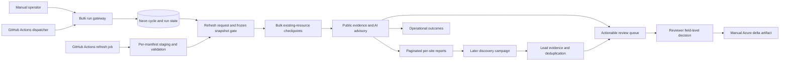
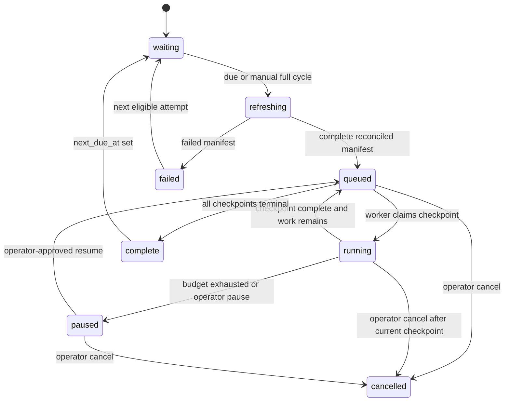

# feat: Add recurring CBO verification and discovery

## Goal Capsule

Operate one review-first program with two visible lanes: first adjudicate the current copied CBO/WIC directory as a bulk cycle, then, after pilot acceptance, discover credible new Chicagoland resources in a separate queue. Operators start a named existing-directory batch or full due cycle; the server, not the browser, drains its frozen work through bounded checkpoints. Every 60 days, the system refreshes its source baseline and audits all due known resources; a separately budgeted discovery campaign may open only after the known-directory release and pilot are accepted. Every checked site receives a durable report—not only sites that need a change.

The app never automatically closes, removes, adds, merges, or publishes a directory record. The source mirror remains read-only; the new Neon workspace is the durable working copy and audit system; Azure is a manual, contract-gated handoff.

**Execution profile:** Vercel hosts the Clerk-protected review app and the bounded worker. A GitHub Actions source-refresh job runs in a separately authorized environment when Neon marks a 60-day cycle due; it creates the required reconciled manifest, then invokes the protected Vercel dispatcher. The dispatcher drains bounded checkpoints every 15 minutes while the cycle remains active. Neon—not cron syntax—decides whether a 60-day cycle is due. This preserves the free Vercel tier without pretending a daily Hobby cron can drain a provider-backed directory review.

---

## Product Contract

### Summary

The first cycle adjudicates the resources ChicagoHealthMap already lists. Staff launch a bulk known-directory audit, not thousands of individual browser jobs; the service checkpoints the frozen workload safely behind the scenes. Every later cycle rechecks those records against a frozen CBO/WIC refresh before beginning separately budgeted discovery. Every completed resource produces an auditable case report; only supported changes and credible unmatched leads require a reviewer decision.

Approved field subsets become a manually downloadable, Azure-ready delta only after the Azure owner supplies and rehearses the authoritative table/key/version contract. The app never receives an Azure production credential and never overwrites or directly applies the directory.

### Problem Frame

The current directory is a valuable baseline, not proof that every listing is current or eligible. Nearly 2,000 CBO locations and 30 WIC locations need periodic attention, while a one-off browser loop cannot safely coordinate provider usage, retries, evidence provenance, or staff review. A literal 60-day cron also cannot represent missed runs or recover from an interrupted provider call.

### Requirements

- R1. Make bulk existing-directory adjudication the primary operator action. An operator can launch a named selected batch or a full due cycle against a reconciled frozen CBO/WIC baseline; workers, not the browser, drain the work through bounded checkpoints. Discovery is a separate operator-visible campaign that is unavailable during the first-cycle known-directory release and only begins after that release is accepted.
- R2. A full or scheduled cycle first binds immutable per-resource cycle membership to a successful, promoted CBO/WIC refresh manifest, freezes the selected snapshots, and records its 60-day due-window anchor. A scheduled cycle accepts only the manifest produced for its current refresh request; a refresh failure, missing receipt, or stale manifest creates no verification checkpoints.
- R3. Use one shared leased-checkpoint worker for manual and scheduled work. Launches, dispatcher deliveries, retries, pause/resume, and cancellation must be idempotent and may not duplicate provider work or candidates; cancellation is terminal.
- R4. Treat outcome states separately: `verified_no_change`, `candidate_staged`, `conflict`, `unable_to_verify`, provider failure, duplicate lead, out-of-scope lead, non-credible lead, and budget exhaustion. Every terminal existing-resource outcome creates a durable case report; only actionable changes and credible unmatched leads enter the reviewer queue.
- R5. Re-verify existing resources with official-site Firecrawl evidence, identity-matched Google Places corroboration, and advisory-only Azure OpenAI scoring. Deterministic comparison may propose supported corrections to name, address, phone, URL, and governed category/type; operational status remains conservative. A closure/move proposal needs an authoritative organization signal plus independently attributable corroboration and remains human-reviewed; failures, absent websites, stale pages, and a Google-only closure may not change public status.
- R6. Discovery is a separate, bounded lead pipeline. Approved category-and-geography searches may propose a `potential_new_resource` only after deterministic deduplication, the versioned seven-county Chicagoland/CBO eligibility policy in `README.md`, and public evidence collection. Discovery never inserts into copied public CBO/WIC tables.
- R7. The system must calculate a rolling 60-day due date from fenced completed verification outcomes, not from a brittle calendar expression. A single active full cycle may exist at once; manual spot checks may coexist only when they do not claim the same pending resource. `unable_to_verify`, provider failure, cancellation, and budget-paused work do not advance a due date.
- R8. The operator UI must make an all-due cycle or bounded existing-directory batch the default choice, show frozen baseline, scope, budget, progress, remaining work, failure counts, and safe start/pause/cancel/resume actions, and expose paginated per-site reports rather than a browser loop or newest-100 list. The reviewer UI must filter by cycle and distinguish actionable candidates from operational outcomes.
- R9. Every provider observation, AI advisory, lead decision, frozen snapshot, run outcome, reviewer decision, and schedule/manual trigger is traceable and append-only. New evidence or an edit supersedes prior approval.
- R10. Scheduled execution stays disabled until a manual pilot produces a reconciled refresh, bounded cost report, usable reviewer decisions, and an explicit persisted activation decision. A service-owner-controlled global emergency stop is checked before cycle creation and every checkpoint claim; a run operator may pause or cancel only its individual run. Manual runs remain available while scheduling is disabled, subject to operator authorization, a reconciled frozen refresh where required, and their explicit budget.
- R11. A reviewer-approved subset of an existing resource's fields is exportable only through a manually downloaded PostgreSQL delta artifact. Existing-row updates require a versioned, allowlisted Azure target contract, exact source identity/version, immutable evidence and decision references, an idempotency receipt, and a schema-matched non-production rehearsal. An approved new-resource proposal remains export-disabled until the Azure owner supplies a separately reviewed insert contract with target table, required columns/defaults, and deduplication evidence. No export workflow may mutate Azure or overwrite the copied CBO/WIC tables.

### Actors

- A1. **Run and export operator:** starts, confirms, pauses, cancels, or resumes a manual run; sees its operational report; and, after reviewer approval, creates and downloads a manual export artifact.
- A2. **Scheduler identity:** invokes only the protected dispatcher; it cannot approve, edit, or export anything.
- A3. **Reviewer:** examines evidence and makes field-level approve, reject, defer, or edit decisions with a reason.
- A4. **Source owner:** owns the read-only mirror and the separately authorized scheduled refresh job; it creates a reconciled manifest for each due-cycle refresh request before the dispatcher can queue verification work.
- A5. **Service owner:** alone may change scheduler activation or emergency-stop state; every transition is server-authorized and audited.

### Key Flows

- F1. **Existing-resource adjudication:** due-cycle refresh request → source-owner refresh job produces a reconciled manifest → freeze all due CBO/WIC snapshots → operator confirms an existing-directory batch or full cycle, or the dispatcher resumes its scheduled cycle → leased evidence checkpoints drain server-side → durable report for every site → actionable review candidates or visible non-actionable outcomes → human field decision.
- F2. **New-resource discovery:** after first-cycle known-directory acceptance, approved search query → durable lead → deduplicate and screen → collect corroborating evidence → `potential_new_resource` candidate or non-actionable disposition → human decision.
- F3. **Manual audit and review:** operator confirms scope and budget once, then follows a durable run dashboard instead of clicking through sites. Reviewers inspect only proposed field changes or credible new leads.
- F4. **Azure handoff:** approved immutable field subset or new-resource decision → contract-gated delta artifact and manifest → authorized operator downloads → Azure owner validates and applies it manually to a schema-matched target.

### Acceptance Examples

- AE1. A staff member launches one existing pantry; Firecrawl and an identity-matched Google Place corroborate its new address; the queue shows both sources and only that address can be approved.
- AE2. A scheduled dispatcher is delivered twice while a full cycle is active; it resumes the same durable run and does not repeat a checkpoint or create a second cycle.
- AE3. The mirror refresh fails validation; the attempt has a failed manifest and the system stages no web-verification work.
- AE4. Discovery finds a credible in-region clinic absent from the directory; it becomes a reviewable potential resource. A same-name/same-address result links to the existing resource instead.
- AE5. Firecrawl times out or Google says closed without corroboration; the run records `unable_to_verify` or conflict, and no closure, removal, or new-resource proposal is created.
- AE6. A 1,999-record cycle is launched once from the operator console; it drains through bounded server checkpoints, shows completed and remaining counts, and pauses at its provider-cost cap pending human-approved continuation rather than silently exceeding the cap.
- AE7. A verified but unchanged clinic appears in the completed batch report with the baseline fields, sources checked, evidence excerpts, AI advisory, and a clear “keep—no supported change” result; it does not create a reviewer candidate.
- AE8. A reviewer approves only a pantry's corrected phone and category while deferring its address; the downloadable Azure patch contains only the approved phone/category fields, target version guard, evidence/decision IDs, and a receipt.

### Success Criteria

- A complete scheduled or manual full cycle has a reconciled refresh, frozen scope, countable terminal outcomes, paginated case reports for every checked existing resource, and a review link for every actionable result.
- Staff can explain any candidate from its source snapshot, evidence, advisory score, and decision history.
- The due-resource queue finishes within 60 days at the configured provider budget, or visibly reports why it did not.
- The pilot acceptance receipt records the team-set review-age cap, candidate disposition rate, and either a successful non-production Azure update-artifact rehearsal or its explicit external-contract blocker.

### Scope Boundaries

**In scope:** recurring verification, potential-resource discovery, manual operator controls, field-level adjudication of name/address/phone/URL/category/status, durable per-resource case reports, free dispatcher integration, a contract-gated manual Azure delta artifact, evidence safety fixes, durable state, reviewer filters, and operational runbooks.

**Deferred for later:** direct Azure publishing, automatic directory changes, 211 Illinois ingestion before a data-use agreement/API, login/CAPTCHA bypass, free-form browser agents, and natural-language operator controls.

**Outside this product's identity:** treating AI, a search result, an unreachable website, or an omitted source row as proof of closure or non-eligibility.

---

## Planning Contract

### Key Technical Decisions

1. **Use a due-date coordinator, not a literal 60-day cron.** Neon owns `next_due_at`, active-cycle locks, frozen run scope, remaining-work state, and one idempotent refresh request per due cycle. A scheduled source-refresh job claims the request, stages and validates both copied relations, and promotes one immutable reconciled manifest before the dispatcher queues that exact cycle. This recovers after late/missed schedules while preserving a manual full-cycle start. Governs R1, R2, R3, R7, R10.
2. **Use free GitHub Actions jobs for refresh and bounded dispatch.** A source-refresh job receives the read-only mirror credential and writes a manifest only in its separate GitHub environment; the Vercel dispatcher receives no source credential. After activation, the dispatcher runs every 15 minutes and claims a small server-owned checkpoint quota. No client submits thousands of IDs or holds a long request open. Governs R1, R3, R7, R8, R10.
3. **Audit the known directory before discovery.** A full CBO/WIC cycle is the first shipped operator workflow. Discovery remains a durable, separately budgeted lead lane that is enabled only after the known-directory release and pilot are accepted. Governs R1, R4, R6, R9.
4. **Make public-source evidence deterministic and AI advisory-only.** Google corroboration must identity-match; Azure may propose only an existing controlled taxonomy ID/confidence and short rationale, never values, free-form categories, closures, merges, or actions. This avoids treating model or untrusted-page content as evidence. Governs R5, R6, R9.
5. **Freeze cycle inputs before web work starts.** A refresh failure or later refresh cannot alter a queued run's baseline: checkpoints reference a `(cycle, resource, snapshot)` membership row rather than the latest snapshot. Governs R2, R3, R9.
6. **Make a paginated report the primary output of a bulk cycle.** A no-change, conflict, or unable-to-verify result is a completed, inspectable case—not an invisible counter or an empty candidate. The report service must page/filter the full 1,999-plus resource cohort rather than render only a newest-100 subset. Governs R4, R8, R9.
7. **Export approved deltas, never a wholesale table copy.** The copied CBO/WIC tables stay production-compatible refresh baselines; an artifact is generated from immutable reviewed subsets against a supplied Azure schema/key/version contract, then manually applied by the Azure owner. Governs R11.

### High-Level Technical Design

### Scheduler and Cycle Lifecycle

### Assumptions

- The GitHub repository stays public or otherwise has sufficient GitHub Actions minutes for a small scheduled source-refresh job and dispatcher.
- Source refresh work uses the existing read-only mirror connection in a separately authorized GitHub Actions environment. Its source and refresh-write secrets are unavailable to Vercel; Vercel receives only the completed manifest receipt and bounded worker configuration.
- The configured provider budget can process the frozen cycle before its 60-day due window. A budget that cannot do so pauses the cycle with a remaining-work forecast; it is never silently relaxed.

### Sources & Research

- Existing durable-run, evidence, and safety patterns: `src/lib/runs/index.ts`, `src/lib/verification/run-checkpoint.ts`, `src/lib/providers/hosted-evidence.ts`, `src/lib/repositories/review.ts`, `tests/run-lifecycle.test.ts`, and `tests/verification-workflow.test.ts`.
- Existing source, human-review, and deployment boundaries: `docs/ops/operator-runbook.md`, `docs/policy/source-policy.md`, `docs/policy/reviewer-guide.md`, `docs/ops/operations.md`, and `docs/security-and-secrets.md`.
- [Vercel Cron Jobs](https://vercel.com/docs/cron-jobs) and [Vercel Cron usage and pricing](https://vercel.com/docs/cron-jobs/usage-and-pricing): schedules are UTC; Hobby allows only one daily invocation and does not guarantee timing precision.
- [Vercel cron management](https://vercel.com/docs/cron-jobs/manage-cron-jobs): no automatic retry; function duration limits apply, so the worker must be checkpointed.
- [Firecrawl v2](https://docs.firecrawl.dev/api-reference/v2-introduction), [Map](https://docs.firecrawl.dev/api-reference/endpoint/map), and [error handling](https://docs.firecrawl.dev/api-reference/errors): bounded retrieval, error-class retry policy, and `Retry-After` handling.
- [Google Text Search (New)](https://developers.google.com/maps/documentation/places/web-service/text-search) and [Place Details (New)](https://developers.google.com/maps/documentation/places/web-service/place-details): field-mask costs, business status, and moved-place fields must be treated as corroborating evidence rather than autonomous status decisions.
- [Google Maps Platform Service Specific Terms](https://cloud.google.com/maps-platform/terms/maps-service-terms) and [Place IDs](https://developers.google.com/maps/documentation/places/web-service/place-id): retain the Google Place ID as the durable identity reference; apply the current Google content caching, attribution, and refresh rules to any Google-derived display value rather than treating raw Places content as an indefinite audit payload.

---

## Implementation Units

### U0. Establish the production-compatible CBO/WIC copy and migration gate

**Goal:** Make the new Neon workspace a safe, production-compatible CBO/WIC working copy before recurring adjudication, case reports, or Azure delta export depend on it.

**Requirements:** R2, R9, R11.

**Dependencies:** A source-owner-approved profile of the two read-only mirror relations and a dedicated new Neon workspace.

**Files:** `migrations/010_cbo_mirror_copy.sql`, `scripts/apply-review-migrations.ts`, `src/lib/db.ts`, `src/lib/imports/cbo-baseline.ts`, `src/lib/imports/cbo-source-profile.ts`, `tests/cbo-source-profile.test.ts`, `tests/baseline-import.test.ts`, `tests/schema-contract.test.ts`, `migrations/README.md`, `package.json`, `docs/data/cbo-source-profile.md`, `docs/ops/operator-runbook.md`.

**Approach:**

1. Use the code-owned `chicagohealthmap-direct-v2` profile to read only `public.community_resource_locations` and `public.wic_locations`; do not require a source-side view or source DDL. Capture a non-executable schema fingerprint before committing constrained additive destination DDL that preserves approved public columns, stable keys, PostGIS geometry type/SRID, and source-compatible names in the new workspace's `public` schema. Do not use the normalized JSON snapshot payload as the copy source, and do not copy source triggers, functions, grants, policies, owner settings, or arbitrary expressions.
2. Define an audited `refresh_requests` relation before the manifest: a due-cycle/idempotency key is unique; its lifecycle is `pending`, `claimed`, `reconciled`, `failed`, or `abandoned`; its claim lease is fenced; and it links to at most one terminal manifest. The refresh command creates or claims this request transactionally, so duplicate triggers reuse the same request and a scheduled launcher can never choose merely the latest reconciled manifest.
3. Give every request one immutable source-snapshot manifest with profile/version, source timestamps, relation counts, unique-ID checks, geometry/SRID checks, source-schema fingerprint, and per-relation content checksums. Stage both relation copies under that manifest; a failure after either staging step leaves the prior promoted CBO/WIC pair active and the failed manifest audit-only.
4. In one destination transaction, promote only a fully reconciled CBO/WIC pair, persist immutable row snapshots and source receipts, mark the request reconciled, and mark that exact manifest eligible. Every cycle, checkpoint, case report, candidate, and future export links to its exact manifest rather than to the latest copied row or snapshot. Source omission is a refresh discrepancy, never a deletion.
5. Start from the landed `009_recurring_verification.sql` contract. The migration runner must verify the target sentinel, migration ledger/checksums, PostGIS availability/version, and append-only guards before applying `010_cbo_mirror_copy.sql` and recording it in `review_workspace.schema_migrations`. A mismatch in `004`, `009`, or `010` blocks before any copied-row mutation; recovery disables refresh eligibility rather than deleting audit data.
6. Bind the workspace sentinel to the dedicated new Neon project/database and use least-privilege runtime roles: a short-lived migration principal for DDL, a source-only refresh environment outside Vercel, a refresh writer limited to the two copies plus minimal refresh-request lease state and manifest/snapshot/receipt records, and an app role that cannot mutate copied `public` tables.

**Test scenarios:**

- The approved profile preserves CBO and WIC stable IDs and `geometry(Point,4326)` while rejecting an unreviewed source field, relation, expression, extension, null/duplicate ID, schema/type drift, or invalid geometry/SRID.
- A reconciled two-relation refresh produces source-compatible public rows and an eligible manifest; a mismatch/partial failure retains the prior promoted pair and leaves no new eligible manifest.
- Duplicate, concurrent, late, or retried source-refresh delivery creates or reuses one fenced request and can promote only its linked manifest.
- A later refresh cannot change the manifest lineage of an earlier cycle, case report, candidate, or export.
- Clean and existing workspace migration preflight rejects ambiguous `004_*` ledger state before a public-table or snapshot write.
- The Vercel app role cannot mutate the `public` copies, and the source refresh role has no review/export authority.

**Verification:** Disposable-Neon migration and refresh integration proves atomic dual-table promotion, source/schema/geometry reconciliation, manifest lineage, role boundaries, and target sentinel before U1 begins.

---

### U1. Establish cycle, frozen-snapshot, and terminal-outcome state

**Goal:** Make a 60-day full cycle a durable, no-overlap object whose checkpoints always reference the exact CBO/WIC snapshot selected after a completed refresh.

**Requirements:** R1, R2, R3, R4, R7, R9.

**Dependencies:** U0.

**Files:** `migrations/011_bulk_audit_controls.sql`, `scripts/apply-review-migrations.ts`, `src/lib/imports/cbo-baseline.ts`, `src/lib/domain/review-workspace.ts`, `src/lib/runs/index.ts`, `src/lib/repositories/review.ts`, `tests/run-lifecycle.test.ts`, `tests/schema-contract.test.ts`.

**Approach:**

1. Treat checksum-locked, separately applied `009_recurring_verification.sql` as a non-editable prerequisite for its cycle, immutable membership, fenced outcome, due-date, budget-state, and per-resource case-report projections. Add only the bulk-console indexes/projections needed for cycle-level progress, remaining-work counts, and paginated reports in `011_bulk_audit_controls.sql`. Each membership has one `(cycle, resource, snapshot)` tuple and an FK proving the snapshot belongs to its resource; checkpoints and candidate staging reference that membership, never a latest-snapshot query.
2. Make the separately authorized refresh command own the source handoff: it claims a durable due-cycle refresh request, creates the CBO/WIC source receipts under one U0 source-snapshot manifest, copies and validates the immutable public-row payloads, and asks Neon to promote that manifest in one destination transaction only after both sources reconcile. Failed or abandoned manifests remain audit-only; source omissions are discrepancies, never deletions or closure evidence. A scheduled dispatcher may queue work only from the completed manifest linked to its current refresh request; a missing, failed, superseded, or stale request remains visible as `refresh_required` and fails closed.
3. Enforce one active full cycle with a database partial-unique constraint and transactionally create/reuse it. Define `paused` as resumable and `cancelled` as terminal; named selected batches are spot checks and do not reset routine due dates or substitute for an all-due cycle.
4. Persist exactly one immutable case report for every terminal existing-resource checkpoint before its lease-token-fenced completion. A report links the frozen snapshot, normalized current fields, every provider observation or failure, deterministic reasons, Azure advisory/version, outcome, optional candidate revision, and completion time. Advance `next_due_at` once in that completion transaction for `verified_no_change`, `candidate_staged`, or `conflict`; `unable_to_verify`, provider failure, budget pause, cancellation, discovery dispositions, and later-superseded evidence remain due. Reviewer decisions never retroactively advance a checkpoint due date.
5. Make `011_bulk_audit_controls.sql` additive after landed `009` and U0's `010`, retain old run readability, and backfill only safe due state from the latest reconciled receipt. U0's migration-ledger preflight is a hard prerequisite; this unit never repairs history as part of the feature. Rollback disables eligibility/dispatch or selects a prior promoted manifest; it never drops audit history.

**Patterns to follow:** Existing migration order and append-only triggers in `migrations/003_neon_review_persistence.sql` and `migrations/004_live_verification.sql`; fenced checkpoint ownership in `src/lib/runs/index.ts`.

**Test scenarios:**

- A completed refresh freezes all due CBO/WIC snapshot IDs before checkpoints are queued.
- A no-change, conflict, and unable-to-verify checkpoint each retain one report with its source snapshot and evidence/failure details, while only the actionable result has a candidate link.
- A later refresh proves queued evidence and candidates retain the original membership snapshot.
- A failed or non-reconciled refresh records failure and creates no verification checkpoint.
- An injected partial CBO/WIC refresh failure leaves no eligible manifest or cycle.
- A refresh command records both source receipts and the promoted manifest before a full-cycle launch can proceed.
- A scheduled due-cycle request with no completed manifest for that request remains `refresh_required`; the dispatcher consumes no provider budget and creates no verification checkpoints.
- A completed but stale manifest cannot be reused for a later scheduled due-cycle request.
- Concurrent source-refresh claims create or reuse one request/manifest, while a cycle bound to manifest A retains A after manifest B is promoted.
- A second scheduled or manual full-cycle launch returns the active cycle without duplicating work.
- A manual spot check leaves the resource's cycle due date unchanged; a terminal full-cycle check advances it.
- An expired/stale lease cannot complete an outcome or advance a due date; budget pause leaves work resumable while cancellation is terminal.
- Outcome-matrix tests prove exactly which terminal existing-resource states advance the due date and that every other state remains due.

**Verification:** Database constraints reject overlapping active cycles and invalid snapshot links; lifecycle tests prove 60-day eligibility, frozen inputs, resume, exactly-one terminal case report, and terminal reports.

### U2. Make evidence collection safe for recurring execution

**Goal:** Harden the existing worker so public evidence remains independently attributable, bounded, and safe to retry before it runs across the entire directory.

**Requirements:** R3, R4, R5, R9.

**Dependencies:** U1.

**Files:** `src/lib/verification/run-checkpoint.ts`, `src/lib/verification/index.ts`, `src/lib/providers/hosted-evidence.ts`, `src/lib/retrieval/firecrawl.ts`, `src/lib/retrieval/google-places.ts`, `src/lib/ai/azure-openai.ts`, `src/lib/repositories/review.ts`, `tests/run-checkpoint.test.ts`, `tests/provider-clients.test.ts`, `tests/verification-workflow.test.ts`.

**Approach:**

1. Keep Azure advice isolated from captured provider values; deterministic evidence extraction and identity matching decide whether a provider observation can corroborate name, address, phone, URL, or status. A model may propose only a controlled taxonomy ID/confidence and short rationale; it cannot supply fields, categories, closures, or actions.
2. Canonicalize every public URL; reject localhost, private/link-local/reserved IP literals and DNS-resolved private targets, then revalidate every redirect/final host. Use Firecrawl only for public unauthenticated fetches and never forward internal credentials to a target. Discovery URLs cannot become scrape targets until identity vetting accepts an official domain. Restrict Interact to an exact vetted domain, one page, fixed timeout, no form/file/navigation actions, and unconditional session cleanup.
3. Redact and size-limit excerpts before both persistence and Azure. Persist only redacted decision excerpts in Neon; keep any raw Firecrawl/official-site body or screenshot in private object storage for 30 days, then purge it and retain only hash, source, retrieval time, and purge receipt. For Google Places, permanently retain only the Place ID, source/time, request/version metadata, allowed derived decision metadata, and integrity reference; display/cache Google-derived content only under the current vendor retention and attribution policy, with a scheduled purge/refresh job. Send Azure bounded, per-observation-delimited evidence and accept only a schema-constrained advisory score, approved taxonomy ID, short rationale, model/deployment, and prompt-policy version—never model-supplied field values, URLs, or actions.
4. Persist observations and the case report even when no candidate is warranted. Complete a leased checkpoint with a durable operational failure if persistence/staging fails after a claim; do not leave it hanging for lease expiry.
5. Make observation and candidate idempotency stable across a retry and serialize staging by run/resource before evidence-specific candidate checks. A candidate approval or edit must compare the immutable current revision/evidence-set version; refreshed or contradictory evidence supersedes and blocks an older pending approval.

**Execution note:** Start with characterization tests for the current unsafe boundaries, then change the worker.

**Patterns to follow:** Capture contracts in `src/lib/retrieval/types.ts`, current evidence redaction in `src/lib/evidence/redaction.ts`, and lease completion in `src/lib/runs/index.ts`.

**Test scenarios:**

- An Azure-suggested address absent from primary evidence cannot create a candidate.
- A Google result for a similarly named organization becomes conflict/no-result rather than corroboration.
- A hung provider times out within the checkpoint budget and completes as `unable_to_verify`.
- Google-derived values expire/purge under the documented policy while the case retains its Place ID and derived decision provenance; required attribution remains visible wherever Google content is displayed.
- A repository failure after a lease claim records a terminal failure without duplicating provider calls on recovery.
- A retry with identical evidence produces one observation/candidate lineage.
- URL parser bypasses, private DNS/redirect destinations, and injected discovery links fail closed without outbound credential delivery.
- Redacted credential-like text or prompt injection never reaches Azure, durable evidence, a category mapping, or a candidate action.
- A reviewer cannot approve an older revision after refreshed evidence supersedes it.

**Verification:** Worker tests prove every claimed checkpoint reaches a fenced terminal state and no AI/provider failure can create an unreviewed status change.

### U3. Expose server-owned bulk existing-directory cycles

**Goal:** Replace the 10-record browser pilot as the primary workflow with a server-owned selected-batch or all-due CBO/WIC cycle that can drain safely over many dispatcher invocations.

**Requirements:** R1, R3, R7, R8, R10.

**Dependencies:** U1, U2.

**Files:** `src/app/api/runs/route.ts`, `src/app/api/runs/[runId]/execute/route.ts`, `src/app/api/runs/[runId]/status/route.ts`, `src/app/api/cron/route.ts`, `src/lib/runs/cron.ts`, `src/lib/runs/index.ts`, `tests/review-authorization.test.ts`, `tests/run-lifecycle.test.ts`, `tests/run-checkpoint.test.ts`, `tests/run-route.test.ts`.

**Approach:**

1. Keep `manual_selected` and `manual_full_cycle` as the only implemented existing-directory modes. A selected batch receives server-side ID validation and a cap suitable for review; full/due launch derives all due memberships from one reconciled manifest. No browser request contains the full directory selection.
2. Keep the current leased checkpoint as the execution primitive. The operator console launches, pauses, resumes, or reads status; a bounded server drain processes the frozen full cycle across dispatcher invocations. The run gateway must refuse an existing resource already claimed by another active run/cycle rather than relying on a disabled browser button.
3. Make the scheduler identity server-authorized rather than Clerk-impersonated. The cron endpoint derives scope and budgets from persisted configuration; it accepts no resource IDs, modes, or overrides. Require the persisted activation gate and emergency-stop check before cycle creation and every claim.
4. Persist a timestamped scheduler-delivery nonce and per-cycle claim quota so repeated, expired, or concurrent deliveries cannot amplify work or spend. Reject duplicate/unknown selection IDs, duplicate active cycles, cross-scope resource conflicts, and budget-free full runs; return the existing active run where applicable. A run status/receipt summarizes frozen scope, terminal case-report counts, candidate links, completed/remaining work, provider usage, and failures.
5. Require same-origin/CSRF validation on every Clerk-cookie-authenticated mutation before any side effect; scheduler requests use their separate signed-delivery validation.

**Patterns to follow:** Clerk operator gate in `src/lib/db.ts` and `src/app/api/runs/route.ts`; existing `CRON_SECRET` handling in `src/app/api/cron/route.ts`.

**Test scenarios:**

- A reviewer cannot launch or execute a run; an operator can launch a bounded selected batch or bulk all-due run.
- A full-cycle confirmation creates one frozen due set without receiving thousands of IDs, while a duplicate request returns that run.
- Duplicate scheduler deliveries continue the existing cycle without a second refresh or provider request.
- A manual spot check overlapping an actively leased cycle resource is rejected or linked to the existing work.
- An operator starts a full due cycle once, sees progress and remaining count from the status endpoint, and observes one durable case report per resource as it finishes without resubmitting completed sites.
- Pause stops future claims and resume continues the same frozen scope; cancellation is terminal.
- A disabled pilot gate, invalid scheduler secret, or missing provider budget prevents scheduled execution.
- Replayed/expired scheduler delivery and activation revoked between claims cause no additional provider call.
- Cross-origin requests cannot launch, execute, pause, resume, or cancel a run.

**Verification:** Route and lifecycle tests prove mode authorization, idempotency, no-overlap rules, and bounded scheduler invocation.

### U4. Build the later durable new-resource discovery lane

**Goal:** Turn bounded, approved searches into explainable potential-resource reviews without contaminating existing-resource verification or the copied source tables.

**Requirements:** R4, R6, R9.

**Dependencies:** U1, U2, U3, U5. U3/U5 deliver and accept the known-directory bulk release first; this unit adds discovery only after staff can operate and review a completed existing-resource cycle.

**Files:** `migrations/012_discovery_lane.sql`, `src/lib/domain/review-workspace.ts`, `src/lib/providers/hosted-evidence.ts`, `src/lib/verification/run-checkpoint.ts`, `src/lib/verification/index.ts`, `src/lib/repositories/review.ts`, `src/lib/taxonomy/categories.ts`, `tests/hosted-evidence.test.ts`, `tests/verification-workflow.test.ts`, `tests/run-checkpoint.test.ts`, `tests/discovery-lane.test.ts`.

**Approach:**

1. Persist versioned discovery queries, lead fingerprints, source observations, policy version, and dispositions separately from copied resource identities. A discovery checkpoint has exactly one target—either a frozen existing membership or a lead—and one active lineage per normalized fingerprint/source-scope version.
2. Before the first discovery run, persist a reviewed query/source matrix covering the selected taxonomy categories and seven counties, with per-query caps and a coverage/yield report. Use the existing Tavily/Google discovery paths only to find leads or official URLs, then collect public evidence through the ordinary provider policy. Add another search provider only after a measured discovery-quality gap and an explicit provider decision; a low/zero credible-lead yield is a visible service-owner decision, not a healthy silent completion.
3. Deduplicate each lead against copied CBO/WIC records, Google place identity, prior open leads, and prior reviewer dispositions before advisory scoring.
4. Stage only credible, unmatched, in-scope leads as a `new_resource` candidate with UI label `potential_new_resource`; link it to its immutable lead/evidence lineage rather than `candidate_revision_snapshot_links`, which remains for existing copied resources. Retain rejected, duplicate, out-of-scope, and insufficient-evidence results in the run report instead of the reviewer candidate list. Discovery has a separate provider budget and cannot starve due existing-resource adjudication.

**Patterns to follow:** `potential_new_resource` semantics in `src/lib/verification/index.ts`, source-policy boundaries in `docs/source-policy.md`, and governed category lookup in `src/lib/taxonomy/categories.ts`.

**Test scenarios:**

- A trusted lead matching current name/address/phone links to the existing record and cannot create a new resource candidate.
- A credible unmatched food pantry or clinic within the defined counties stages exactly one potential-resource candidate with sources and advisory rationale.
- A for-profit clinic, worship-only site, advocacy-only nonprofit, out-of-region lead, or prompt-injection text is recorded as non-actionable.
- Repeated discovery query runs deduplicate previously adjudicated leads unless material evidence changes.
- Concurrent discovery retries and a later exact match to a seeded record retain one lead lineage and create no copied-table write.
- A search result alone cannot create a category, closure, copied table row, or reviewer-approved resource.
- The discovery report identifies each approved query's category/county/source coverage, deduplication count, credible-lead yield, and a zero-yield review decision when applicable.

**Verification:** Discovery fixtures prove the end-to-end lead state machine and reviewer queue receives only actionable unmatched leads.

### U5. Deliver an operator console and reviewer audit workflow

**Goal:** Make a bulk CBO/WIC cycle observable and controllable without making staff click through individual execution jobs, while keeping reviewer adjudication evidence-led.

**Requirements:** R4, R8, R9, R10.

**Dependencies:** U1, U3. U4 adds the Discovery surface after the known-directory bulk release; U8 adds the Exports surface after its target-contract gate.

**Files:** `src/app/review/page.tsx`, `src/app/review/runs/[runId]/page.tsx`, `src/app/review/run-controls.tsx`, `src/app/review/run-status.tsx`, `src/app/review/site-reports.tsx`, `src/app/review/[candidateId]/page.tsx`, `src/app/review/review-actions.tsx`, `src/app/review/review-provenance.tsx`, `src/app/styles.css`, `tests/review-ui-workflow.test.ts`, `tests/review-action-ui.test.ts`, `docs/policy/reviewer-guide.md`, `docs/ops/operator-runbook.md`.

**Approach:**

1. Establish a role-aware information architecture without creating a separate browser-runner surface: `/review` is the reviewer queue plus operator bulk-run composer; `/review/runs/[runId]` is the durable run dashboard and paginated case-report view. U4 adds a Discovery entry only after its release gate; U8 adds an Exports entry after its target-contract gate. The default operator choice is **Audit all due listings**; a named selected batch is the only secondary existing-directory action.
2. Show the exact refreshed baseline, all-due count, fixed provider budget, and confirmation before full-cycle launch. A launch returns directly to its run dashboard; a full cycle is a durable sequence of bounded server checkpoints, never an opaque browser request or a loop of individual execute requests.
3. Add a run dashboard with current state, checked/remaining checkpoints, pause/cancel/resume controls, provider failures, non-actionable outcome counts, and links to every case report and candidate created by the run. Page and filter reports by outcome, category/type, and search text so a 1,999-plus cycle stays navigable. Legacy reports that lack retained evidence remain immutable but are visibly labeled legacy and can be hidden from the default operational view; they are never deleted from audit history.
4. Make each case report a decision aid: show listed baseline name, address, phone, URL, category/type, and status beside proposed values; cite sources, captured excerpts, timestamps, provider failures, deterministic reasoning, and bounded AI advice. A clear “keep—no supported change” or “unable to verify” result explains why it does not need a reviewer approval.
5. Define the operator/reviewer interaction states and allowed recovery: loading; empty; blocked by missing/non-reconciled refresh; running; active elsewhere; paused; budget-paused; provider/checkpoint failed; cancelled; complete; unauthorized/expired session; and mixed-success/stale batch decision. Each state gives the user its scope, retained audit outcome, and only safe next action—retry/continue where permitted, or contact the run/service owner where not.
6. Add reviewer filters for cycle, batch, candidate type, proposed field, conflict, and potential new resource. Show `unable_to_verify` and provider failures only in the operator run report. Render source excerpts and AI rationales as escaped plain text, render only validated HTTP(S) links, and never render source/AI HTML or Markdown.
7. Present a compact candidate provenance timeline: cycle/run, frozen source snapshot and captured values, evidence source/time, AI advisory version, current/superseded revision status, and reviewer decision actor/time/reason. Support a batch-review view that submits one field-level compare-and-swap decision per candidate and reports individual stale conflicts rather than blindly applying a bulk action.
8. Use the supplied Conscience tokens with responsive layouts that preserve the field comparison at narrow widths, semantic table/list alternatives, visible keyboard focus, focus restoration after mutations, screen-reader announcements for run progress and batch outcomes, touch targets at least 44px, and WCAG AA contrast. Preserve distinct reviewer/operator permissions and existing field-level approve/reject/defer/edit rules.

**Patterns to follow:** Current Clerk page gate and reviewer components; supplied Conscience design tokens already applied in `src/app/styles.css`.

**Test scenarios:**

- A selected batch and full-cycle start disclose scope/budget and cannot double-submit; the all-due action is visually primary.
- An operator with an expired session, non-reconciled refresh, active conflicting run, exhausted budget, or checkpoint failure sees the correct state-specific recovery action and never a misleading success message.
- A completed full cycle exposes a paginated case report for every resource, including unchanged and unable-to-verify results, plus a countable completion receipt.
- A queued full cycle shows progress and can be paused/resumed without changing its frozen count; a cancellation is terminal and preserves audit data.
- A reviewer can filter only potential new resources or conflicts and see evidence, AI advisory, and decision history.
- A reviewer can tell whether the visible revision is current or superseded and trace it to its frozen snapshot and run.
- A reviewer approves a name and phone correction, defers an uncertain category, and sees only the approved fields marked ready for future export.
- An operational-only `unable_to_verify` result appears in a run report but not as an empty candidate.
- A reviewer cannot access operator controls, and an operator cannot bypass a reviewer decision.
- Keyboard-only and narrow-screen checks cover opening a case, comparing fields, filtering a batch, receiving progress/decision announcements, and returning focus after an approve/defer/reject mutation.

**Verification:** UI workflow tests and an authenticated preview smoke prove manual launch, progress, evidence inspection, decision persistence, and safe rendering of malicious HTML/URL payloads.

### U6. Add the free periodic dispatcher and activation gate

**Goal:** Run the accepted existing-directory bulk cycle automatically without exceeding Vercel Hobby cron limits or activating the schedule before the pilot is accepted.

**Requirements:** R3, R7, R9, R10.

**Dependencies:** U1, U3, U5, U7. Discovery scheduling is deferred until U4's separate lead lane has passed its own manual acceptance gate.

**Files:** `migrations/014_scheduler_controls.sql`, `.github/workflows/cbo-source-refresh.yml`, `.github/workflows/cbo-dispatcher.yml`, `src/app/api/cron/route.ts`, `src/app/api/scheduler/activation/route.ts`, `src/lib/auth.ts`, `src/lib/runs/cron.ts`, `vercel.json`, `docs/ops/operator-runbook.md`, `docs/ops/operations.md`, `docs/security-and-secrets.md`, `tests/run-lifecycle.test.ts`, `tests/review-authorization.test.ts`.

**Approach:**

1. Keep `vercel.json` cron-free. A daily GitHub Actions source-refresh workflow asks Neon whether a new due-cycle refresh request exists; only then does its separately authorized runner run the source import, promote the linked manifest, and invoke the dispatcher. The dispatcher workflow then runs every 15 minutes while a ready cycle has remaining checkpoints. Both workflows use pinned actions and `contents: read` only.
2. Make each call cheap and bounded: the refresh workflow creates or claims one due-cycle request and the dispatcher creates/reuses that cycle only from its completed linked manifest, then claims/completes a small persisted checkpoint quota. A short-lived timestamped delivery signature/nonce, a Neon lease, manifest-request linkage, and per-cycle budget enforcement make late, missed, replayed, or duplicate deliveries harmless.
3. Add an additive scheduler-controls migration with a `service_owner` grant and append-only activation/stop receipts. Leave the scheduled workflow present but operationally no-op until the persisted activation lifecycle moves from `disabled → manual-pilot-accepted → dispatcher-canary → recurring-enabled`. A server-only `requireServiceOwner` guard on the activation route, not the operator/reviewer role, authorizes activation and emergency-stop mutations; each transition records actor and before/after state. Operators may pause/cancel a run but may not clear the global stop.
4. Store source-refresh credentials only in the protected GitHub Actions environment and dispatcher credentials only in GitHub Actions and Vercel production secrets; previews receive neither source nor provider/scheduler credentials. The source mirror credential remains outside Vercel. Audit and telemetry store refresh-request IDs, delivery nonce IDs/hashes, and redacted error fields only—never authorization headers, signatures, tokens, or provider credentials.

**Patterns to follow:** Current disabled cron endpoint and runbook boundary; existing GitHub CI conventions in `.github/workflows/ci.yml`.

**Test scenarios:**

- The source-refresh and dispatcher workflows before activation return a no-work state and create no manifest or cycle.
- A due refresh request produces one linked reconciled manifest before the dispatcher can create a verification cycle; a missing, failed, or stale manifest fails closed with `refresh_required` and no provider call.
- A due cycle is created once from its linked manifest even when the refresh or dispatcher request repeats or arrives late.
- A normal no-op dispatcher does not consume provider budget; an active cycle advances only its configured checkpoint limit.
- A missing/incorrect scheduler secret cannot invoke the worker.
- Replayed/expired/concurrent valid deliveries cannot exceed the configured quota or provider spend.
- Scheduler requests cannot provide selection, run mode, budget, reviewer action, or export input.
- Reviewer and run-operator identities cannot activate scheduling or clear the emergency stop; audit/log records contain no secret-bearing request data.
- A 60-day due calculation resumes after downtime and never relies on a calendar-day expression.
- Workflow configuration contains no source, provider, Neon, Azure, or Clerk secret value.

**Verification:** A staging smoke uses a tiny provider budget and fixture data to run scheduler → durable queue → review candidate without any production-directory write; the runbook documents emergency disable and recovery.

### U7. Prove first-cycle readiness and operate the recurring program

**Goal:** Establish the first real review cycle as a controlled, measurable pilot before enabling the recurring dispatcher.

**Requirements:** R2, R4, R5, R8, R9, R10.

**Dependencies:** U1, U2, U3, U5. Discovery and scheduling are explicitly outside this first manual pilot.

**Files:** `docs/ops/operator-runbook.md`, `docs/policy/reviewer-guide.md`, `docs/ops/operations.md`, `docs/policy/source-policy.md`, `README.md`.

**Approach:**

1. Before migration, record a recoverable Neon backup/branch point, dedicated workspace sentinel, current CBO/WIC counts, latest baseline-receipt aggregates, migration version, and absence of an active full cycle. Apply additive migrations only after ledger, grants, append-only guards, active-cycle, and activation-state checks pass.
2. Run a read-only source refresh and verify its receipt/count/geometry integrity before any web work. Pilot a balanced bulk sample of existing CBO/WIC categories, then complete an accepted full known-directory cycle; review every candidate and non-actionable outcome with staff. Discovery is not part of this first-cycle acceptance. Before enabling recurring work, run the source-refresh workflow through one due-cycle request and confirm that its linked manifest is the only manifest the dispatcher accepts.
3. Run a dispatcher canary with tiny persisted budgets and exercise duplicate delivery plus pause/resume. Record provider requests/spend, run duration, candidate rate, reviewer disposition, blocked-source rate, dispatcher/auth errors, and remaining-work forecast against the 60-day window.
4. Persist the activation decision only when the team accepts evidence quality, costs, reviewer throughput, and recovery behavior. Its append-only receipt records baseline hash/count reconciliation, code/migration version, caps/actual usage, terminal counts, failure rate, review aging, duplicate/pause-resume proof, operator, and service-owner approval. Otherwise leave schedule disabled and continue manual runs.

**Patterns to follow:** `docs/ops/operator-runbook.md`, `docs/policy/reviewer-guide.md`, `docs/ops/operations.md`, and `docs/policy/source-policy.md`.

**Test expectation:** none -- this is an operational rollout/runbook unit; its proof is the recorded non-production and controlled production-like pilot evidence defined below.

**Verification:** The service owner can reconstruct the first cycle from refresh manifest through reviewer decisions, and a scheduled canary can be stopped without losing its audit trail.

---

### U8. Generate the manual Azure handoff artifact

**Goal:** Turn only immutable, reviewer-approved CBO/WIC field changes into a downloadable, auditable PostgreSQL delta that the Azure team can validate and apply manually, while retaining approved new-resource proposals until their separate insert contract is approved.

**Requirements:** R9, R11.

**Dependencies:** U1, U2, U5. The authoritative Azure table/key/version contract and a schema-matched non-production target must be supplied before this unit is enabled. U4 may later add a separate new-resource insert artifact only after its own contract is approved.

**Files:** `migrations/013_azure_export_claims.sql`, `src/lib/export/azure-sql.ts`, `src/lib/export/azure-export.ts`, `src/lib/repositories/review.ts`, `src/app/api/exports/route.ts`, `src/app/review/exports/page.tsx`, `tests/azure-sql-export.test.ts`, `tests/review-authorization.test.ts`, `docs/ops/operations.md`, `docs/ops/operator-runbook.md`.

**Approach:**

1. Persist an immutable, versioned target contract for exactly the approved CBO/WIC update mappings, stable IDs, optimistic version columns, and allowed update fields. Reject unknown identifiers, expressions, or fields; do not infer mapping from the mirror or review schema. Keep an approved new-resource proposal in review state unless a separately reviewed Azure insert contract supplies target relation, required fields/defaults, deduplication proof, and rehearsal result.
2. In one workspace transaction, claim only current `approved_for_future_export` candidate revisions with an idempotency key, materialize immutable export membership, and prevent a superseded/previously claimed revision from entering another artifact. A reviewer edit or new evidence invalidates an unclaimed approval; an already generated artifact remains an audit record.
3. Generate a transaction-wrapped PostgreSQL patch and count-only manifest with safely encoded literals, per-row identity/version guards, field-level before/after values, evidence and decision IDs, source refresh/case-report references, artifact hash, and receipt. A target drift must abort the whole patch transaction rather than partially applying a batch.
4. Store the artifact privately with operator-only download authorization and append-only creation/download/failure receipts. The review app has no Azure production credential; the Azure operator downloads, validates, backs up, and manually applies the patch.
5. Keep export disabled unless the target contract, backup owner, non-production rehearsal result, and operator authorization are all present. An approved new-resource proposal is never an update to a guessed existing row and stays export-disabled until its separate insert contract is approved.

**Patterns to follow:** Existing pure SQL builder in `src/lib/export/azure-sql.ts`, disabled mapping boundary in `src/lib/export/azure-export.ts`, append-only artifact storage in `migrations/005_azure_exports.sql`, and candidate revision CAS in `src/lib/repositories/review.ts`.

**Test scenarios:**

- A reviewer-approved address and phone export only those approved fields; a deferred category and all unapproved fields are absent.
- Two concurrent export requests claim one immutable revision once and produce one artifact receipt.
- A revision superseded before claim cannot export; a stale target version makes the patch roll back every row in the artifact.
- Quotes, newlines, and adversarial identifiers in values/contracts cannot generate arbitrary SQL.
- An authenticated reviewer or scheduler identity cannot create or download an export; a revoked operator cannot download a prior artifact.
- A schema-matched non-production application updates each intended CBO/WIC row once, rejects a stale row atomically, and records the patch receipt; a new-resource proposal remains unavailable until its insert contract passes its own rehearsal.

**Verification:** SQL-generator, repository, authorization, and schema-matched rehearsal tests prove only approved immutable subsets become a manually downloadable artifact; no route or environment contains Azure production credentials.

---

## Verification Contract

- `npm run check` and `npm run build` pass for every implementation unit.
- Migration integration proves the new role cannot edit/delete audit rows, only one active full cycle exists, cycle membership references the correct resource snapshot, and a wrong Neon sentinel cannot run a cycle.
- Fixture coverage includes normal updates, no-change, provider timeout, Google-only closure, source conflict, source refresh failure, discovery duplicate, ineligible lead, credible new CBO, stale approval, duplicate dispatcher, budget exhaustion, pause/resume, cancellation, and prompt-injection content.
- A selected or due batch proves each frozen existing resource receives exactly one durable case report, while only supported changes are candidates; a full-cycle integration test proves the launch API derives all due memberships server-side without a client-supplied directory array. Cases preserve an immutable optional link to the revision staged by that run even when a later run supersedes the current candidate.
- Run-dashboard tests prove report pagination/filtering reaches unchanged, conflict, unable-to-verify, and provider-failure cases beyond the first 100 records.
- An authenticated Vercel preview smoke confirms the review UI, but only a dedicated staging workspace may run provider calls; it must not write source-mirror, public CBO/WIC, or Azure production data. Preview environments fail closed without scheduler/provider/source/export secrets.
- Before schedule activation, execute a canary with fixed tiny budgets, inspect the count-only report and evidence, and confirm a reviewer can dispose of the resulting candidates.
- Before enabling export, apply a generated artifact to an Azure-schema-matched non-production target and prove a stale version rolls the whole patch back; production application remains manual.

---

## System-Wide Impact and Risks

| Risk | Mitigation |
|---|---|
| A browser-driven 10-record pilot cannot adjudicate the directory | Expose the existing Neon full-cycle primitive through a server-owned all-due launch, bounded worker drains, run dashboard, and paginated reports. |
| Free Vercel cron cannot drain the directory or refresh the source | Use a GitHub Actions source-refresh job plus dispatcher and Neon-backed request/manifest/checkpoint state; each request is bounded and idempotent. |
| Provider costs or rate limits prevent timely completion | Fixed provider budgets, one checkpoint at a time, `Retry-After` handling, pause-on-budget exhaustion, and an explicit remaining-work report. |
| Wrong Google match or AI hallucination changes a listing | Deterministic identity gate; provider evidence stays separate; AI has no decision/write authority. |
| A failed refresh mixes baselines | Stage both relations under one immutable manifest and promote only a reconciled CBO/WIC pair; full cycles require that exact frozen manifest and snapshot links. |
| Search discovers duplicates or ineligible organizations | Lead lane, deterministic dedupe, scope/eligibility screen, and human approval only. |
| Scheduler delivery is late, repeated, or fails | Due state, locks, idempotency, leases, and retryable durable checkpoints live in Neon rather than the scheduler. |
| Scheduler credential is replayed or emergency stop is needed | Signed nonce/quota checks plus a Neon activation/kill switch are checked before creation and every claim; rotate the secret on compromise. |
| Untrusted URL or page text triggers unsafe retrieval or model behavior | Canonical URL/DNS/redirect validation, vetted official-domain policy, fixed Interact limits, evidence redaction, and schema-only AI advice. |
| Reviewer queue becomes noisy | Operational outcomes remain in run reports; only evidence-backed field changes and credible unmatched leads become candidates. |
| A completed site has no explainable deliverable | Persist one immutable case report per terminal checkpoint, including baseline, source evidence/failures, advisory, outcome, and optional candidate link. |
| An export repeats or partially updates Azure | Claim immutable approved revisions once, use an idempotency receipt and transaction-wide target-version guards, and require manual Azure application. |

---

## Documentation and Operational Notes

- The user-facing term “open” means evidence supports a current operational record; it does not turn absence of evidence into “closed.”
- The first full cycle is the current source directory adjudication. It is launched once and drains server-side; it is not a sequence of individual browser jobs. New-resource discovery begins only after this existing-directory release and pilot are accepted, then supplements rather than replaces the audit.
- The dispatcher is a trigger, not a source of truth. A separately authorized source-refresh workflow first produces the exact manifest for a due-cycle request; the dispatcher refuses missing, failed, or stale manifests. The Neon emergency stop halts new claims immediately; disabling the GitHub workflows or rotating their secrets blocks future deliveries. Current durable runs preserve their audit trail and may be paused or cancelled by an operator.
- Reviewers continue to approve only fields or new-resource proposals. Export is a separately gated, manual delta process; it never modifies the production-compatible CBO/WIC copies or Azure directly.

---

## Definition of Done

- A selected batch or all-due full-cycle launch uses durable, idempotent state and evidence semantics; the browser never submits or executes the full directory one record at a time. The selected-batch UI labels it a spot check that does not reset its resources' 60-day due date.
- Every scheduled full cycle references a reconciled immutable source baseline linked to its due-cycle refresh request; missing, failed, or stale manifests fail closed, and no later refresh changes its scope or snapshots.
- Existing-resource verification and discovery both produce clear terminal outcomes, while only actionable changes and credible new leads reach staff review.
- Every checked known resource has an immutable evidence-led case report, including no-change and unable-to-verify outcomes. Operators can launch, pause, resume, and inspect a full known-directory cycle with paginated reports and remaining-work counts.
- No provider, AI, scheduler, or failed lookup can close, remove, merge, publish, or directly add a directory record.
- The 60-day due model, bulk launch without client directory selection, budget pause, cancellation, pause/resume, duplicate delivery recovery, paginated reporting, and reviewer audit trail are covered by automated tests and a controlled pilot.
- The free dispatcher remains disabled until the team records pilot acceptance; its secrets are absent from previews and source control.
- After the Azure owner supplies and rehearses the update target contract, approved immutable field subsets can produce one operator-downloadable, idempotent delta artifact; approved new-resource proposals wait for their separate insert contract, and the review app never receives Azure production credentials.
- No abandoned experiments, unsafe credential paths, or duplicate queue implementations remain in the delivered change.
