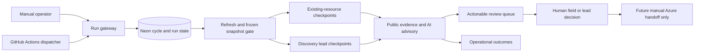
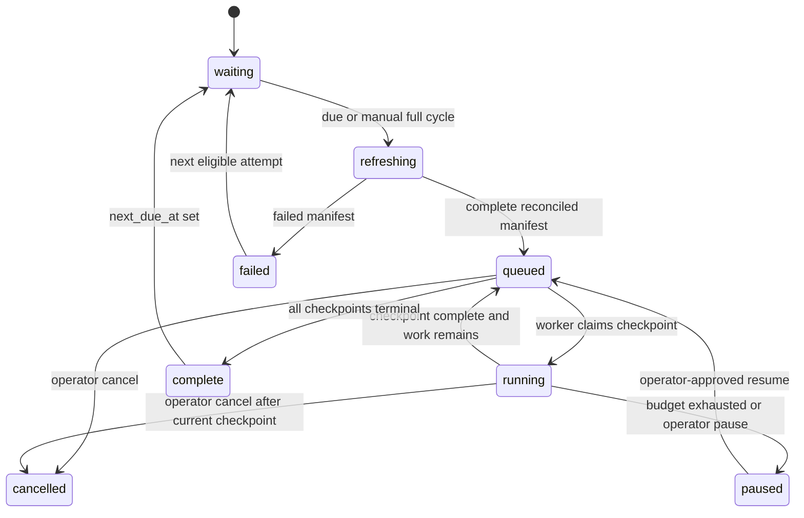

# feat: Add recurring CBO verification and discovery

## Goal Capsule

Operate one review-first program that checks the current copied CBO/WIC directory and finds credible new Chicagoland resources. An operator can start a one-record, selected-record, full-cycle, or discovery-only run. Every 60 days, the system refreshes its source baseline, queues records due for review, runs bounded discovery, and presents only actionable findings for human review.

The app never automatically closes, removes, adds, merges, or publishes a directory record. The source mirror remains read-only; the new Neon workspace is the durable working copy and audit system; Azure remains a manual, future handoff.

**Execution profile:** Vercel hosts the Clerk-protected review app and the bounded worker. A GitHub Actions dispatcher calls the protected worker every 15 minutes on the public repository, while Neon—not cron syntax—decides whether a 60-day cycle is due. This preserves the free Vercel tier without pretending a daily Hobby cron can drain a provider-backed directory review.

---

## Product Contract

### Summary

The first cycle adjudicates the resources ChicagoHealthMap already lists. Each later cycle rechecks those resources against a frozen CBO/WIC refresh and separately discovers possible new resources. Staff see source evidence, provider failures, deterministic findings, and Azure AI advice before making field-level or new-resource decisions.

### Problem Frame

The current directory is a valuable baseline, not proof that every listing is current or eligible. Nearly 2,000 CBO locations and 30 WIC locations need periodic attention, while a one-off browser loop cannot safely coordinate provider usage, retries, evidence provenance, or staff review. A literal 60-day cron also cannot represent missed runs or recover from an interrupted provider call.

### Requirements

- **R1.** Support four durable run modes: manual verification of one or selected existing resources, manual full-cycle verification of all due resources, manual discovery-only, and scheduled cycle verification plus discovery.
- **R2.** A full or scheduled cycle first binds immutable per-resource cycle membership to a successful, promoted CBO/WIC refresh manifest, freezes the selected snapshots, and records its 60-day due-window anchor. A refresh failure creates no verification checkpoints.
- **R3.** Use one shared leased-checkpoint worker for manual and scheduled work. Launches, dispatcher deliveries, retries, pause/resume, and cancellation must be idempotent and may not duplicate provider work or candidates; cancellation is terminal.
- **R4.** Treat outcome states separately: `verified_no_change`, `candidate_staged`, `conflict`, `unable_to_verify`, provider failure, duplicate lead, out-of-scope lead, non-credible lead, and budget exhaustion. Only actionable changes and credible unmatched leads enter the reviewer queue.
- **R5.** Re-verify existing resources with official-site Firecrawl evidence, identity-matched Google Places corroboration, and advisory-only Azure OpenAI scoring. Failures, absent websites, stale pages, and a Google-only closure may not change public status.
- **R6.** Discovery is a separate, bounded lead pipeline. Approved category-and-geography searches may propose a `potential_new_resource` only after deterministic deduplication, the versioned seven-county Chicagoland/CBO eligibility policy in `README.md`, and public evidence collection. Discovery never inserts into copied public CBO/WIC tables.
- **R7.** The system must calculate a rolling 60-day due date from fenced completed verification outcomes, not from a brittle calendar expression. A single active full cycle may exist at once; manual spot checks may coexist only when they do not claim the same pending resource. `unable_to_verify`, provider failure, cancellation, and budget-paused work do not advance a due date.
- **R8.** The operator UI must show run scope, frozen baseline, budget, progress, failure counts, and safe start/pause/cancel/resume actions. The reviewer UI must filter by cycle and distinguish actionable candidates from operational outcomes.
- **R9.** Every provider observation, AI advisory, lead decision, frozen snapshot, run outcome, reviewer decision, and schedule/manual trigger is traceable and append-only. New evidence or an edit supersedes prior approval.
- **R10.** Scheduled execution stays disabled until a manual pilot produces a reconciled refresh, bounded cost report, usable reviewer decisions, and an explicit persisted activation decision. An operator-controlled emergency stop is checked before cycle creation and every checkpoint claim. Manual runs remain available while scheduling is disabled, subject to operator authorization, a reconciled frozen refresh where required, and their explicit budget.

### Actors

- **A1. Run operator:** starts, confirms, pauses, cancels, or resumes a manual run and sees its operational report.
- **A2. Scheduler identity:** invokes only the protected dispatcher; it cannot approve, edit, or export anything.
- **A3. Reviewer:** examines evidence and makes field-level approve, reject, defer, or edit decisions with a reason.
- **A4. Source owner:** owns the read-only mirror and the completed refresh contract.
- **A5. Service owner:** alone may change scheduler activation or emergency-stop state; every transition is server-authorized and audited.

### Key Flows

- **F1. Existing-resource cycle:** refresh manifest → freeze due resource snapshots → leased evidence checkpoints → actionable review candidates or visible non-actionable outcomes → human decision.
- **F2. New-resource discovery:** approved search query → durable lead → deduplicate and screen → collect corroborating evidence → `potential_new_resource` candidate or non-actionable disposition → human decision.
- **F3. Manual review:** operator chooses one, selected, full-cycle, or discovery-only scope → confirms budget → durable run progresses one checkpoint at a time → staff inspect evidence and decide only proposed changes.

### Acceptance Examples

- **AE1.** A staff member launches one existing pantry; Firecrawl and an identity-matched Google Place corroborate its new address; the queue shows both sources and only that address can be approved.
- **AE2.** A scheduled dispatcher is delivered twice while a full cycle is active; it resumes the same durable run and does not repeat a checkpoint or create a second cycle.
- **AE3.** The mirror refresh fails validation; the attempt has a failed manifest and the system stages no web-verification work.
- **AE4.** Discovery finds a credible in-region clinic absent from the directory; it becomes a reviewable potential resource. A same-name/same-address result links to the existing resource instead.
- **AE5.** Firecrawl times out or Google says closed without corroboration; the run records `unable_to_verify` or conflict, and no closure, removal, or new-resource proposal is created.
- **AE6.** A 1,999-record cycle reaches its provider-cost cap; it pauses with remaining work visible and requires a human-approved continuation rather than silently exceeding the cap.

### Success Criteria

- A complete scheduled or manual full cycle has a reconciled refresh, frozen scope, countable terminal outcomes, and a review link for every actionable result.
- Staff can explain any candidate from its source snapshot, evidence, advisory score, and decision history.
- The due-resource queue finishes within 60 days at the configured provider budget, or visibly reports why it did not.

### Scope Boundaries

**In scope:** recurring verification, potential-resource discovery, manual operator controls, free dispatcher integration, evidence safety fixes, durable state, reviewer filters, and operational runbooks.

**Deferred for later:** direct Azure publishing, automatic directory changes, 211 Illinois ingestion before a data-use agreement/API, login/CAPTCHA bypass, free-form browser agents, and natural-language operator controls.

**Outside this product's identity:** treating AI, a search result, an unreachable website, or an omitted source row as proof of closure or non-eligibility.

---

## Planning Contract

### Key Technical Decisions

1. **Use a due-date dispatcher, not a literal 60-day cron.** Neon owns `next_due_at`, active-cycle locks, and frozen run scope; a frequent dispatcher merely wakes it. This recovers after late/missed schedules while preserving manual starts. Governs R1, R2, R3, R7, R10.
2. **Use GitHub Actions as the free frequent dispatcher.** A scheduled, replay-protected request invokes the same bounded Vercel worker every 15 minutes; its actual work remains a Neon-leased checkpoint. This avoids paying for a Vercel plan solely to obtain more frequent cron execution. Governs R3, R7, R10.
3. **Keep discovery separate from existing-resource verification.** A durable lead is deduplicated and screened before it can become a potential-resource candidate, preserving the first cycle's focus on adjudicating the existing directory and reserving its provider budget. Governs R4, R6, R9.
4. **Make public-source evidence deterministic and AI advisory-only.** Google corroboration must identity-match; Azure output cannot supply values, categories, closures, merges, or actions. This avoids treating model or untrusted-page content as evidence. Governs R5, R6, R9.
5. **Freeze cycle inputs before web work starts.** A refresh failure or later refresh cannot alter a queued run's baseline: checkpoints reference a `(cycle, resource, snapshot)` membership row rather than the latest snapshot. Governs R2, R3, R9.

### High-Level Technical Design

### Scheduler and Cycle Lifecycle

### Assumptions

- The GitHub repository stays public or otherwise has sufficient GitHub Actions minutes for a small scheduled dispatcher.
- Source refresh work uses the existing read-only mirror connection in a separately authorized environment; Vercel never receives that source credential.
- The configured provider budget can process the frozen cycle before its 60-day due window. A budget that cannot do so is treated as an operational failure, not silently relaxed.

### Sources & Research

- Existing durable-run, evidence, and safety patterns: `src/lib/runs/index.ts`, `src/lib/verification/run-checkpoint.ts`, `src/lib/providers/hosted-evidence.ts`, `src/lib/repositories/review.ts`, `tests/run-lifecycle.test.ts`, and `tests/verification-workflow.test.ts`.
- Existing source, human-review, and deployment boundaries: `docs/operator-runbook.md`, `docs/source-policy.md`, `docs/reviewer-guide.md`, `docs/operations.md`, and `docs/security-and-secrets.md`.
- [Vercel Cron Jobs](https://vercel.com/docs/cron-jobs) and [Vercel Cron usage and pricing](https://vercel.com/docs/cron-jobs/usage-and-pricing): schedules are UTC; Hobby allows only one daily invocation and does not guarantee timing precision.
- [Vercel cron management](https://vercel.com/docs/cron-jobs/manage-cron-jobs): no automatic retry; function duration limits apply, so the worker must be checkpointed.
- [Firecrawl v2](https://docs.firecrawl.dev/api-reference/v2-introduction), [Map](https://docs.firecrawl.dev/api-reference/endpoint/map), and [error handling](https://docs.firecrawl.dev/api-reference/errors): bounded retrieval, error-class retry policy, and `Retry-After` handling.
- [Google Text Search (New)](https://developers.google.com/maps/documentation/places/web-service/text-search) and [Place Details (New)](https://developers.google.com/maps/documentation/places/web-service/place-details): field-mask costs, business status, and moved-place fields must be treated as corroborating evidence rather than autonomous status decisions.

---

## Implementation Units

### U1. Establish cycle, frozen-snapshot, and terminal-outcome state

**Goal:** Make a 60-day full cycle a durable, no-overlap object whose checkpoints always reference the exact CBO/WIC snapshot selected after a completed refresh.

**Requirements:** R1, R2, R3, R4, R7, R9.

**Dependencies:** Existing review-workspace and baseline/refresh migrations.

**Files:** `migrations/007_recurring_verification.sql`, `scripts/apply-review-migrations.ts`, `src/lib/imports/cbo-baseline.ts`, `src/lib/domain/review-workspace.ts`, `src/lib/runs/index.ts`, `src/lib/repositories/review.ts`, `tests/run-lifecycle.test.ts`, `tests/schema-contract.test.ts`.

**Approach:**

1. Add additive cycle, immutable membership, run-mode, fenced outcome, due-date, and budget-state projections; preserve existing append-only evidence and decision tables. Each membership has one `(cycle, resource, snapshot)` tuple and an FK proving the snapshot belongs to its resource; checkpoints and candidate staging reference that membership, never a latest-snapshot query.
2. Make the separately authorized refresh command own the source handoff: it creates the CBO/WIC source receipts under one manifest, copies the immutable public-row payloads, and asks Neon to promote that manifest in one destination transaction only after both sources reconcile. Failed or abandoned manifests remain audit-only; source omissions are discrepancies, never deletions or closure evidence.
3. Enforce one active full cycle with a database partial-unique constraint and transactionally create/reuse it. Define `paused` as resumable and `cancelled` as terminal; manual spot checks do not reset routine due dates.
4. Save a lease-token-fenced terminal outcome for every checkpoint. Advance `next_due_at` once in that completion transaction for `verified_no_change`, `candidate_staged`, or `conflict`; `unable_to_verify`, provider failure, budget pause, cancellation, discovery dispositions, and later-superseded evidence remain due. Reviewer decisions never retroactively advance a checkpoint due date.
5. Make migration `007` additive, retain old run readability, and backfill only safe due state from the latest reconciled receipt. This unit starts only after a separate migration-ledger preflight resolves the duplicate `004_*` history; the new runner verifies that prerequisite but does not repair history as part of the feature. Rollback disables eligibility/dispatch or selects a prior promoted manifest; it never drops audit history.

**Patterns to follow:** Existing migration order and append-only triggers in `migrations/003_neon_review_persistence.sql` and `migrations/004_live_verification.sql`; fenced checkpoint ownership in `src/lib/runs/index.ts`.

**Test scenarios:**

- A completed refresh freezes all due CBO/WIC snapshot IDs before checkpoints are queued.
- A later refresh proves queued evidence and candidates retain the original membership snapshot.
- A failed or non-reconciled refresh records failure and creates no verification checkpoint.
- An injected partial CBO/WIC refresh failure leaves no eligible manifest or cycle.
- A refresh command records both source receipts and the promoted manifest before a full-cycle launch can proceed.
- A second scheduled or manual full-cycle launch returns the active cycle without duplicating work.
- A manual spot check leaves the resource's cycle due date unchanged; a terminal full-cycle check advances it.
- An expired/stale lease cannot complete an outcome or advance a due date; budget pause leaves work resumable while cancellation is terminal.
- Outcome-matrix tests prove exactly which terminal existing-resource states advance the due date and that every other state remains due.

**Verification:** Database constraints reject overlapping active cycles and invalid snapshot links; lifecycle tests prove 60-day eligibility, frozen inputs, resume, and terminal reports.

### U2. Make evidence collection safe for recurring execution

**Goal:** Harden the existing worker so public evidence remains independently attributable, bounded, and safe to retry before it runs across the entire directory.

**Requirements:** R3, R4, R5, R9.

**Dependencies:** U1.

**Files:** `src/lib/verification/run-checkpoint.ts`, `src/lib/verification/index.ts`, `src/lib/providers/hosted-evidence.ts`, `src/lib/retrieval/firecrawl.ts`, `src/lib/retrieval/google-places.ts`, `src/lib/ai/azure-openai.ts`, `src/lib/repositories/review.ts`, `tests/run-checkpoint.test.ts`, `tests/provider-clients.test.ts`, `tests/verification-workflow.test.ts`.

**Approach:**

1. Keep Azure advice isolated from captured provider values; deterministic evidence extraction and identity matching decide whether a provider observation can corroborate a field.
2. Canonicalize every public URL; reject localhost, private/link-local/reserved IP literals and DNS-resolved private targets, then revalidate every redirect/final host. Use Firecrawl only for public unauthenticated fetches and never forward internal credentials to a target. Discovery URLs cannot become scrape targets until identity vetting accepts an official domain. Restrict Interact to an exact vetted domain, one page, fixed timeout, no form/file/navigation actions, and unconditional session cleanup.
3. Redact and size-limit excerpts before both persistence and Azure. Send Azure bounded, per-observation-delimited evidence and accept only a schema-constrained advisory score, approved taxonomy ID, short rationale, model/deployment, and prompt-policy version—never model-supplied field values, URLs, or actions.
4. Complete a leased checkpoint with a durable operational failure if persistence/staging fails after a claim; do not leave it hanging for lease expiry.
5. Make observation and candidate idempotency stable across a retry and serialize staging by run/resource before evidence-specific candidate checks. A candidate approval or edit must compare the immutable current revision/evidence-set version; refreshed or contradictory evidence supersedes and blocks an older pending approval.

**Execution note:** Start with characterization tests for the current unsafe boundaries, then change the worker.

**Patterns to follow:** Capture contracts in `src/lib/retrieval/types.ts`, current evidence redaction in `src/lib/evidence/redaction.ts`, and lease completion in `src/lib/runs/index.ts`.

**Test scenarios:**

- An Azure-suggested address absent from primary evidence cannot create a candidate.
- A Google result for a similarly named organization becomes conflict/no-result rather than corroboration.
- A hung provider times out within the checkpoint budget and completes as `unable_to_verify`.
- A repository failure after a lease claim records a terminal failure without duplicating provider calls on recovery.
- A retry with identical evidence produces one observation/candidate lineage.
- URL parser bypasses, private DNS/redirect destinations, and injected discovery links fail closed without outbound credential delivery.
- Redacted credential-like text or prompt injection never reaches Azure, durable evidence, a category mapping, or a candidate action.
- A reviewer cannot approve an older revision after refreshed evidence supersedes it.

**Verification:** Worker tests prove every claimed checkpoint reaches a fenced terminal state and no AI/provider failure can create an unreviewed status change.

### U3. Add manual run modes and protected cycle dispatch

**Goal:** Let operators explicitly start the right workload while making scheduled and manual full cycles use the same run gateway and provider budget controls.

**Requirements:** R1, R3, R7, R8, R10.

**Dependencies:** U1, U2.

**Files:** `src/app/api/runs/route.ts`, `src/app/api/runs/[runId]/execute/route.ts`, `src/app/api/cron/route.ts`, `src/lib/runs/cron.ts`, `src/lib/runs/index.ts`, `tests/review-authorization.test.ts`, `tests/run-lifecycle.test.ts`, `tests/run-checkpoint.test.ts`.

**Approach:**

1. Add explicit `manual_verify`, `manual_full_cycle`, `manual_discover`, `scheduled_verify`, and `scheduled_discover` modes with validated scope, source-refresh version, and capped, separately reserved existing/discovery provider budgets.
2. Keep the current one-checkpoint worker as the execution primitive; the browser and scheduler only launch, resume, or request a bounded drain.
3. Make the scheduler identity server-authorized rather than Clerk-impersonated. The cron endpoint derives scope and budgets from persisted configuration; it accepts no resource IDs, modes, or overrides. Require the persisted activation gate and emergency-stop check before cycle creation and every claim.
4. Persist a timestamped scheduler-delivery nonce and per-cycle claim quota so repeated, expired, or concurrent deliveries cannot amplify work or spend. Reject duplicate/unknown selection IDs, duplicate active cycles, cross-scope resource conflicts, and budget-free full runs; return the existing active run where applicable.
5. Require same-origin/CSRF validation on every Clerk-cookie-authenticated mutation before any side effect; scheduler requests use their separate signed-delivery validation.

**Patterns to follow:** Clerk operator gate in `src/lib/db.ts` and `src/app/api/runs/route.ts`; existing `CRON_SECRET` handling in `src/app/api/cron/route.ts`.

**Test scenarios:**

- A reviewer cannot launch or execute a run; an operator can launch a one-record or bounded selected run.
- A full-cycle confirmation creates one frozen due set, while a duplicate request returns that run.
- Duplicate scheduler deliveries continue the existing cycle without a second refresh or provider request.
- A manual spot check overlapping an actively leased cycle resource is rejected or linked to the existing work.
- Pause stops future claims and resume continues the same frozen scope; cancellation is terminal.
- A disabled pilot gate, invalid scheduler secret, or missing provider budget prevents scheduled execution.
- Replayed/expired scheduler delivery and activation revoked between claims cause no additional provider call.
- Cross-origin requests cannot launch, execute, pause, resume, or cancel a run.

**Verification:** Route and lifecycle tests prove mode authorization, idempotency, no-overlap rules, and bounded scheduler invocation.

### U4. Build the durable new-resource discovery lane

**Goal:** Turn bounded, approved searches into explainable potential-resource reviews without contaminating existing-resource verification or the copied source tables.

**Requirements:** R4, R6, R9.

**Dependencies:** U1, U2. U3 delivers existing-resource modes first and adds discovery launch routes only after this unit's lead/checkpoint contract is present.

**Files:** `migrations/008_discovery_lane.sql`, `src/lib/domain/review-workspace.ts`, `src/lib/providers/hosted-evidence.ts`, `src/lib/verification/run-checkpoint.ts`, `src/lib/verification/index.ts`, `src/lib/repositories/review.ts`, `src/lib/taxonomy/categories.ts`, `tests/hosted-evidence.test.ts`, `tests/verification-workflow.test.ts`, `tests/run-checkpoint.test.ts`.

**Approach:**

1. Persist versioned discovery queries, lead fingerprints, source observations, policy version, and dispositions separately from copied resource identities. A discovery checkpoint has exactly one target—either a frozen existing membership or a lead—and one active lineage per normalized fingerprint/source-scope version.
2. Limit discovery to reviewed taxonomy categories and the existing seven-county Chicagoland/CBO eligibility policy; use Exa/Google only to find leads or official URLs, then collect public evidence through the ordinary provider policy.
3. Deduplicate each lead against copied CBO/WIC records, Google place identity, prior open leads, and prior reviewer dispositions before advisory scoring.
4. Stage only credible, unmatched, in-scope leads as a `new_resource` candidate with UI label `potential_new_resource`; link it to its immutable lead/evidence lineage rather than `candidate_revision_snapshot_links`, which remains for existing copied resources. Retain rejected, duplicate, out-of-scope, and insufficient-evidence results in the run report instead of the reviewer candidate list. Discovery has a separate provider budget and cannot starve due existing-resource adjudication.

**Patterns to follow:** `potential_new_resource` semantics in `src/lib/verification/index.ts`, source-policy boundaries in `docs/source-policy.md`, and governed category lookup in `src/lib/taxonomy/categories.ts`.

**Test scenarios:**

- A trusted lead matching current name/address/phone links to the existing record and cannot create a new resource candidate.
- A credible unmatched food pantry or clinic within the defined counties stages exactly one potential-resource candidate with sources and advisory rationale.
- A for-profit clinic, worship-only site, advocacy-only nonprofit, out-of-region lead, or prompt-injection text is recorded as non-actionable.
- Repeated discovery query runs deduplicate previously adjudicated leads unless material evidence changes.
- Concurrent discovery retries and a later exact match to a seeded record retain one lead lineage and create no copied-table write.
- A search result alone cannot create a category, closure, copied table row, or reviewer-approved resource.

**Verification:** Discovery fixtures prove the end-to-end lead state machine and reviewer queue receives only actionable unmatched leads.

### U5. Deliver an operator console and reviewer audit workflow

**Goal:** Make long-running cycles understandable and usable without hiding uncertainty or conflating AI advice with evidence.

**Requirements:** R4, R8, R9, R10.

**Dependencies:** U1, U3, U4.

**Files:** `src/app/review/page.tsx`, `src/app/review/run-controls.tsx`, `src/app/review/[candidateId]/page.tsx`, `src/app/review/review-actions.tsx`, `src/app/review/review-provenance.tsx`, `src/app/styles.css`, `tests/review-ui-workflow.test.ts`, `tests/review-action-ui.test.ts`, `docs/reviewer-guide.md`.

**Approach:**

1. Present four explicit operator choices with scope/count, expected provider budget, frozen-refresh status, and a second confirmation for full cycle/discovery runs.
2. Add a run history/progress surface with current state, remaining checkpoints, pause/cancel/resume controls, provider failures, non-actionable outcome counts, and direct links to candidates created by the run.
3. Add reviewer filters for cycle, candidate type, conflict, and potential new resource. Show `unable_to_verify` and provider failures only in the operator run report. Render source excerpts and AI rationales as escaped plain text, render only validated HTTP(S) links, and never render source/AI HTML or Markdown.
4. Present a compact candidate provenance timeline: cycle/run, frozen source snapshot and captured values, evidence source/time, AI advisory version, current/superseded revision status, and reviewer decision actor/time/reason.
5. Preserve distinct reviewer/operator permissions and existing field-level approve/reject/defer/edit rules.

**Patterns to follow:** Current Clerk page gate and reviewer components; supplied Conscience design tokens already applied in `src/app/styles.css`.

**Test scenarios:**

- A manual one-record and full-cycle start disclose scope/budget and cannot double-submit.
- A queued full cycle shows progress and can be paused/resumed without changing its frozen count; a cancellation is terminal and preserves audit data.
- A reviewer can filter only potential new resources or conflicts and see evidence, AI advisory, and decision history.
- A reviewer can tell whether the visible revision is current or superseded and trace it to its frozen snapshot and run.
- An operational-only `unable_to_verify` result appears in a run report but not as an empty candidate.
- A reviewer cannot access operator controls, and an operator cannot bypass a reviewer decision.

**Verification:** UI workflow tests and an authenticated preview smoke prove manual launch, progress, evidence inspection, decision persistence, and safe rendering of malicious HTML/URL payloads.

### U6. Add the free periodic dispatcher and activation gate

**Goal:** Run the durable cycle automatically without exceeding Vercel Hobby cron limits or activating the schedule before the pilot is accepted.

**Requirements:** R3, R7, R9, R10.

**Dependencies:** U1, U3, U4, U5.

**Files:** `.github/workflows/cbo-dispatcher.yml`, `src/app/api/cron/route.ts`, `src/lib/runs/cron.ts`, `vercel.json`, `docs/operator-runbook.md`, `docs/operations.md`, `docs/security-and-secrets.md`, `tests/run-lifecycle.test.ts`, `tests/review-authorization.test.ts`.

**Approach:**

1. Keep `vercel.json` cron-free. GitHub Actions `schedule` and maintainer-controlled manual dispatch call the protected Vercel dispatcher every 15 minutes; the repository workflow uses pinned actions and `contents: read` only.
2. Make each call cheap and bounded: create/reuse a due cycle only once, then claim/complete a small persisted checkpoint quota. A short-lived timestamped delivery signature/nonce, a Neon lease, and per-cycle budget enforcement make late, missed, replayed, or duplicate deliveries harmless.
3. Leave the scheduled workflow present but operationally no-op until the persisted activation lifecycle moves from `disabled → manual-pilot-accepted → dispatcher-canary → recurring-enabled`. A distinct server-enforced service-owner allowlist, not the operator/reviewer role, authorizes activation and emergency-stop mutations; each transition records actor and before/after state.
4. Store scheduler credentials only in GitHub Actions and Vercel production secrets; previews receive neither source nor provider/scheduler credentials. The source mirror credential remains outside Vercel. Audit and telemetry store delivery nonce IDs/hashes and redacted error fields only—never authorization headers, signatures, tokens, or provider credentials.

**Patterns to follow:** Current disabled cron endpoint and runbook boundary; existing GitHub CI conventions in `.github/workflows/ci.yml`.

**Test scenarios:**

- The dispatcher before activation returns a no-work state and creates no cycle.
- A due cycle is created once even when the scheduled request repeats or arrives late.
- A normal no-op dispatcher does not consume provider budget; an active cycle advances only its configured checkpoint limit.
- A missing/incorrect scheduler secret cannot invoke the worker.
- Replayed/expired/concurrent valid deliveries cannot exceed the configured quota or provider spend.
- Scheduler requests cannot provide selection, run mode, budget, reviewer action, or export input.
- Reviewer and run-operator identities cannot activate scheduling or clear the emergency stop; audit/log records contain no secret-bearing request data.
- A 60-day due calculation resumes after downtime and never relies on a calendar-day expression.
- Workflow configuration contains no source, provider, Neon, Azure, or Clerk secret value.

**Verification:** A staging smoke uses a tiny provider budget and fixture data to run scheduler → durable queue → review candidate without any production-directory write; the runbook documents emergency disable and recovery.

### U7. Prove first-cycle readiness and operate the recurring program

**Goal:** Establish the first real review cycle as a controlled, measurable pilot before enabling the recurring dispatcher.

**Requirements:** R2, R4, R5, R6, R8, R9, R10.

**Dependencies:** U1-U6.

**Files:** `docs/operator-runbook.md`, `docs/reviewer-guide.md`, `docs/operations.md`, `docs/source-policy.md`, `README.md`.

**Approach:**

1. Before migration, record a recoverable Neon backup/branch point, dedicated workspace sentinel, current CBO/WIC counts, latest baseline-receipt aggregates, migration version, and absence of an active full cycle. Apply additive migrations only after ledger, grants, append-only guards, active-cycle, and activation-state checks pass.
2. Run a read-only source refresh and verify its receipt/count/geometry integrity before any web work. Pilot one record, then a balanced small sample of existing CBO/WIC categories, then a bounded discovery sample; review every candidate and non-actionable outcome with staff.
3. Run a dispatcher canary with tiny persisted budgets and exercise duplicate delivery plus pause/resume. Record provider requests/spend, run duration, candidate rate, reviewer disposition, blocked-source rate, dispatcher/auth errors, and remaining-work forecast against the 60-day window.
4. Persist the activation decision only when the team accepts evidence quality, costs, reviewer throughput, and recovery behavior. Its append-only receipt records baseline hash/count reconciliation, code/migration version, caps/actual usage, terminal counts, failure rate, review aging, duplicate/pause-resume proof, operator, and service-owner approval. Otherwise leave schedule disabled and continue manual runs.

**Patterns to follow:** `docs/operator-runbook.md`, `docs/reviewer-guide.md`, `docs/operations.md`, and `docs/source-policy.md`.

**Test expectation:** none -- this is an operational rollout/runbook unit; its proof is the recorded non-production and controlled production-like pilot evidence defined below.

**Verification:** The service owner can reconstruct the first cycle from refresh manifest through reviewer decisions, and a scheduled canary can be stopped without losing its audit trail.

---

## Verification Contract

- `npm run check` and `npm run build` pass for every implementation unit.
- Migration integration proves the new role cannot edit/delete audit rows, only one active full cycle exists, cycle membership references the correct resource snapshot, and a wrong Neon sentinel cannot run a cycle.
- Fixture coverage includes normal updates, no-change, provider timeout, Google-only closure, source conflict, source refresh failure, discovery duplicate, ineligible lead, credible new CBO, stale approval, duplicate dispatcher, budget exhaustion, pause/resume, cancellation, and prompt-injection content.
- An authenticated Vercel preview smoke confirms the review UI, but only a dedicated staging workspace may run provider calls; it must not write source-mirror, public CBO/WIC, or Azure production data. Preview environments fail closed without scheduler/provider/source/export secrets.
- Before schedule activation, execute a canary with fixed tiny budgets, inspect the count-only report and evidence, and confirm a reviewer can dispose of the resulting candidates.

---

## System-Wide Impact and Risks

| Risk | Mitigation |
|---|---|
| Free Vercel cron cannot drain the directory | Use a GitHub Actions dispatcher and Neon-backed checkpoint queue; each request is bounded and idempotent. |
| Provider costs or rate limits prevent timely completion | Fixed provider budgets, one checkpoint at a time, `Retry-After` handling, pause-on-budget exhaustion, and an explicit remaining-work report. |
| Wrong Google match or AI hallucination changes a listing | Deterministic identity gate; provider evidence stays separate; AI has no decision/write authority. |
| A failed refresh mixes baselines | Full cycles require a complete manifest and frozen snapshot links. |
| Search discovers duplicates or ineligible organizations | Lead lane, deterministic dedupe, scope/eligibility screen, and human approval only. |
| Scheduler delivery is late, repeated, or fails | Due state, locks, idempotency, leases, and retryable durable checkpoints live in Neon rather than the scheduler. |
| Scheduler credential is replayed or emergency stop is needed | Signed nonce/quota checks plus a Neon activation/kill switch are checked before creation and every claim; rotate the secret on compromise. |
| Untrusted URL or page text triggers unsafe retrieval or model behavior | Canonical URL/DNS/redirect validation, vetted official-domain policy, fixed Interact limits, evidence redaction, and schema-only AI advice. |
| Reviewer queue becomes noisy | Operational outcomes remain in run reports; only evidence-backed field changes and credible unmatched leads become candidates. |

---

## Documentation and Operational Notes

- The user-facing term “open” means evidence supports a current operational record; it does not turn absence of evidence into “closed.”
- The first full cycle is the current source directory adjudication. New-resource discovery supplements it and never replaces it.
- The dispatcher is a trigger, not a source of truth. The Neon emergency stop halts new claims immediately; disabling the GitHub workflow or rotating its secret blocks future deliveries. Current durable runs preserve their audit trail and may be paused or cancelled by an operator.
- Reviewers continue to approve only fields or new-resource proposals. Any future Azure export remains a separately gated, manual process.

---

## Definition of Done

- Manual one/selected/full-cycle/discovery-only runs and scheduled due-cycle runs share durable, idempotent state and evidence semantics.
- Every full cycle references a reconciled immutable source baseline; no later refresh changes its scope or snapshots.
- Existing-resource verification and discovery both produce clear terminal outcomes, while only actionable changes and credible new leads reach staff review.
- No provider, AI, scheduler, or failed lookup can close, remove, merge, publish, or directly add a directory record.
- The 60-day due model, budget pause, cancellation, pause/resume, duplicate delivery recovery, and reviewer audit trail are covered by automated tests and a controlled pilot.
- The free dispatcher remains disabled until the team records pilot acceptance; its secrets are absent from previews and source control.
- No abandoned experiments, unsafe credential paths, or duplicate queue implementations remain in the delivered change.
