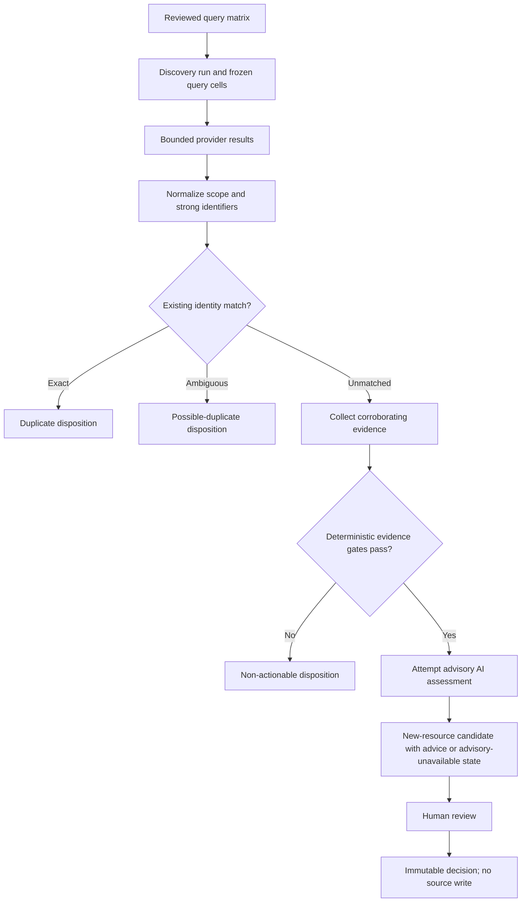
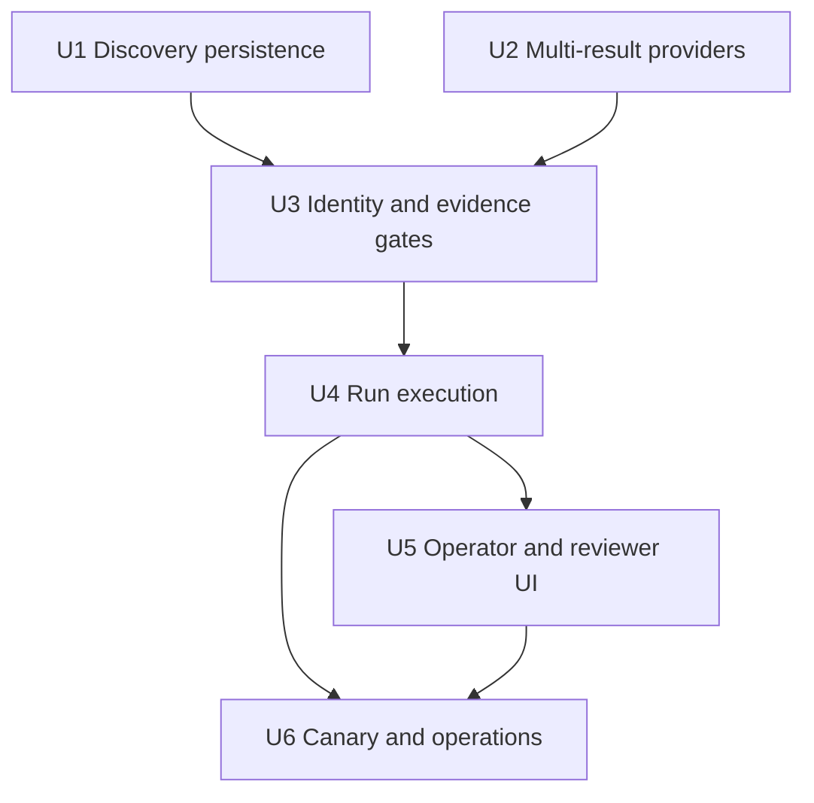

# New CBO and WIC Resource Discovery

## Overview

Add a separately budgeted discovery lane that searches a reviewed, versioned query matrix across the seven-county Chicago region, resolves each service-location lead against the current copied CBO/WIC directory and prior discovery history, gathers corroborating public evidence, and sends only credible unmatched leads to the existing human-review queue. Reuse the current Neon run/checkpoint engine, Vercel cron worker, provider clients, observation ledger, audit provenance, and reviewer workflow.

The feature does not write new rows to the source Azure tables. Approval records a review decision; producing an Azure-compatible insertion artifact remains disabled until that separate schema/default/key contract is validated.

## Problem Frame

The application can bulk-audit known resources, and its domain types already recognize `discovery_only` runs and `new_resource` candidates, but discovery is not executable. Search clients collapse multi-result responses to one observation, checkpoints target known resources, and the review landing page labels discovery as a future backend lane. Operators therefore cannot measure search coverage, distinguish duplicates from credible new organizations, or review a reproducible discovery campaign.

This plan supersedes U4 of `docs/plans/2026-08-14-0555-feat-recurring-cbo-verification-plan.md` and is the authoritative discovery implementation plan. It is aligned with the repository's current schema version 14 and production release invariant.

## Requirements Trace

### Search coverage and evidence

- R1. An operator can create a capped `discovery_only` run from the repository-managed query-matrix version shipped with the app, selecting approved categories and counties among Cook, DuPage, Kane, Kendall, Lake, McHenry, and Will. Launch snapshots the resolved query cells, texts, policy version, and caps into the run; v1 has no query-authoring UI or database-managed query-set abstraction.
- R2. Each executed query cell records its category, county, provider, query text, policy version, result cap, execution outcome, provider request identifier when available, and immutable bounded source-result provenance. Full provider payloads, response headers, HTML, Markdown, credentials, and URL secrets are never persisted.
- R3. Discovery consumes multiple bounded Google Places and configured search-fallback results without changing the single-result behavior used to verify known resources.
- R4. Search results are leads, not proof. In v1, a lead can become a candidate only after corroborating evidence establishes a credible current identity, an exact in-scope public service-location address, direct service delivery in an approved category, and CBO eligibility under the existing reviewer policy. Service-area-only organizations without a verifiable service address remain `insufficient_evidence` and are reported as a known coverage limitation.

### Identity, deduplication, and decisions

- R5. The identity grain is one physical service location. Deterministic resolution runs before AI scoring and compares each lead with copied current locations, open discovery lineages, and prior dispositions using Google Place ID, normalized full service address, normalized location name, canonical website domain, and normalized phone under the decision table below. Organization-level domain or phone alone never suppresses a new location.
- R6. Repeated query results across providers, categories, counties, and retries converge on one service-location lineage. Exact location matches are recorded as duplicates; conflicting or supporting-only signals become `possible_duplicate`; unmatched leads continue to evidence collection. Provider/category/county are occurrence provenance, never lineage-key dimensions.
- R7. Every returned lead records one explicit disposition: `candidate_staged`, `duplicate`, `possible_duplicate`, `out_of_scope`, `not_a_cbo`, `insufficient_evidence`, `provider_failure`, or `not_processed_budget`, with evidence and deterministic reasons. Results beyond the unique-lead cap remain visible as `not_processed_budget` rather than disappearing.
- R8. AI output remains advisory: it may assess eligibility, operating status, category, and evidence quality from captured observations, but it cannot collect evidence, override deterministic scope or identity gates, create a candidate without corroboration, or write source data. A scorer failure records `advisory_unavailable` but does not block a deterministically qualified lead from human review.
- R9. A prior disposition can be reevaluated without erasing history when the service address, Place ID, direct-service evidence, eligibility policy version, or a 12-month review interval materially changes; previously rejected human decisions reopen only as a new lineage evaluation and never mutate the old decision.

### Execution, review, and operations

- R10. Discovery reuses lease-token-fenced runs with two typed checkpoint stages: immutable query-cell checkpoints created at launch and deduplicated lead checkpoints appended transactionally by query completion. Run completion requires no pending, retry-waiting, or leased checkpoint of either type.
- R11. Discovery permits only one active campaign, reserves its provider-call budget atomically against a server-configured daily workspace cap, rate-limits launches, and cannot consume cron capacity ahead of claimable known-resource work.
- R12. Every discovery run exposes query coverage, normalized leads, deduplicated leads, disposition counts, credible-lead yield, provider failures, provider-call budget, zero-yield cells, and partial/terminal state in a paginated operator report.
- R13. A staged `new_resource` review shows normalized proposed fields aligned to the current review model, exact address and county evidence, category and eligibility reasoning, source lineage, duplicate-screen results, and a visible `advisory_unavailable` state when applicable. Human approval, rejection, edit, and defer remain immutable review events.
- R14. An approved `new_resource` remains in the existing approved state but is displayed as “Awaiting map handoff”; it cannot generate or publish an Azure insert until a separately reviewed destination-schema contract defines source columns, required defaults, identifier allocation, duplicate protection, and rollback behavior. Stage C broad manual discovery remains blocked until that handoff is proven.
- R15. Server-side authorization preserves the existing roles: operators activate/deactivate discovery and launch/pause/resume/cancel runs; reviewers decide candidates; both may view bounded provenance needed for their work; the authenticated cron secret may only dispatch checkpoints. Every mutation records its actor or cron identity.
- R16. Discovery remains disabled until an operator records an activation event referencing an accepted completed known-directory cycle. The activation event also records the query policy version, daily provider-call ceiling, rationale, and service-owner approval; a later deactivation is the audited kill switch.
- R17. The additive schema change is delivered as migration 015, increments `REQUIRED_REVIEW_SCHEMA_VERSION`, participates in the checksum ledger, and ships only through the repository's staged Vercel/Neon production release workflow.

## Scope Boundaries

### In scope

- Manual, capped discovery campaigns over a reviewed repository-managed category/county query matrix.
- Google Places plus the already configured Tavily-or-Exa search fallback for lead generation.
- Official-site and existing trusted-source evidence collection under the current provider safety policy.
- Deterministic scope, identity, and duplicate screening; AI advisory grading; human review.
- Durable discovery lineage, dispositions, coverage/yield reporting, and canary rollout controls.

### Deferred to follow-up work

- Azure-compatible new-row export and insertion: requires a verified destination schema, identifier/default policy, and rollback design.
- Automatically scheduled discovery campaigns and database/UI query authoring: add only after the manual validation demonstrates a second operationally managed matrix is needed.
- Additional search providers or ML/fuzzy entity resolution: add only if measured recall or ambiguity cannot be handled by the existing providers and deterministic signals.

### Explicit non-goals

- Automatic additions, deletions, merges, closures, or source-table writes.
- Treating search ranking, Google business status, or AI output as sufficient proof.
- Crawling arbitrary URLs supplied by search results; Firecrawl remains limited to a validated official URL under the existing SSRF and interaction policy.
- Discovering resources outside the approved taxonomy or seven-county service area, or accepting service-area-only leads without an exact public service address in v1.

## Context and Research

### Relevant code and patterns

- `src/lib/runs/index.ts` and `src/lib/runs/execute-checkpoint.ts` provide durable runs, frozen checkpoint targets, lease fencing, retry behavior, budgets, and terminal reports.
- `migrations/001_review_workspace.sql` already provides append-only `source_observations`; discovery should add only a lead association rather than a second observation ledger.
- `migrations/009_recurring_verification.sql` establishes the run/cycle/checkpoint schema and append-only outcomes; migration 015 should extend this pattern rather than introduce another queue.
- `src/lib/providers/index.ts` already requests multiple Google/Tavily/Exa results but exposes only the first result; discovery needs a bounded multi-result surface while known-resource verification keeps its present contract.
- `src/lib/providers/hosted-evidence.ts` enforces the current evidence boundary: search discovers leads, while an official URL is the only Firecrawl target.
- `src/lib/verification/run-checkpoint.ts` and `src/lib/repositories/review.ts` are the staging and provenance seams to extend for `new_resource` candidates.
- `src/app/review/run-controls.tsx`, `src/app/review/runs/[runId]/page.tsx`, and `src/app/review/[candidateId]/page.tsx` establish operator launch, paginated reporting, and reviewer-detail patterns.
- `src/lib/taxonomy/categories.ts` is the sole approved category vocabulary; the discovery query matrix references these stable values rather than defining another taxonomy.

### External references

- [Google Places Text Search (New)](https://developers.google.com/maps/documentation/places/web-service/text-search) returns a result array, requires an explicit field mask, supports bounded result counts, and documents that repeated queries are not guaranteed to return identical sets. Request only fields used for identity, address/scope, status, contact, and provenance.
- [Google Place IDs](https://developers.google.com/maps/documentation/places/web-service/place-id) permits storing Place IDs, recommends refreshing IDs older than 12 months, and warns that IDs can change or become obsolete. Treat Place ID as the strongest available signal, not an eternal primary key.
- [Tavily Search API](https://docs.tavily.com/documentation/api-reference/endpoint/search) returns ranked result arrays and supports an explicit `max_results`; keep the existing basic-search cost posture and persist request IDs when returned.
- [Exa Search API](https://docs.exa.ai/reference/search) is the existing alternate search fallback; preserve the configured-provider choice rather than invoking both search fallbacks per query.

## Key Technical Decisions

| Decision | Chosen approach | Why |
|---|---|---|
| Execution engine | Extend existing verification runs and checkpoints | Retains leases, budgets, retries, reports, authorization, and Vercel cron behavior without a second queue system. |
| Lead identity | Deterministic, ordered strong identifiers before AI | Identity is an auditable data-integrity decision; model judgment must not merge or duplicate organizations. |
| Provider surface | Add discovery-specific multi-result methods beside existing single-result methods | Avoids changing known-resource verification semantics while exposing provider arrays already returned upstream. |
| Evidence gate | Search lead plus corroborating official/trusted evidence | Prevents search snippets or rankings from becoming database claims. |
| Query configuration | One reviewed versioned matrix in code, resolved cells snapshotted with each run | Makes v1 reproducible without premature database configuration tables or an authoring UI. |
| Scheduling priority | One cross-run dispatcher claims known-resource work first, then the oldest eligible discovery work | Discovery cannot starve the directory-quality workflow, and cron can actually resume discovery runs. |
| New-row delivery | Review only; no Azure insert/export in this feature | The current destination contract covers field updates, not safe identifier allocation or required defaults for new rows. |

### Deterministic service-location match table

| Observed signals against a copied/current location | Outcome |
|---|---|
| Same Google Place ID with no material address conflict | `duplicate` |
| Same normalized full service address plus matching normalized location name, domain, or phone | `duplicate` |
| Same Place ID with conflicting address, or same address with conflicting identity signals | `possible_duplicate` |
| Shared organization domain and/or central phone but different or missing service address | `possible_duplicate` |
| Similar name without a matching full address or other location-level signal | `possible_duplicate` |
| No supported match | unmatched; continue to evidence collection |

Place ID, address, domain, and phone remain separate provenance fields. The durable lineage is policy-independent and represents one service location; each fingerprint/evaluation event records the identity-policy version. Provider, query cell, category, and county observations attach to that lineage. Material address, Place ID, service evidence, or policy changes create a new evaluation event without splitting history.

## High-Level Technical Design

The run freezes query cells rather than current-resource memberships. It creates typed query-cell checkpoints at launch. Completing a query checkpoint transactionally upserts service-location lineages, attaches bounded observations in the existing observation ledger, and appends at most the run's remaining unique-lead cap as lead checkpoints. A run completes only when neither checkpoint type is pending, retry-waiting, or leased. Every outbound provider or AI attempt consumes one call from the run's preallocated provider-call budget; exhaustion pauses the run. Full provider payloads are never retained.

## Acceptance Examples

- AE1. A Google result has the same Place ID as a copied WIC location: record `duplicate`; do not scrape, score, or stage it.
- AE2. A lead lacks a Place ID and shares a central domain and phone with a copied CBO but has a different address: record `possible_duplicate`; a multi-site organization must not suppress a legitimate new service location.
- AE3. A lead shares a normalized name with a copied resource but has a materially different address and no other strong match: record `possible_duplicate`; do not auto-merge or stage as new.
- AE4. A Cook County pantry has a stable public identity, exact service address, and direct-service evidence from its official site plus one independent approved source, or from two independent approved trusted sources: exactly one `new_resource` candidate is staged; AI advice is attached when available but is not a staging prerequisite.
- AE5. A search hit is in Indiana, is worship-only, or lacks credible service evidence: record `out_of_scope`, `not_a_cbo`, or `insufficient_evidence`; do not stage it.
- AE6. The same lead appears in several categories, counties, providers, or retries: attach observations to one lineage and retain one terminal disposition/candidate.
- AE7. A query provider times out or rate-limits before returning leads: preserve a query-cell `provider_failure` outcome and create no lead disposition. A corroboration provider that fails for an existing lead records that lead's `provider_failure` disposition after bounded retries.
- AE8. A known-resource checkpoint and discovery checkpoint are both claimable: process the known-resource checkpoint first.
- AE9. A reviewer approves a new resource: preserve the decision, but offer no publish/export action until the separate Azure insertion contract exists.
- AE10. A previously out-of-scope lineage later presents a new in-scope service address: preserve the old disposition and create a new evaluation event rather than suppressing or rewriting it.

## Implementation Units

### U1. Add durable discovery persistence and schema gating

**Goal:** Represent service-location lineages, dispositions, activation history, typed checkpoint targets, observation links, and candidate lineage within the existing review workspace.

**Requirements:** R1, R2, R6, R7, R9, R10, R11, R15, R16, R17

**Dependencies:** None

**Files:**
- Create: `migrations/015_discovery_lane.sql`
- Create: `src/lib/discovery/query-matrix.ts`
- Create: `docs/policy/discovery-query-matrix.md`
- Modify: `scripts/apply-review-migrations.ts`
- Modify: `src/lib/review-schema.ts`
- Modify: `src/lib/domain/review-workspace.ts`
- Modify: `src/lib/repositories/review.ts`
- Test: `tests/schema-contract.test.ts`
- Test: `tests/discovery-repository.test.ts`

**Approach:**
- Define the reviewed query matrix and stable policy version in `src/lib/discovery/query-matrix.ts`, with its category terms, county templates, caps, and approval rationale mirrored in `docs/policy/discovery-query-matrix.md`; use existing taxonomy exports and snapshot selected resolved cells into each run rather than adding query-configuration tables. The service owner approves this file in the release PR before activation.
- Add policy-independent durable service-location lineages. Store normalized fingerprints and identity-policy versions on evaluation events; retain Place ID, address, domain, and phone separately so evidence changes can reopen evaluation without losing history.
- Reuse `review_workspace.source_observations`; add only the minimum lead-observation association. Full provider payloads are not stored.
- Keep the current disposition in explicit current state backed by immutable disposition events and material-change/review-interval reopening events.
- Add append-only activation events and current activation state. Activation references an accepted completed known-directory cycle and records operator, service-owner approval, query policy, daily provider-call ceiling, and rationale; deactivation is the kill switch.
- Extend checkpoints and outcomes with typed query-cell and lead targets. Enforce at the database boundary that a checkpoint has exactly one target kind and that only one discovery campaign is active.
- Link a staged candidate revision to exactly one discovery lineage and checkpoint outcome; preserve that link through reviewer edits.
- Add migration 015 to the ledger preflight, checksum, ordered application path, verification test, and required schema version.

**Test scenarios:**
- Happy path: migration 015 applies after version 14 and records one checksum-ledger row.
- Edge case: replay exits without duplicating immutable schema or ledger history.
- Error path: checksum drift, missing prerequisite version, or a checkpoint with conflicting target types fails closed.
- Error path: discovery activation without a referenced accepted known-directory cycle, service-owner approval, or daily budget fails closed.
- Integration: a discovery candidate can be traced from decision to candidate revision, disposition, checkpoint, query cell, and source observations.

**Verification:** `node --experimental-strip-types --test tests/schema-contract.test.ts tests/discovery-repository.test.ts` and the existing production-release tests prove version 15 is staged, migrated, verified, and only then promotable.

### U2. Expose bounded multi-result discovery provider methods

**Goal:** Preserve multiple lead results and identity fields without changing evidence collection for known resources.

**Requirements:** R2, R3, R4

**Dependencies:** None

**Files:**
- Modify: `src/lib/providers/index.ts`
- Modify: `src/lib/retrieval/types.ts`
- Test: `tests/provider-clients.test.ts`

**Approach:**
- Keep each existing `search()` method unchanged for known-resource verification. Add the minimum discovery-specific method that returns a bounded array of normalized results.
- Request Google `places.id` and `places.addressComponents` in addition to the currently required public fields; retain county-relevant components, formatted address, contact fields, business status, types, and website while avoiding wildcard field masks.
- Return all bounded Tavily or Exa hits from the configured fallback, including source URL, title, excerpt/highlight, rank, and request identifier when supplied.
- Keep explicit per-query caps at or below the current provider-client ceiling and reject unbounded requests.

**Test scenarios:**
- Happy path: three Google/search hits produce three ordered normalized leads with provenance.
- Edge case: missing Place ID or address component remains a valid incomplete lead for later evidence gating, not a fabricated value.
- Error path: malformed arrays, provider errors, rate limits, and unsafe URLs become bounded provider observations and never authorize scraping.
- Regression: existing known-resource `search()` tests and identity filtering remain unchanged.

**Verification:** `node --experimental-strip-types --test tests/provider-clients.test.ts tests/hosted-evidence.test.ts` proves multi-result discovery and single-result verification coexist.

### U3. Implement deterministic scope, identity, and evidence gates

**Goal:** Convert normalized leads into auditable dispositions and stage only credible unmatched resources.

**Requirements:** R4, R5, R6, R7, R8, R9, R13

**Dependencies:** U1, U2

**Files:**
- Create: `src/lib/discovery/index.ts`
- Modify: `src/lib/providers/hosted-evidence.ts`
- Modify: `src/lib/providers/index.ts`
- Create: `src/lib/security/outbound-url.ts`
- Modify: `src/lib/repositories/review.ts`
- Test: `tests/discovery-workflow.test.ts`
- Test: `tests/outbound-url-safety.test.ts`

**Approach:**
- Normalize names, canonical domains, US phones, and addresses with small deterministic helpers; persist the original values beside normalized comparison values.
- Resolve county from structured address evidence. A text mention of a county or a location bias is not proof of scope.
- Apply the service-location match table exhaustively and return matched identifiers, supporting/conflicting signals, and rule version as audit evidence. Do not use AI for entity resolution.
- For unmatched leads, allow an official URL only when its provider fields agree with the lead identity. Before any Firecrawl request, a shared outbound-URL guard rejects non-HTTP(S), userinfo, localhost, IP literals, and hostnames resolving to private/reserved IPv4 or IPv6 space. Revalidate returned redirect/canonical destinations before interaction or follow-up requests. Accept either official-site evidence plus independent corroboration or two independent approved trusted sources; sources count as independent only when they have distinct publishers/origin evidence rather than syndicated copies. Track missing-official-site and missing-address failures so digitally sparse coverage loss is measurable.
- Reuse the existing CBO eligibility/category prompt contract. When deterministic scope, identity, service, and corroboration gates pass, call a dedicated `stageDiscoveryCandidate` transaction keyed by lineage and leased checkpoint. It writes `candidate_revisions.resource_id = null`, uses a stable `discovery:<lineage-id>` display identity, links the lineage, and is retry-idempotent. Candidate reads fall back to proposed name/address, and superseding edits copy the lineage link.
- Stage the candidate with advisory evidence when scoring succeeds or an explicit `advisory_unavailable` marker when it fails. Store all non-actionable terminal dispositions without creating candidates.

**Test scenarios:**
- Happy path: an unmatched, in-scope, corroborated direct-service organization stages one `new_resource` candidate with exact address/county and provenance.
- Edge case: Place ID match, shared organization domain/phone across different locations, normalized-name/address ambiguity, Place ID replacement, and material-change reopening produce the required outcomes.
- Error path: unsupported county, worship-only/advocacy-only/for-profit evidence, missing address, search-only evidence, prompt injection, unrelated HTTPS hits, userinfo, loopback/private IPv4/IPv6, DNS-to-private resolution, and disallowed redirects never stage a candidate or authorize an outbound request.
- Integration: AI citations must name captured providers, an AI assertion cannot bypass a failed deterministic gate, and scorer failure does not discard a qualified candidate.

**Verification:** `node --experimental-strip-types --test tests/discovery-workflow.test.ts tests/hosted-evidence.test.ts tests/azure-openai.test.ts` proves gating and advisory boundaries.

### U4. Execute discovery through existing runs and checkpoints

**Goal:** Launch, pause, resume, cancel, retry, and report discovery campaigns without starving known-resource audits.

**Requirements:** R1, R2, R6, R7, R10, R11, R12, R15, R16

**Dependencies:** U1, U2, U3

**Files:**
- Modify: `src/lib/runs/index.ts`
- Modify: `src/lib/runs/execute-checkpoint.ts`
- Modify: `src/lib/runs/cron.ts`
- Modify: `src/app/api/runs/route.ts`
- Modify: `src/app/api/cron/route.ts`
- Test: `tests/discovery-run.test.ts`
- Test: `tests/run-checkpoint.test.ts`

**Approach:**
- Resolve the repository-managed query-policy version, selected cells, query-cell cap, unique-lead cap, provider-call budget, and idempotency key at launch. Reject disabled, empty, over-cap, over-daily-budget, duplicate-active, rate-limited, or unauthorized requests before mutation. In one transaction, allocate `reserved_calls` to the run against a UTC-day workspace ledger.
- Create all query-cell checkpoints at launch. Completing a query checkpoint transactionally attaches bounded observations to deduplicated lineages and appends lead checkpoints up to the remaining unique-lead cap before evaluating run completion.
- Before every external provider or AI request, atomically increment `used_calls` only when it remains within the run's allocation; failed attempts count as used. Terminal completion/cancellation releases unused same-day allocation. A paused run retains allocation only through that UTC day; after rollover, resume must reserve new-day headroom within the workspace ceiling.
- Retry only timeout, rate-limit, unavailable, and HTTP 5xx captures, for at most three total attempts. Persist `next_attempt_at`, move the same checkpoint to `retry_wait`, and use bounded one-minute then five-minute backoff without advancing completion. Blocked, malformed, unsafe-URL, and non-429 HTTP 4xx outcomes are terminal. Cancellation terminates retry-waiting checkpoints, and an attempt never starts without provider-call allocation.
- Add one server-owned cross-run dispatcher used by `src/app/api/cron/route.ts`: claim existing known-resource work first, then the oldest eligible discovery work, create a scheduled known run only when due records exist, and return a successful no-op when neither lane has work.
- Reuse the existing lease, attempt, timeout, cancellation, and completion functions within each typed checkpoint. A discovery run queued behind known work is a visible expected state.
- Make lead creation and fingerprint conflict handling idempotent so retries or overlapping query cells attach observations instead of duplicating candidates.
- Aggregate coverage and dispositions from immutable outcomes; do not infer success solely from a completed run status.

**Test scenarios:**
- Happy path: a capped query cell expands leads, deduplicates them, processes each within the run budget, and completes with exact totals.
- Edge case: overlapping cells and concurrent retries converge on one lineage and one candidate.
- Error path: rate-limit then success, exhausted timeout, malformed/blocked terminal failure, cancellation during retry wait, lease expiry, daily-budget exhaustion before retry, and dynamic checkpoint insertion failure preserve consistent state without partial candidate writes.
- Integration: when known and discovery work coexist, cron processes known work first and later resumes discovery.

**Verification:** `node --experimental-strip-types --test tests/discovery-run.test.ts tests/run-checkpoint.test.ts tests/run-route.test.ts` plus `npm test`.

### U5. Add discovery controls, reports, and reviewer provenance

**Goal:** Let operators launch and evaluate discovery and let reviewers judge a proposed new resource without reading provider payloads.

**Requirements:** R1, R11, R12, R13, R14, R15, R16

**Dependencies:** U4

**Files:**
- Modify: `src/app/review/page.tsx`
- Modify: `src/app/review/run-controls.tsx`
- Modify: `src/app/review/runs/[runId]/page.tsx`
- Modify: `src/app/review/[candidateId]/page.tsx`
- Modify: `src/app/review/site-reports.tsx`
- Modify: `src/app/review/review-provenance.tsx`
- Create: `src/app/api/discovery/activation/route.ts`
- Test: `tests/review-ui-workflow.test.ts`
- Test: `tests/review-action-ui.test.ts`
- Test: `tests/discovery-activation-route.test.ts`

**Approach:**
- Reuse the role-aware navigation and state patterns in the umbrella plan's U5. `/review` shows activation/readiness, repository query-policy version, selected categories/counties, resolved cell preview, unique-lead cap, maximum provider calls, and launch confirmation; v1 exposes no query authoring.
- Organize `/review/runs/[runId]` task-first: status and stop conditions; actionable exceptions/dispositions; filterable paginated lead table; lead/candidate detail; return links that preserve filters. Primary metrics are remaining work, failures, possible duplicates, and staged candidates; coverage/yield/cost are secondary.
- Cover loading, disabled/no accepted cycle, queued behind known work, running/partial, paused, retrying, budget-exhausted, completed, zero-yield, cancelled, and page-level error states with explicit available actions.
- Render provider titles, excerpts, highlights, and provenance as escaped plain text only. Never render provider HTML or Markdown. Display only validated HTTP(S) links, revalidate redirect destinations server-side, and use isolated external-link attributes.
- In `new_resource` review, show normalized proposed public fields aligned to the current review model, exact location evidence, eligibility/category reasoning, match signals, prior lineage, and AI-availability state. Preserve review actions, omit publish/export, and render approved records as “Awaiting map handoff” without adding a new candidate state.
- Enforce the R15 permission matrix server-side before every mutation and provenance read; UI visibility is not authorization. Configuration, run, and review events record the acting subject.
- On narrow screens, transform dense tables into labeled lead rows; wrap addresses/source text, retain keyboard-operable filters/disclosures, keep review actions reachable, restore focus predictably, and avoid announcing every progress tick.

**Test scenarios:**
- Happy path: an authorized operator launches a capped campaign and a reviewer can approve, reject, edit, or defer a staged lead.
- Edge case: zero-yield, possible-duplicate, incomplete-evidence, queued, partial, paused, exhausted, and cancelled reports remain visible and understandable.
- Error path: unauthorized launch, missing activation, excessive/daily-exhausted budget, repeated launch, unsafe provider content, and stale candidate actions are rejected before mutation or safely escaped.
- Accessibility: controls have programmatic labels, status is not conveyed by color alone, provenance disclosure is keyboard operable, and the lead table remains usable at narrow widths and 200% zoom.

**Verification:** route-level mutation tests plus component/source assertions, followed by `npm run build` to exercise the current Next.js server/client boundaries.

### U6. Ship a gated canary and operational contract

**Goal:** Prove technical safety first, then discovery effectiveness and reviewer capacity before broadening coverage.

**Requirements:** R9, R11, R12, R14, R16, R17

**Dependencies:** U4, U5

**Files:**
- Modify: `docs/ops/operator-runbook.md`
- Modify: `docs/ops/operations.md`
- Modify: `docs/policy/reviewer-guide.md`
- Modify: `README.md`
- Test: `tests/production-release.test.ts`

**Approach:**
- Before activation, require the accepted completed known-directory cycle referenced by R16 and a service-owner-approved query-policy version and category/county subset.
- Stage A is a 10-unique-lead technical smoke over at most two query cells; inspect every disposition. Stop immediately on an unflagged duplicate/out-of-scope approval, missing exact address or source-linked eligibility evidence, source-policy violation, malformed/provider-contract failure, or budget overrun. Stop when more than 20% of provider calls end blocked, timed out, or rate-limited after retries. This stage proves execution safety, not recall or population-level precision.
- Stage B is a separate representative validation over at most five approved category/county cells and 50 unique leads; review staged leads plus a service-owner-selected sample of every suppressed disposition. Include a blinded holdout of at least five known-missing eligible service locations or an authoritative inventory comparison; require retrieval of at least four of five holdouts, otherwise revise the query/provider strategy. Treat organic zero yield as acceptable only after this sensitivity check passes.
- Record coverage, holdout retrieval, provider overlap/saturation, duplicate precision, possible-duplicate workload, digitally sparse/missing-address exclusions, provider and AI failure rates, reviewer overturns, median review time, projected weekly reviewer hours, and estimated per-lead cost. Expansion requires service-owner sign-off that projected review work fits documented staffing capacity.
- Stage C broad manual discovery may use the remaining approved matrix only after the separately owned Azure insertion-review artifact is validated end to end. Approved discoveries remain visibly “Awaiting map handoff”; automatic insertion and scheduled discovery stay out of scope.
- Release through `.github/workflows/production.yml` or `npm run release:production`: stage Vercel, apply and verify Neon migration 015, promote, then smoke-test schema readiness, discovery authorization, one controlled query cell, report rendering, and the absence of source writes.

**Test scenarios:**
- Integration: a preview deployment on schema 14 fails readiness for discovery without affecting the currently deployed app; schema 15 passes before promotion.
- Integration: the 10-lead canary produces a complete disposition reconciliation and no Azure/source-table writes.
- Integration: the representative validation samples suppressed leads and records holdout retrieval and reviewer-capacity evidence before expansion.
- Rollback: the previous app remains compatible with additive migration 015; an audited deactivation event prevents new campaigns while retaining audit history.

**Verification:** all repository checks pass, production-release tests prove migration-before-promotion ordering, and a signed pilot report accounts for every query cell, lead, disposition, candidate, and review decision.

## System-Wide Impact

- **Interaction graph:** review launch API → run registry → Vercel cron claim → provider discovery → deterministic resolution/evidence → optional AI advisory → repository staging → run report/reviewer UI.
- **Error propagation:** provider and scorer failures become explicit observations/dispositions; invariant or persistence failures fail the checkpoint and use existing bounded retries; authorization and invalid configuration fail before run creation.
- **State lifecycle:** query snapshots, normalized results, observation links, dispositions, activation events, checkpoint outcomes, candidate links, and decisions are auditable. Mutable current-state rows point to immutable events but never replace provenance.
- **Security:** no new credential surface; provider keys remain server-only, mutations and provenance reads use the existing operator/reviewer roles, external URLs pass existing safety checks, Firecrawl scope does not expand from search text, and untrusted provider content is escaped plain text.
- **Retention and logging:** retain minimal audit facts—provider, sanitized source URL, timestamps/request ID, normalized organization/service-location fields, hashes, state, and reasons—for the life of the review workspace. Do not persist source excerpts for non-candidate leads. For staged candidates only, retain bounded excerpts in immutable candidate provenance for the life of the audit record, excluding personal names/emails and contact details other than the organization's public main phone. Never persist full payloads, headers, HTML/Markdown, credentials, or URL secrets. Logs contain IDs, state, provider, timing, and redacted errors—not excerpts or query payloads. Access is limited to operators/reviewers through server checks.
- **Performance and cost:** query-cell, unique-lead, per-run provider-call, one-active-campaign, launch-rate, and daily workspace caps bound fan-out and repeated-run spend. Pagination prevents operator pages from loading all leads. Existing-resource work retains dispatcher priority.
- **Unchanged invariants:** copied CBO/WIC identities remain read-only, reviewers remain the only decision makers, and production cannot promote ahead of the Neon schema ledger.

## Risks and Dependencies

- Google results are not stable across identical queries and Place IDs can change. Preserve query/version provenance, retain multiple match signals, and refresh stored Place IDs older than 12 months before relying on them for a new campaign.
- County or exact-address evidence may be incomplete for service-area and digitally sparse organizations. Such leads remain `insufficient_evidence`; report this exclusion rate and do not infer scope from search wording.
- High duplicate volume can create reviewer noise. Keep exact duplicates out of the review queue and report ambiguous matches separately.
- Search snippets may contain prompt injection or stale claims. Never interpret them as instructions and never let them authorize scraping or candidate creation.
- Provider cost and rate limits are external dependencies. Use the existing configured fallback, bounded result caps, atomic daily/provider-call budgets, one active campaign, and visible failure accounting.
- Safe Azure insertion remains blocked on an external data-contract decision; this feature deliberately ends at immutable human review.

## Documentation and Operational Notes

- Update the reviewer guide with the difference between `duplicate`, `possible_duplicate`, `not_a_cbo`, `out_of_scope`, and `insufficient_evidence`, including what evidence supports each decision.
- Document how maintainers version the repository query matrix, how an operator records activation against an accepted known-directory cycle, chooses the canary subset, interprets zero yield, pauses/cancels a run, and reconciles every disposition.
- Document the permission matrix, daily provider-call ceiling, launch rate limit, emergency deactivation, bounded provenance retention, and safe-rendering rules.
- Record that discovery complements rather than replaces the recurring audit of existing CBO/WIC records.
- Never deploy discovery code directly from `main`; use the repository production release workflow so Neon and Vercel advance together.

## Definition of Done

- A capped manual discovery campaign can execute end to end on schema 15 using the existing run, observation, review, authorization, and release infrastructure.
- Every provider result is accounted for by a durable lineage and terminal disposition, with repeated runs producing no duplicate candidates.
- Only corroborated, in-scope, unmatched resources reach the `new_resource` human-review queue.
- Reviewers see clean address, county, category, eligibility, source, duplicate, and AI-availability evidence and can decide without provider-output clutter.
- No discovery or review action writes to the copied or source CBO/WIC tables, and no Azure insert/export path is exposed.
- Stage A technical smoke passes, then Stage B representative validation recovers at least four of five known-missing holdouts, samples suppressed leads, and receives service-owner precision/capacity sign-off.
- Approved discoveries remain in the existing approved state and display “Awaiting map handoff”; Stage C broad manual discovery does not begin until a separate validated insertion-review artifact can move approved rows into the map schema safely.
