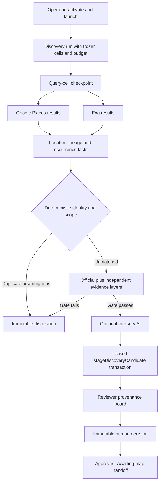
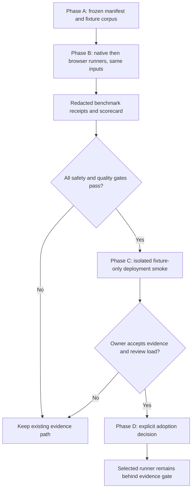

# New CBO and WIC Resource Discovery - Plan

## Goal Capsule

- **Objective:** Let authorized staff find credible, previously unmapped Chicago-area CBO and WIC service locations without turning search results, models, or provider output into source-data writes.
- **Means:** Add a manual, capped Google-plus-Exa discovery lane to the existing run, evidence, review, and release system. (KTD1, KTD2, KTD4)
- **Authority:** The product requirements and existing read-only Azure/source-table boundary override implementation choices. Human reviewers make all candidate decisions. Operators control activation and campaigns. Cron only dispatches claimable work.
- **Stop conditions:** Keep discovery disabled until activation is recorded against an accepted known-directory cycle. Do not enable scheduled or broad discovery, deploy, apply production migrations, or create an Azure insert/export path in this work.
- **Execution profile:** Implement persistence and execution contracts test-first where they alter durable state. Use the existing production release path only after local verification and human approval.

**Product Contract preservation:** changed: R18-R21 — user-directed addition of a measured, review-only open-source worker evaluation. Existing discovery authority, source policy, and no-bypass scope are unchanged.

---

## Product Contract

### Summary

Add a separately budgeted discovery lane for a reviewed category-and-county query matrix across Cook, DuPage, Kane, Kendall, Lake, McHenry, and Will Counties. A run uses Google Places and Exa to produce leads. Deterministic identity checks and a multi-source evidence gate decide whether a lead becomes a review-only candidate. The existing human review workflow remains the only approval authority.

### Problem Frame

The application can audit known resources, but it cannot execute new-resource discovery. The current partial foundations have a migration, provider array methods, and an activation route, but no durable two-stage checkpoint execution, transactional candidate staging, review provenance, or operator report. Without those pieces, staff cannot see coverage, duplicate handling, evidence quality, or a reproducible campaign history.

### Actors

- A1. **Operator:** Activates or deactivates discovery, launches and controls capped campaigns, and reads operational reports.
- A2. **Reviewer:** Reviews proposed public resource fields and their bounded provenance. A reviewer approves, edits, defers, or rejects a candidate.
- A3. **Scheduled dispatcher:** Uses the cron secret to claim one checkpoint. It has no authority to activate discovery, launch campaigns, or decide candidates.
- A4. **Service owner:** Accepts the known-directory cycle and approves the policy and canary expansion outside the application.

### Requirements

**Campaign scope and provenance**

- R1. An operator can create a capped `discovery_only` run from the repository-managed query-matrix version, selecting approved categories and counties in the seven-county region. Launch snapshots the resolved cells, policy version, and caps. Version 1 has no query-authoring UI or database-managed query-set abstraction.
- R2. Each query cell records category, county, provider, query text, policy version, result cap, outcome, provider request identifier when available, and bounded immutable result provenance. It never stores provider payloads, headers, HTML, Markdown, credentials, or URL secrets.
- R3. Discovery consumes bounded multiple-result responses from Google Places and Exa. Known-resource verification keeps its present single-result provider behavior.

**Identity and Swiss-cheese evidence**

- R4. A search result is a lead, not proof. A candidate requires a credible current identity, an exact public in-scope service-location address, direct delivery in an approved category, and CBO eligibility under the reviewer policy. Service-area-only organizations remain `insufficient_evidence`.
- R5. The identity grain is one physical service location. Before any AI assessment, deterministic resolution compares Google Place ID, normalized full address, normalized location name, canonical website domain, and normalized phone against copied current locations, open lineages, and prior dispositions. Domain or phone alone does not suppress another location.
- R6. Repeated results from providers, cells, categories, counties, and retries converge on one service-location lineage. Exact matches are `duplicate`. Supporting or conflicting signals are `possible_duplicate`. Provider and query-cell facts remain occurrence provenance, not lineage-key dimensions.
- R7. Every returned lead has one explicit disposition: `candidate_staged`, `duplicate`, `possible_duplicate`, `out_of_scope`, `not_a_cbo`, `insufficient_evidence`, `provider_failure`, or `not_processed_budget`. Leads over the unique-lead cap remain visible as `not_processed_budget`.
- R8. AI is advisory only. It can summarize captured evidence and suggest eligibility or category. It cannot collect evidence, bypass deterministic scope or identity gates, create candidates alone, or write source data. A scorer failure records `advisory_unavailable` without blocking a deterministically qualified candidate.
- R9. A material address, Place ID, direct-service evidence, eligibility-policy change, or 12-month review interval creates a new evaluation without erasing prior history. A rejected human decision only reopens as a new evaluation.

**Execution, review, and release**

- R10. Discovery uses lease-token-fenced query-cell checkpoints created at launch and lead checkpoints appended transactionally after query completion. A run completes only when neither stage has pending, retry-waiting, or leased work.
- R11. Only one discovery campaign may be active. Launch reserves provider-call budget atomically against a server-configured UTC-day workspace cap, rate-limits requests, and cannot take cron capacity from claimable known-resource work.
- R12. A paginated operator report shows query coverage, normalized and deduplicated lead counts, dispositions, credible yield, provider failures, call budget, zero-yield cells, and partial or terminal status.
- R13. A `new_resource` review shows normalized proposed fields, exact address and county evidence, category and eligibility rationale, source lineage, duplicate screen, and advisory availability. Human decisions remain immutable.
- R14. An approved `new_resource` stays approved and displays **Awaiting map handoff**. It cannot generate or publish an Azure insert until a separate destination-schema contract defines columns, defaults, identifiers, duplicate protection, and rollback.
- R15. Server-side authorization preserves the existing roles: operators activate/deactivate and operate runs; reviewers decide candidates; both can read bounded provenance; the cron secret can only dispatch. Every mutation records the actor or cron identity.
- R16. Discovery is disabled until an operator records activation against an accepted completed known-directory cycle. The activation captures policy version, daily call ceiling, rationale, and service-owner approval. Deactivation is the audited kill switch.
- R17. Migration 015 is additive, increments `REQUIRED_REVIEW_SCHEMA_VERSION`, participates in the checksum ledger, and releases only through the staged Vercel/Neon production workflow.
- R18. Any crawler evaluation uses only a checked-in, approved target manifest and a shared test corpus. It must obey source policy, robots rules, per-domain pacing, URL/redirect validation, and existing evidence retention/redaction rules; it must not use login, proxy rotation, stealth/fingerprint evasion, CAPTCHA solving, or unrestricted link traversal.
- R19. Candidate runners emit the same bounded observation envelope and benchmark receipt: fixture/target ID, runner/version/image digest, requested and final URL, policy decision, timing, request count, extraction result, error class, and redacted diagnostics. A runner cannot stage a candidate, write a source table, or call advisory AI.
- R20. The first evaluation compares a native HTTP policy baseline and direct Playwright on the same approved corpus. Crawlee plus Playwright is a conditional third comparison only when the direct-Playwright scorecard identifies an unmet orchestration requirement. Firecrawl remains the existing evidence service comparator; Scrapy, Scrapling, Katana, and autonomous browser-agent repositories are research references, not deployment candidates in this plan.
- R21. Railway remains a short-lived manual dispatcher to the protected application cron route. It does not host a crawler or receive source, provider, Azure, or database credentials. A recurring Railway schedule requires a separate service-owner approval after the full evaluation and canary gates pass.

### Key Decisions

- **Google plus Exa is the discovery pair.** Google Places supplies location-oriented leads. Exa supplies bounded web discovery and corroboration. Exa MCP is a planning/research aid only; production code calls the existing server-side Exa client with `EXA_API_KEY`. Governs R2, R3.
- **The candidate gate uses independent evidence layers.** A lead needs an exact in-scope address and either official-site evidence plus one independent approved source, or two independent approved sources. Search rank, Exa text, and AI output are insufficient on their own. Governs R4, R8.
- **Human review is the decision boundary.** The system stages candidates and displays a source-linked review board. It does not write copied CBO/WIC records or Azure. Governs R13, R14, R15.
- **Discovery is a manual canary lane.** The weekly cron remains a one-checkpoint dispatcher for known work first. It may resume an already-authorized discovery run only after no claimable known-resource checkpoint exists. It never schedules discovery campaigns. Governs R10, R11, R16.

### Acceptance Examples

- AE1. A Google result matches a copied WIC service location by Place ID and compatible address. The system records `duplicate` and does not scrape, score, or stage it.
- AE2. A lead shares an organization domain and central phone with a copied CBO but has another service address. The system records `possible_duplicate` and preserves the case for review rather than suppressing the location.
- AE3. A Cook County pantry has an exact service address, direct-service evidence, and either official-site plus independent evidence or two independent approved sources. The system stages exactly one `new_resource` candidate. AI advice is optional.
- AE4. A provider returns an Indiana result, worship-only organization, or addressless service-area claim. The system records a terminal non-candidate disposition.
- AE5. The same lead appears in several cells or after a retry. The system links occurrence observations to one lineage and stages at most one current candidate.
- AE6. A known-resource checkpoint and a discovery checkpoint are both claimable. Cron processes known work first.
- AE7. A reviewer approves a new resource. The record reads **Awaiting map handoff** and exposes no publish or export action.
- AE8. A later public address materially changes an out-of-scope lineage. The system preserves the old disposition and creates a new evaluation.

### Scope Boundaries

**In scope**

- Manual capped campaigns over a reviewed in-code category/county matrix.
- Google Places and Exa direct API discovery.
- Official-site and approved independent-source evidence under the existing outbound safety policy.
- Deterministic identity and duplicate checks, bounded AI advice, human review, reports, and canary controls.

### Deferred to Follow-Up Work

- Azure-compatible insert/export, including destination contract, identifier allocation, rehearsal, rollback, and publish controls.
- Scheduled discovery campaigns, broad discovery, or database/UI query authoring.
- New providers, arbitrary web crawling, fuzzy/ML entity resolution, and provider selection based on unmeasured recall.
- Proxy rotation, stealth/fingerprint evasion, CAPTCHA solving, authenticated browsing, self-hosted Firecrawl, and a Python worker service.

### Explicit Non-Goals

- Source-table, copied-table, Azure, automatic addition, deletion, closure, or merge writes.
- Treating search snippets, provider ranking, business status, or AI output as proof.
- Crawling arbitrary URLs found in Google or Exa results.

---

## Planning Contract

### Key Technical Decisions

- KTD1. **Extend the existing run registry and checkpoints.** Add typed discovery targets and dispatcher priority to `src/lib/runs/index.ts` and `src/lib/runs/execute-checkpoint.ts` instead of creating a second queue. This retains leases, retries, cancellation, reports, and production cron behavior. Governs R10, R11, R12.
- KTD2. **Use Google and Exa as distinct bounded lead sources.** Keep `search()` for known-resource verification. Add or complete discovery-specific array methods with fixed request and result caps. Exa responses remain provider observations, not scrape targets. Governs R2, R3, R4.
- KTD3. **Stage a discovery candidate in one fenced repository transaction.** `stageDiscoveryCandidate` must verify the leased lead checkpoint, persist sanitized source observations and lineage links, create or update the review state idempotently, and preserve lineage links across reviewer supersedes. Governs R6, R8, R9, R13.
- KTD4. **Apply evidence in fixed layers before advisory AI.** The evidence worker performs deterministic scope, location identity, official-source, and independent-publisher checks before optional scoring. It must not let the model pick URLs, extend crawling, or choose dispositions. Governs R4, R5, R8.
- KTD5. **Use append-only audit facts with a small current-state projection.** Migration 015 extends the review workspace and checkpoint schema additively. Immutable events retain provenance while indexed current tables support launch gates and report queries. Governs R2, R6, R7, R9, R16, R17.
- KTD6. **Treat weekly cron as a dispatcher, not a discovery scheduler.** It claims one known-resource checkpoint first, then an eligible already-launched discovery checkpoint. The weekly `0 0 * * 0` schedule remains unchanged. Governs R10, R11, R16.
- KTD7. **Evaluate runners behind a no-authority adapter seam.** The benchmark harness accepts only policy-approved targets and returns redacted observations and metrics; only the existing evidence gate may later consume a selected runner. Governs R18, R19.
- KTD8. **Use the existing Node runtime for the first three-way comparison.** Node HTTP is the low-complexity baseline, direct Playwright tests rendering need, and Crawlee plus Playwright tests queue/retry ergonomics. This isolates the orchestration decision without adding a second language/runtime. Governs R20.
- KTD9. **Treat repository stars as discovery input, not a selection score.** Selection uses source-policy compliance, deterministic provenance, reproducibility, operational fit, recall/precision on approved fixtures, blocked-rate behavior, and cost. Governs R18, R20.
- KTD10. **Keep Railway outside the retrieval trust boundary.** Railway invokes the already-authorized application route once and exits; it does not become a second run engine or credential store. Governs R21.

### Bounded Discovery Roles

- **Discovery role:** Runs only frozen approved query cells through Google and Exa. It can create lead observations but cannot choose new sources or decide a candidate.
- **Identity role:** Applies the deterministic location-match rules. It can attach supporting signals but cannot merge records or override ambiguity.
- **Evidence role:** Validates the official source and independent publishers against the fixed evidence gate. It cannot crawl an arbitrary result URL.
- **Advisory AI role:** Summarizes captured evidence and suggests eligibility, category, and evidence quality. Its output is visible as advice, not a composite approval score.
- **Human review role:** Sees the proposed location, source layers, duplicate comparison, and advisory state. It alone can approve, edit, defer, or reject.

### High-Level Technical Design

The diagram shows the required authority order. Search and evidence steps produce bounded observations. Deterministic gates choose eligibility for staging. AI cannot move a lead around a gate. A reviewer decision ends this feature's data path.

### A-D Worker Evaluation Flow

The evaluation is not a crawler deployment. Phase C is a separately deployed, non-production fixture service—not the application cron route—and has no database, provider, Azure, Clerk, or application credentials. It compares bounded retrieval behavior before any runner can enter the evidence path, and it retains the existing manual/disabled discovery controls.

### Bake-off Protocol

**Decision question:** Does a renderer recover required public fields from an approved JavaScript fixture often enough to justify its added operational surface over the native HTTP baseline? Crawlee is evaluated only if direct Playwright leaves a measured scheduling or retry problem.

| Phase | Inputs and boundary | Runners | Exit gate |
| --- | --- | --- | --- |
| A — contract | Checked-in manifest plus local fixtures only; fixture origin is the only allowed destination | No retrieval | Invalid manifest, unsafe URL/redirect, unbounded request ceiling, or receipt schema violation fails before startup. |
| B1 — baseline | Same immutable corpus, one target per invocation, no credentials or persistence | Native HTTP and direct Playwright | Any safety failure rejects that runner. Retain native HTTP unless Playwright materially improves the dynamic fixture's exact required-field score. |
| B2 — conditional | Same corpus and receipts; executed only after B1 records the unmet direct-Playwright requirement | Crawlee plus Playwright | Reject if it cannot meet B1's safety and accuracy results or if direct Playwright already meets the requirement. |
| C — deployment smoke | Dedicated non-production runner and private fixture service; no application endpoint or durable workspace | Selected B1/B2 runner | Non-root image executes one fixture, emits one redacted receipt, exits, and makes no request outside the fixture origin. |
| D — decision | Scorecard, image digest, corpus version, and human fixture-golden agreement | No retrieval | Service owner records adopt or no-adopt. A real-source canary is a separate future approval. |

#### Corpus and oracle

The fixture server supplies exactly these synthetic cases. Each case has a checked-in expected normalized value object; runner adapters never contain fixture-specific extraction rules.

| Fixture | Expected terminal result | Purpose |
| --- | --- | --- |
| `static-service-page` | required fields extracted | Native baseline and common parser correctness. |
| `dynamic-service-page` | required fields extracted only after a deliberate client-side render | Tests whether browser rendering creates material value. |
| `redirect-approved` | required fields extracted; every hop revalidated | Redirect policy and request accounting. |
| `redirect-private` | policy denied before private destination request | SSRF and redirect failure-closed behavior. |
| `robots-denied`, `robots-missing`, `robots-invalid` | terminal policy result defined by the manifest | Explicit robots policy rather than an implicit library default. |
| `rate-limited`, `timeout`, `malformed`, `block-page` | normalized terminal error with no escalation | Error taxonomy, timeout, retry, and no-evasion behavior. |
| `decoy-address` | no false address extraction | Separates mailing/contact text from an eligible service-location field. |

#### Frozen Neon-derived holdout

After the synthetic corpus is green, a separate read-only preparation command may sample already-accepted, public CBO/WIC locations from the dedicated review workspace into a versioned holdout manifest. The preparation command—not any runner—uses the review database credential and records the source snapshot version, selection query version, extraction date, and a reviewer-approved public-field oracle. The runner receives only the frozen manifest and the approved public target URL; it never receives a database URL or queries Neon.

The holdout measures real-location extraction and identity behavior, including known duplicate and possible-duplicate cases. It is not proof that a current public site remains correct: changed, inaccessible, or policy-denied targets remain explicit terminal results and are adjudicated outside the benchmark. The holdout contains no credentials, provider payloads, or source-table writes and must remain in the restricted repository/test boundary rather than a synced Dropbox path.

#### Runner invariants

- One manifest entry and one browser context per process invocation; maximum concurrency is one.
- No proxy, login, session pool, persistent cookies/storage, CAPTCHA handling, fingerprint/stealth feature, recursive link enqueue, advisory AI, database access, or provider call.
- Each navigation, redirect, and browser subresource increments the receipt request count. Non-document subresources are blocked unless the manifest explicitly permits the fixture host.
- Redirect destinations are validated before following. Unsafe URLs, a fixture-host mismatch, missing policy decision, or request-budget breach produce a terminal receipt and a non-zero process exit.
- Receipts contain only fixture ID, runner/version/image digest, requested/final URL, policy decision, elapsed time, request count, normalized extraction result, terminal class, and redacted diagnostics. They have no candidate, review, or source-table state.
- The Neon-derived holdout is generated before a run and is immutable for that scorecard. The runner may read it but cannot update it, query Neon, or use it to stage/review a candidate.

#### Selection thresholds

Safety is lexicographic: one safety failure disqualifies a runner, regardless of speed. Among safe runners, select the least complex runner that has all required static fields, zero decoy false positives, exact terminal classes, and stays within every request ceiling. Direct Playwright may replace native HTTP only if it recovers all required dynamic fields that native HTTP misses; Crawlee may replace direct Playwright only if B1 documents an unmet orchestration requirement and it is otherwise no worse on those criteria. Peak RSS, elapsed time, and image size are tie-breakers, not approval criteria.

### Open-Source Candidate Landscape

| Repository | Snapshot from research | Role in this plan | Decision |
| --- | --- | --- | --- |
| [microsoft/playwright](https://github.com/microsoft/playwright) | Apache-2.0; about 95k GitHub stars; Node-compatible browser automation | Rendering-only comparator | Include in Phase B. |
| [apify/crawlee](https://github.com/apify/crawlee) | Apache-2.0; about 25k stars; TypeScript queue, retries, and Playwright integration | Conditional browser-orchestration comparator | Include only in Phase B2 when direct Playwright has a measured gap; disable proxy/session features. |
| [scrapy/scrapy](https://github.com/scrapy/scrapy) | BSD-3-Clause; about 64k stars; mature Python crawler | Reference for benchmark dimensions | Exclude from initial implementation because it creates a Python service boundary. |
| [d4vinci/Scrapling](https://github.com/d4vinci/Scrapling) | BSD-3-Clause; about 77k stars; Python retrieval stack | Reference only | Exclude: its stealth/proxy-oriented surface conflicts with R18. |
| [firecrawl/firecrawl](https://github.com/firecrawl/firecrawl) | AGPL-3.0; about 166k stars; broad crawl/search/interact platform | Existing hosted evidence comparator | Do not self-host or widen from the existing allowlisted evidence usage. |
| [projectdiscovery/katana](https://github.com/projectdiscovery/katana) | MIT; about 17k stars; Go crawler | Reference only | Exclude: separate Go runtime and security-scanning-oriented breadth are not needed. |

Stars, licenses, and activity are a triage snapshot as of 2026-08-31; they are not scores and must be refreshed before dependency selection.

### Deterministic Location Match Rules

| Observed relationship to a copied or prior location | Disposition |
| --- | --- |
| Same Google Place ID and no material address conflict | `duplicate` |
| Same normalized full address plus matching name, domain, or phone | `duplicate` |
| Same Place ID with a conflicting address, or address with conflicting identity signals | `possible_duplicate` |
| Shared organization domain or central phone with another or missing address | `possible_duplicate` |
| Similar name without a location-level match | `possible_duplicate` |
| No supported match | continue to evidence gate |

### Sequencing

1. Land additive persistence, query policy, and schema/release guards before changing runtime behavior.
2. Complete bounded provider and evidence surfaces before adding lead execution.
3. Add the fenced lineage-to-candidate path before exposing launch controls.
4. Add the two-stage dispatcher and reports before the reviewer board.
5. Complete canary documentation and release tests while discovery remains disabled.
6. Run the A-D worker evaluation only after U1-U6 are green; it cannot replace the existing source-policy and evidence gates.

### Deferred Implementation Notes

- Use the repository's existing SQL and test conventions to select exact new table and function names after inspecting all migration constraints. Do not replace the current schema with a new queue.
- The approved independent-source publisher list needs service-owner review before activation. Store its policy version, not unbounded webpage text.
- DNS validation must remain an SSRF preflight. Do not represent it as network pinning unless the deployed HTTP client can bind the validated address.

---

## Implementation Units

### U1. Complete additive discovery persistence and policy snapshots

- **Goal:** Make migration 015 and the repository model sufficient for frozen query cells, typed checkpoint targets, lineages, evaluations, observations, activation, budget reservation, and candidate lineage links.
- **Requirements:** R1, R2, R6, R7, R9, R10, R11, R15, R16, R17.
- **Dependencies:** None.
- **Files:** Modify `migrations/015_discovery_lane.sql`, `scripts/apply-review-migrations.ts`, `src/lib/review-schema.ts`, `src/lib/domain/review-workspace.ts`, and `src/lib/repositories/review.ts`. Create or complete `src/lib/discovery/query-matrix.ts` and `docs/policy/discovery-query-matrix.md`. Add `tests/discovery-repository.test.ts` and extend `tests/schema-contract.test.ts`.
- **Patterns to follow:** The append-only events and current-state projections in `migrations/009_recurring_verification.sql`; the migration ledger checks in `scripts/apply-review-migrations.ts`; the repository's parameterized SQL and `assertReviewWorkspace` access path.
- **Approach:** Extend, rather than replace, the existing partial 015 tables. Persist frozen selected query cells and checkpoint target kind. Add database constraints for one active discovery campaign, one valid target per checkpoint, activation prerequisites, and idempotent lineage/candidate links. Persist budget reservation and use state in UTC-day records. Link discovery occurrences to existing `source_observations`; do not add a second raw payload ledger. KTD3 and KTD5 govern transaction boundaries.
- **Execution note:** Begin with migration-contract tests that fail for invalid checkpoint targets, duplicate active campaigns, ledger drift, and source-write attempts.
- **Test scenarios:**
  - Apply migration 015 after schema 14 and verify one checksum-ledger entry and schema version 15.
  - Replay the migration path without duplicating immutable rows or changing recorded checksums.
  - Reject an activation without an accepted completed known-directory cycle, service-owner approval, bounded rationale, or daily call ceiling.
  - Reject a checkpoint with both or neither resource and discovery target, and reject a second active discovery campaign.
  - Trace a staged candidate through revision, lineage, evaluation, checkpoint, query cell, and bounded source observations.
- **Verification:** Schema and repository tests demonstrate backward-compatible migration, idempotence, authorization prerequisites, and complete lineage traversal.

### U2. Make Google and Exa bounded discovery sources and evidence layers

- **Goal:** Provide normalized multi-result lead observations without changing known-resource evidence collection or authorizing arbitrary result URLs.
- **Requirements:** R2, R3, R4, R8.
- **Dependencies:** U1.
- **Files:** Modify `src/lib/providers/index.ts`, `src/lib/providers/hosted-evidence.ts`, `src/lib/retrieval/types.ts`, and `src/lib/security/outbound-url.ts`. Add or extend `tests/provider-clients.test.ts`, `tests/hosted-evidence.test.ts`, and `tests/outbound-url-safety.test.ts`.
- **Patterns to follow:** Existing `GooglePlacesClient.search()` and `ExaClient.search()` for known-resource compatibility; `collectHostedEvidence()` for bounded collection; `safeOutboundUrl()` and manual redirect handling for server-side target validation.
- **Approach:** Preserve one-result `search()` methods. Complete Google discovery results with only fields required for identity and scope. Use Exa's direct `/search` API through the existing server-only client with bounded `numResults`, fixed search type, moderation, and bounded highlight/text fields. Separate independent-publisher collection from lead generation. Only request Firecrawl for an identity-consistent validated official URL. Treat Exa and Google result URLs as untrusted observations, never scrape instructions. KTD2 and KTD4 govern this unit.
- **Test scenarios:**
  - Return ordered bounded Google and Exa arrays with source URL, title or name, excerpt, and available identity fields.
  - Preserve incomplete leads with missing Place ID or county components without fabricating values.
  - Reject result caps outside the server limit and map malformed, timeout, rate-limit, and blocked responses to bounded observations.
  - Accept only official-plus-independent or two distinct approved publisher sources after exact-address evidence is present.
  - Reject userinfo URLs, loopback and private IPv4/IPv6, unsafe redirects, arbitrary Exa URLs, and model-proposed targets before outbound fetches.
  - Keep existing one-result known-resource provider tests unchanged.
- **Verification:** Provider, hosted-evidence, and outbound-safety tests prove Google/Exa discovery does not widen scrape authority.

### U3. Build deterministic lead resolution and fenced candidate staging

- **Goal:** Turn deduplicated lead observations into immutable dispositions or one review candidate per service-location lineage.
- **Requirements:** R4, R5, R6, R7, R8, R9, R13.
- **Dependencies:** U1, U2.
- **Files:** Modify `src/lib/discovery/index.ts`, `src/lib/repositories/review.ts`, `src/lib/verification/run-checkpoint.ts`, and `src/lib/evidence/redaction.ts` if the existing projection needs a discovery-safe extension. Add `tests/discovery-workflow.test.ts` and extend `tests/discovery-repository.test.ts`.
- **Patterns to follow:** `reviewRepository.stageVerification()` for lease fencing, source observation persistence, candidate revisions, and idempotent state transitions; `reviewProvenance()` for bounded safe projections.
- **Approach:** Replace the current minimal helper behavior with policy-versioned normalization and the match table. Persist every terminal disposition and its reasons. Add `stageDiscoveryCandidate`, keyed by lineage and the leased lead checkpoint, to write proposed public fields with `resource_id = null`, a stable discovery display identity, sanitized provenance, and lineage link in one transaction. On reviewer edit, copy the discovery-lineage link to the superseding revision. Store `advisory_unavailable` as provenance state, not as a failed candidate or a reason to discard qualified evidence. KTD3 and KTD4 govern this unit.
- **Execution note:** Start with transaction-level tests that prove a retry or overlapping cell cannot create a second candidate.
- **Test scenarios:**
  - Covers AE1. A compatible Place ID/address match records `duplicate` with no candidate or external evidence call.
  - Covers AE2. Shared domain or phone at another address records `possible_duplicate` and retains matched identifiers.
  - Covers AE3. A qualified unmatched location stages exactly one `new_resource` candidate with address, county, sources, and optional advice.
  - Covers AE4. Unsupported county, missing exact address, search-only evidence, worship-only or for-profit evidence, and failed direct-service evidence do not stage a candidate.
  - Covers AE5. Concurrent retry and overlapping lead observations converge on one lineage and one current candidate.
  - A scorer failure records `advisory_unavailable` while preserving a deterministically qualified candidate.
  - A reviewer supersede retains lineage provenance and the older immutable revision remains readable.
- **Verification:** Workflow and repository tests prove deterministic disposition, idempotent staging, revision lineage, redaction, and advisory boundaries.

### U4. Execute two-stage discovery runs with known-work-first dispatch

- **Goal:** Launch and operate discovery runs through the existing lease engine without starving known-resource verification.
- **Requirements:** R1, R2, R6, R7, R10, R11, R12, R15, R16.
- **Dependencies:** U1, U2, U3.
- **Files:** Modify `src/lib/runs/index.ts`, `src/lib/runs/execute-checkpoint.ts`, `src/lib/runs/cron.ts`, `src/app/api/runs/route.ts`, and `src/app/api/cron/route.ts`. Add `tests/discovery-run.test.ts` and extend `tests/run-checkpoint.test.ts`, `tests/run-route.test.ts`, and cron-route tests.
- **Patterns to follow:** `NeonRunRegistry.claimNext()`, `complete_run_checkpoint`, lease-token fencing, `recoverCheckpointFailure()`, and the existing cron route's one-checkpoint response shape.
- **Approach:** Launch snapshots selected matrix cells and caps after operator authorization and activation checks. Query-cell completion appends deduplicated lead checkpoints transactionally, marking overflow leads `not_processed_budget`. Reserve call budget before each external attempt and release only unused same-day allocation on terminal cancellation or completion. Retry only timeout, 429, unavailable, and 5xx outcomes up to three attempts with persisted one-minute then five-minute retry windows. Keep unsafe, malformed, and other 4xx outcomes terminal. Replace `launchScheduled()`'s known-run-only assumption with a single dispatcher that claims known work first, then the oldest eligible discovery checkpoint, or returns a successful no-op. KTD1 and KTD6 govern this unit.
- **Test scenarios:**
  - Launch a capped run, execute cells, append leads, deduplicate them, and reconcile report totals at completion.
  - Preserve an empty or zero-yield cell as completed coverage rather than a silent skip.
  - Retry 429 then success, exhaust a timeout, cancel during retry wait, and expire a lease without leaking a budget reservation or candidate.
  - Reject disabled discovery, duplicate active launch, empty/over-cap selection, non-operator launch, and daily-budget exhaustion before external calls.
  - Covers AE6. When both lanes are claimable, cron runs a known-resource checkpoint first and later resumes the discovery run.
  - Return a successful no-op when neither lane has claimable work.
- **Verification:** Run, checkpoint, route, and cron tests prove atomic fan-out, retry state, budget accounting, lease recovery, and dispatcher priority.

### U5. Add operator controls, reports, activation, and reviewer provenance

- **Goal:** Give operators a safe manual launch and report surface and reviewers a clear card-first evidence board for new resources.
- **Requirements:** R1, R11, R12, R13, R14, R15, R16.
- **Dependencies:** U1, U3, U4.
- **Files:** Modify `src/app/review/page.tsx`, `src/app/review/run-controls.tsx`, `src/app/review/runs/[runId]/page.tsx`, `src/app/review/[candidateId]/page.tsx`, `src/app/review/site-reports.tsx`, `src/app/review/review-provenance.tsx`, `src/app/api/discovery/activation/route.ts`, and `src/app/api/runs/route.ts`. Add or extend `tests/review-ui-workflow.test.ts`, `tests/review-action-ui.test.ts`, `tests/discovery-activation-route.test.ts`, and route authorization tests.
- **Patterns to follow:** Existing Clerk `requireWorkspaceRole()` checks, run controls, paginated run report pages, candidate revision actions, and plain-text `reviewProvenance()` projection.
- **Approach:** Replace the current “planned” discovery panel with activation readiness, frozen matrix preview, approved category/county selection, fixed caps, and explicit manual launch confirmation. Keep all authorization and validation server-side. Add report filters for query cells, disposition, provider failure, and possible duplicate. Render a reviewer card with exact address, county evidence, evidence-layer status, duplicate comparison, public proposed fields, source links, advice availability, and immutable action history. Show advisory eligibility, category, and evidence quality as separate labeled inputs rather than an approval score. Render external content as escaped text and only validated HTTP(S) links with safe external-link attributes. Map approved new resources to **Awaiting map handoff** without a new publish state. KTD3 and KTD5 govern provenance; R15 governs authorization.
- **Test scenarios:**
  - An operator can activate against an accepted cycle and launch a capped campaign; a reviewer can approve, reject, defer, or edit a staged lead.
  - A non-operator cannot activate, launch, pause, resume, cancel, or read operator-only run provenance. A non-reviewer cannot decide a candidate.
  - Covers AE7. An approved new resource shows **Awaiting map handoff** and no publish/export control.
  - Show disabled, queued behind known work, running, retrying, budget-exhausted, zero-yield, partial, cancelled, and error states with available actions.
  - Escape provider title, excerpt, highlight, and rationale content. Reject unsafe links before render.
  - At narrow width and 200% zoom, controls retain labels, keyboard operation, visible focus, non-color status cues, and reachable review actions.
- **Verification:** Route, component-source, accessibility, and build checks demonstrate authorization, safe rendering, responsive operability, and Next.js server/client boundaries.

### U6. Define canary gates, runbooks, and production-release proof

- **Goal:** Keep discovery disabled until operations can demonstrate safety, evidence quality, and reviewer capacity.
- **Requirements:** R9, R11, R12, R14, R16, R17.
- **Dependencies:** U1, U4, U5.
- **Files:** Modify `docs/ops/operator-runbook.md`, `docs/ops/operations.md`, `docs/policy/reviewer-guide.md`, `README.md`, `.github/workflows/production.yml`, and `scripts/release-production.ts` only when existing release tests identify a missing schema-15 gate. Extend `tests/production-release.test.ts` and add canary/runbook source tests where the repository convention supports them.
- **Patterns to follow:** The production release invariant in `AGENTS.md`; the staged Vercel then Neon-ledger verification flow; existing production-release tests.
- **Approach:** Document a Stage A technical smoke of at most two cells and ten unique leads, with stop conditions for unflagged duplicate/out-of-scope staging, missing exact address or source-linked eligibility evidence, source-policy violation, provider contract failure, budget overrun, or more than 20% retriable provider failures after retries. Document Stage B representative validation of at most five cells and fifty leads, review suppressed-disposition samples, a five-location holdout or authoritative inventory comparison, at least four recovered holdouts, and service-owner capacity sign-off. Keep Stage C broad manual discovery blocked by the separate Azure insertion contract. Add schema-15 promotion ordering and source-write absence to release tests. KTD5 and KTD6 govern release and operations.
- **Test scenarios:**
  - A staged release on schema 14 fails discovery readiness without breaking the deployed known-resource app.
  - Schema 15 applies and verifies before a production promotion can proceed.
  - Canary reporting reconciles every cell, lead, disposition, candidate, and decision without Azure or source-table writes.
  - An activation deactivation event prevents new launches while preserving prior reports and reviews.
- **Verification:** Production-release and documentation tests show migration-before-promotion ordering, disabled-by-default behavior, canary stop gates, and no source writes.

### U7. Define the policy-bound benchmark contract and corpus

- **Goal:** Create a deterministic test target manifest, local fixture corpus, and runner-neutral receipt schema without changing production retrieval.
- **Requirements:** R18, R19, R20.
- **Dependencies:** U2, U6.
- **Files:** Create `src/lib/retrieval/benchmark-contract.ts`, `tests/fixtures/retrieval-benchmark/`, and `tests/retrieval-benchmark-contract.test.ts`. Modify `docs/policy/source-policy.md`, `docs/ops/operator-runbook.md`, and `README.md`.
- **Patterns to follow:** `src/lib/retrieval/types.ts` for bounded observation states, `src/lib/security/outbound-url.ts` for safe URL rules, and `tests/outbound-url-safety.test.ts` for failure-first safety coverage.
- **Approach:** Define a checked-in manifest whose entries name a fixture or approved public target, expected policy decision, exact expected fields, rendering requirement, and allowed request ceiling. Keep target approval separate from query discovery. The common receipt contains only redacted policy/measurement fields and cannot represent a candidate disposition. KTD7 and KTD9 govern this unit.
- **Execution note:** Start with local fixtures for static HTML, JavaScript-rendered content, redirect chains, robots denial, timeout, 429, malformed response, and CAPTCHA-like block page; add any public target only after its owner and policy allow it.
- **Test scenarios:**
  - A manifest with an unsafe URL, missing expected outcome, duplicate ID, disallowed host, or excessive request ceiling is rejected before a runner starts.
  - A robots-denied, login, CAPTCHA-like, blocked, or rate-limited target produces a terminal non-retry receipt and no browser escalation.
  - Every runner receipt redacts headers, cookies, tokens, and raw response bodies while retaining comparable timing, request-count, and error-class fields.
  - A runner attempting to emit a candidate, advisory result, or source-table operation fails contract validation.
- **Verification:** Contract and fixture tests prove every comparison shares inputs and cannot widen source or staging authority.

### U8. Implement staged runner adapters and a local scorecard

- **Goal:** Compare native HTTP and direct Playwright against the same frozen corpus; run Crawlee plus Playwright only if direct Playwright has a measured orchestration gap.
- **Requirements:** R18, R19, R20.
- **Dependencies:** U7.
- **Files:** Create `src/lib/retrieval/benchmark-runners/native-http.ts`, `src/lib/retrieval/benchmark-runners/playwright.ts`, `src/lib/retrieval/benchmark-runners/crawlee-playwright.ts`, `scripts/run-retrieval-benchmark.ts`, and `tests/retrieval-benchmark-runners.test.ts`. Modify `package.json` and `docs/ops/operations.md`.
- **Patterns to follow:** `src/lib/providers/hosted-evidence.ts` for bounded collection and `src/lib/runs/execute-checkpoint.ts` for timeout/error normalization. Do not reuse the durable run registry for a benchmark receipt.
- **Approach:** Give each adapter one pre-approved URL at a time, one browser context at a time, fixed timeout, fixed retry classification, per-domain delay, redirect revalidation, blocked subresources, and no recursive enqueue. The test process accepts only a local fixture origin and has no database, provider, Azure, Clerk, or application credentials. Native HTTP is the default selection. Add direct Playwright only when the dynamic fixture demonstrates a material extraction gap. Run Crawlee only if direct Playwright still needs queue/retry orchestration; explicitly disable proxy configuration, session pools, cookie persistence, automatic link enqueueing, persistent local storage, and blocked-page retry. The scorecard reports safety-gate compliance first, then exact-field recall/precision, false positives, rendered-content recovery, wall time, peak RSS, request count including redirects and subresources, terminal-error fidelity, and container image size. KTD8 and KTD9 govern this unit.
- **Execution note:** Treat the local fixture results as characterization proof; do not infer production recall from generic web benchmarks.
- **Test scenarios:**
  - Native HTTP and direct Playwright recover required static fields; direct Playwright recovers the marked dynamic fixture without exceeding its request ceiling. Crawlee runs only after the documented escalation condition is met.
  - Redirect, private-address, robots-denied, 429, timeout, malformed, and CAPTCHA-like fixtures produce identical safe terminal classes across adapters.
  - A Crawlee configuration containing proxy, session rotation, automatic enqueue, or more than one concurrent page is rejected.
  - Scorecard ordering cannot select a runner that has a safety failure, any unredacted diagnostic, or a lower policy-compliance score even when it is faster.
- **Verification:** A reproducible local run emits one receipt per runner/fixture and one JSON/Markdown scorecard with all policy and quality dimensions.

### U9. Add an isolated fixture-only deployment smoke

- **Goal:** Prove the selected runner image starts, runs exactly one fixture target, emits one redacted receipt, and exits in a dedicated non-production service.
- **Requirements:** R18, R19, R21.
- **Dependencies:** U7, U8.
- **Files:** Create `Dockerfile.retrieval-benchmark`, `docs/ops/retrieval-benchmark.md`, and `tests/retrieval-benchmark-deployment.test.ts`. Modify `docs/ops/operator-runbook.md` and `README.md`. Do not modify `scripts/railway-dispatch.mjs`, `Dockerfile.railway-dispatcher`, or the application cron route for this unit.
- **Patterns to follow:** The existing bounded outbound URL policy and Railway dispatcher documentation. The benchmark remains a process-level command, not a run-registry checkpoint.
- **Approach:** The image receives only a checked-in fixture manifest and a fixture-base URL. It must run as a non-root user, exit after one target, block non-fixture origins, and write its redacted receipt to stdout or an ephemeral artifact. It does not receive a cron secret, database URL, provider key, Azure credential, Clerk credential, application URL, or source data. Railway may host this smoke only after its non-root browser sandbox and private fixture-network capability are verified; otherwise run the same image in local/CI and record Railway as blocked. Railway's existing manual dispatcher remains unrelated and unscheduled. KTD7 and KTD10 govern this unit.
- **Test scenarios:**
  - Missing manifest, a non-fixture base URL, an unsafe redirect, or an unapproved destination fails before retrieval.
  - The image processes exactly one approved fixture target, emits one redacted receipt, and exits without database/provider/Azure/Clerk/application credentials.
  - The container runs as non-root; browser subresources and redirects count against the approved ceiling and non-fixture requests fail closed.
  - No cron expression, discovery launch, Azure export, source write, application route, or credential is introduced by the evaluation configuration.
- **Verification:** Container and documentation tests demonstrate a fixture-only deployment boundary. A Railway smoke is optional external evidence, not a prerequisite for runner selection.

### U10. Make the adoption decision and preserve the no-adopt path

- **Goal:** Turn benchmark and canary evidence into an explicit, reversible decision without silently widening recurring work.
- **Requirements:** R18, R20, R21.
- **Dependencies:** U8, U9.
- **Files:** Create `docs/ops/retrieval-runner-scorecard.md` and `docs/decisions/2026-08-31-retrieval-runner-selection.md`. Modify `docs/ops/operations.md`, `docs/ops/operator-runbook.md`, `README.md`, and `tests/production-release.test.ts`.
- **Patterns to follow:** The staged release and documented Stage A/Stage B gates in `docs/ops/operator-runbook.md`; preserve existing migration-before-promotion tests.
- **Approach:** Require a service-owner decision that records tested image digests, corpus version, scorecard, safety findings, expected monthly runtime/cost, reviewer agreement on fixture goldens, and rollback to Firecrawl-only evidence. Do not record a reviewer correction rate until a separately approved real-source canary has completed. Adopt only if the candidate has zero policy violations, no unsafe escalation, no unreconciled provenance gap, better or equal eligible-field recall with no worse false-positive rate, and an owner-approved operational budget. Otherwise retain the current evidence path and document why. A recurring Railway schedule remains an external, separate approval after this decision. KTD9 and KTD10 govern this unit.
- **Test scenarios:**
  - A scorecard with a safety failure, missing corpus/runner digest, unreconciled receipt, or worse false-positive rate cannot produce an adoption record.
  - A no-adopt decision leaves the current provider path and Railway schedule unchanged.
  - An adoption record includes the rollback target, owner, date, corpus version, image digest, and reviewer-capacity decision but no secret or raw provider payload.
- **Verification:** Documentation and release-contract tests prove adoption remains explicit, evidence-backed, and independent of deployment or broad discovery activation.

---

## Verification Contract

| Scope | Required verification | Expected signal |
| --- | --- | --- |
| Schema and repository | Targeted Node tests for schema contracts and discovery repository behavior | Migration 015 is additive, checksummed, idempotent, and traceable. |
| Providers and safety | Targeted provider, hosted-evidence, outbound-url, and discovery workflow tests | Google/Exa inputs stay bounded and cannot widen crawl authority or staging authority. |
| Run engine | Targeted discovery-run, checkpoint, run-route, and cron-route tests | Typed checkpoints, retries, budget caps, cancellation, and known-work-first dispatch reconcile. |
| UI and authorization | Activation route, review action, UI workflow, and safe-rendering/accessibility tests | Server-side role checks and reviewer provenance work in all supported states. |
| Repository gate | `npm run check` | Type checking and the complete repository test suite pass. |
| Framework build | `npm run build` | The Next.js 16.3 production build passes with the changed server/client boundaries. |
| Release gate | Production-release tests and human-approved staged release workflow | Schema 15 verifies before promotion. No production deployment or migration occurs during implementation. |
| Runner evaluation | Retrieval benchmark contract, runner, fixture, scorecard, and isolated deployment-smoke tests | The selected path has no policy violation, retains redacted receipts, and does not widen application or Railway authority. |

---

## System-Wide Impact

- **Data lifecycle:** Frozen query cells create occurrence observations. Occurrences converge on durable location lineages. Evaluations and dispositions remain append-only. A current candidate state points to immutable revision and lineage facts.
- **Authorization:** Clerk operator/reviewer checks remain server-side. Cron authenticates only for dispatch. UI visibility cannot grant an action.
- **Security:** Provider keys stay server-only. Untrusted search text is data, not instruction. Outbound URLs require the existing HTTP(S), hostname, DNS, redirect, and safe-rendering controls. DNS preflight does not claim connection-level pinning.
- **Reliability:** Each checkpoint is lease-fenced and idempotent. Retryable failure, terminal failure, cancellation, and budget exhaustion produce durable state rather than stranded work.
- **Cost and throughput:** Query-cell, unique-lead, per-run call, daily workspace, launch-rate, and one-active-campaign limits bound fan-out. The dispatcher preserves the known-directory audit's priority.
- **Release compatibility:** Migration 015 stays additive and the old application remains compatible until the staged release verifies the ledger. No source or Azure table becomes writable.

---

## Risks and Dependencies

- Google results vary and Place IDs can change. Retain policy and occurrence provenance and re-evaluate stale identity evidence rather than treating Place ID as an eternal key.
- Independent directories may be stale, syndicated, or unavailable. Require publisher independence, record the source failure, and report digitally sparse exclusions instead of guessing.
- Exa's API contract, pricing, and rate limits are external dependencies. Bound queries and results, consume atomic budgets, and keep failure accounting visible.
- A result URL can target private infrastructure through redirect or DNS rebinding. Preserve the SSRF guard and make its deployment limits explicit.
- The Azure insert contract is external and absent. Keep approved discoveries at map handoff until the destination owner supplies and rehearses it.

---

## Documentation and Operational Notes

- The reviewer guide must distinguish `duplicate`, `possible_duplicate`, `out_of_scope`, `not_a_cbo`, `insufficient_evidence`, and `provider_failure`.
- The operator runbook must cover matrix-version review, activation, weekly-dispatch behavior, launch confirmation, pause/cancel/resume, report reconciliation, emergency deactivation, and canary stop conditions.
- The policy document must identify category terms, county templates, caps, approved independent publishers, and the policy-version review process.
- Documentation must say that discovery supplements the recurring known-resource audit and does not enable Azure insertion.

---

## Definition of Done

- U1 through U6 meet their stated verification outcomes and test scenarios.
- A manual, capped `discovery_only` campaign can execute on schema 15 using the existing run, observation, review, authorization, and release infrastructure.
- Every provider lead reconciles to a lineage and explicit disposition. Retries and overlapping query cells do not create duplicate candidates.
- Only corroborated, in-scope, unmatched service locations reach human review. AI remains advisory and source tables remain read-only.
- Operators can safely activate, launch, control, and report campaigns. Reviewers can make lineage-preserving decisions from escaped, bounded provenance.
- Discovery stays disabled by default. Stage A and Stage B canary evidence, service-owner sign-off, and the separate Azure insert contract remain external gates to expansion.
- `npm run check` and `npm run build` pass during implementation. Production release tests prove migration-before-promotion. No production deployment or migration is performed as part of this plan.
- The final implementation contains no abandoned experiments, duplicate queue, raw provider payload persistence, secret exposure, or unreviewed source-write path.
- U7 through U10 meet their stated verification outcomes; no runner is adopted from GitHub stars, generic benchmark claims, or a successful Railway invocation alone.
- The checked-in scorecard names the corpus and runner/image versions, records a service-owner decision, and retains a no-adopt/rollback path.

---

## Appendix

### Sources and Research

- `src/lib/runs/index.ts`, `src/lib/runs/execute-checkpoint.ts`, and `src/app/api/cron/route.ts` show the existing durable run, lease, and weekly one-checkpoint execution seams.
- `src/lib/repositories/review.ts` shows the candidate revision, decision, provenance, and lease-fenced staging patterns to extend.
- `migrations/009_recurring_verification.sql` and current `migrations/015_discovery_lane.sql` establish additive review-workspace migration and checkpoint patterns.
- `src/lib/providers/index.ts`, `src/lib/providers/hosted-evidence.ts`, and `src/lib/security/outbound-url.ts` establish the current provider, evidence, and SSRF boundary.
- [Google Places Text Search (New)](https://developers.google.com/maps/documentation/places/web-service/text-search) documents result arrays, field masks, and non-stable repeated query results.
- [Google Place IDs](https://developers.google.com/maps/documentation/places/web-service/place-id) documents Place ID storage and refresh considerations.
- [Exa Search API reference](https://docs.exa.ai/reference/search) documents the direct `/search` request, bounded result count, content fields, and result metadata used by the server-side Exa client.
- [Crawlee](https://github.com/apify/crawlee) is the Node/TypeScript browser-orchestration candidate; its queue/retry facilities require an explicit policy wrapper because its broader proxy and session features are not authorized here.
- [Playwright](https://github.com/microsoft/playwright) is the rendering comparator and supports the repository's Node/TypeScript runtime.
- [Scrapy](https://github.com/scrapy/scrapy), [Scrapling](https://github.com/d4vinci/Scrapling), [Firecrawl](https://github.com/firecrawl/firecrawl), and [Katana](https://github.com/projectdiscovery/katana) informed the candidate landscape; their language, license, breadth, or stealth-oriented features exclude them from the first implementation.
- [Thunderbit scraper benchmark](https://github.com/thunderbit-operations/scraper-benchmark) and [Phidi](https://github.com/vladbalan/phidi) informed the shared-fixture, same-input, redacted-scorecard approach. Their published results are not treated as evidence of suitability for this domain.
